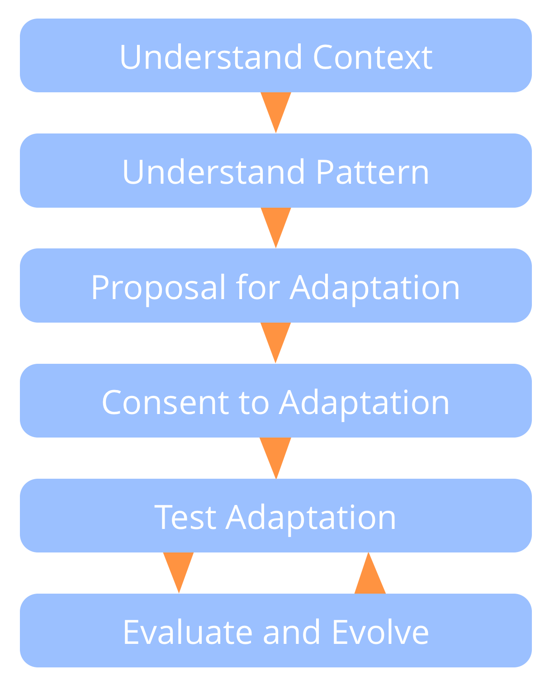

**התאימו ופתחו את תבניות S3 כדי שיתאימו להקשר הספציפי שלכם.**

ודאו שכל מי שמושפע:

- מבין מדוע שינוי התבנית נחוץ (או מועיל)
- נוכח או מיוצג כאשר מחליטים כיצד לשנות אותה
- השתמשו בעקרונות S3 כמדריך להסתגלות.

הריצו ניסויים עם התאמות במשך מספיק זמן כדי ללמוד על היתרונות ועל מלכודות פוטנציאליות.

שתפו התאמות בעלי ערך עם קהילת S3.

[&#9654; צרו מערכת-משיכה לשינוי אירגוני](create-a-pull-system-for-organizational-change.html) [&#9650; הכנסת S3](bringing-in-s3.html)

