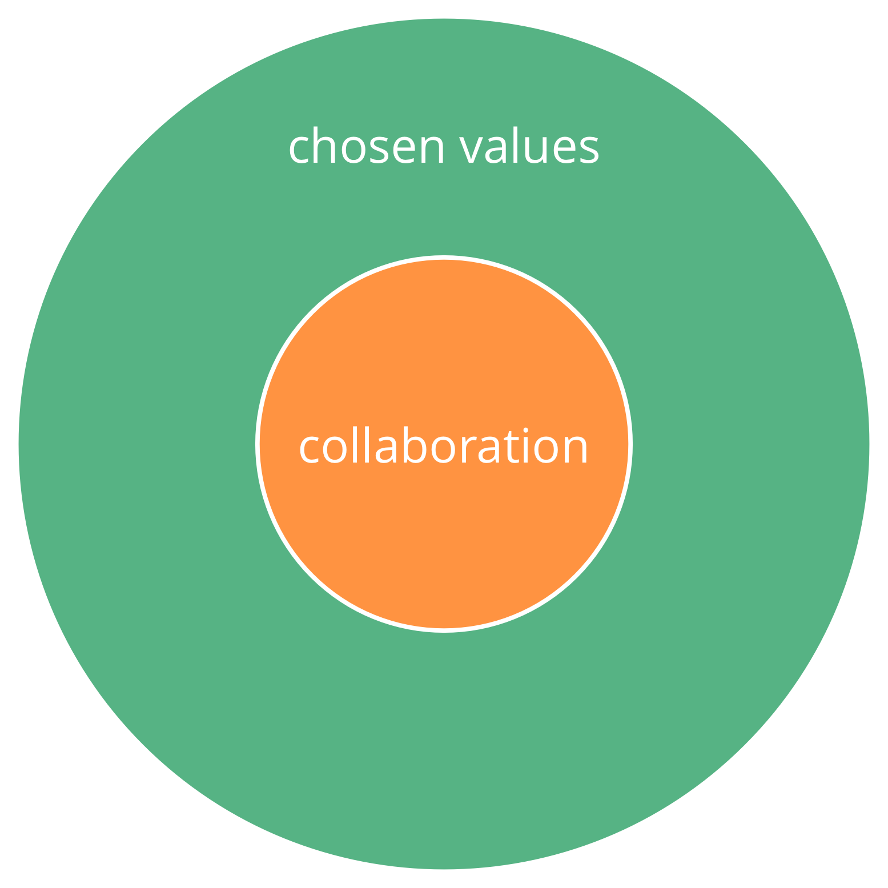

**במכוון מפתחת את התרבות בארגון שלכם.**

_**ערכים** הם עקרונות מוערכים המנחים התנהגות. ערכים מגדירים את היקף הפעולה ואת המגבלות האתיות._

- כל חבר מביא את הערכים שלו לארגון בהתבסס על חוויות אישיות ואמונות
- קבוצה או ארגון יכולים **לבחור באופן קולקטיבי לאמץ ערכים** כדי להנחות את שיתוף הפעולה שלהם

## הסכמה על ערכים (...)

ערכים מציעים הנחיות לקביעת הפעולה המתאימה, גם בהעדר הסכמים מפורשים.

Collectively adopting a set of values supports the effectiveness of an organization:

- מפחיתה את הפוטנציאל ל-**אי הבנה**
- עוזר **ליישר קו** בין קבלת החלטות ומעשים
- **מושכת חברים חדשים, שותפים ולקוחות** שנמצאים בקו אחד עם הארגון

הערכים שנבחרו הם הסכם הנהנה מ**סקירה סדירה**.

[&#9654; מנחה מדיניות](governance-facilitator.html) [&#9664; לאמץ את שבעת העקרונות](adopt-the-seven-principles.html) [&#9650; מאפשרים של יצירה משותפת](enablers-of-co-creation.html)

