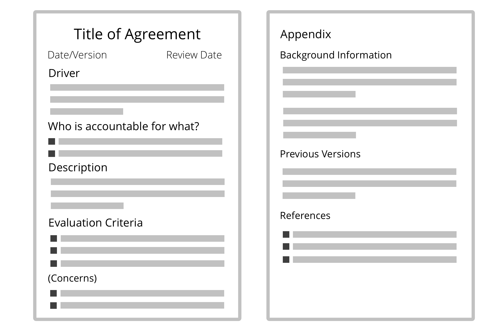

_* *הסכם** הוא הסכמה על קו מנחה, תהליך או פרוטוקול שנועד להנחות את הזרימה של הערך._

- הסכמים נוצרים כמענה למניעים ארגוניים 
- **אחריותיות כוללת** להסכם טמונה באנשים שעושים אותו
- הסכם יכול לכלול **האצלה של אחריות ספציפית** ליחידים או לקבוצות
- הסכמים **נסקרים באופן קבוע**, ומפותחים על פי הצורך
- רישמו הסכמים אלו ייתכן שתרצו להתייחס אליהם מאוחר יותר

**הערה**: ב-S3, הנחיות, תהליכים או פרוטוקולים שנוצרו על ידי אנשים בתפקידים מטופלים גם כהסכמים.

### תבנית עבור הסכמים

[&#9654; פיתוח אסטרטגיה](develop-strategy.html) [&#9650; הגדרת הסכמים](defining-agreements.html)

