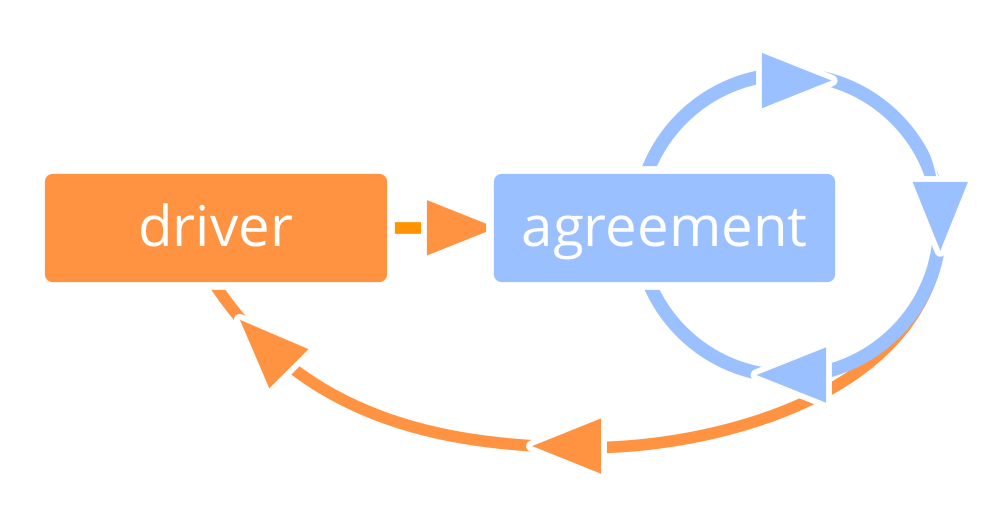

_* *הסכם** הוא הסכמה על קו מנחה, תהליך או פרוטוקול שנועד להנחות את הזרימה של הערך._

- הסכמים נוצרים כמענה למניעים 
- הסכמים הם **באחריותם של האנשים** שעושים אותם
- הסכמים **נסקרים באופן שוטף**

**הערה**: ב- S3, הנחיות, תהליכים או פרוטוקולים שנוצרו על ידי אנשים בתפקידים נחשבים הסכמים.

### תבנית עבור הסכמים

[&#9654; פיתוח אסטרטגיה](develop-strategy.html) [&#9650; הגדרת הסכמים](defining-agreements.html)

