# Introduction

# סוציוקרטיה 3.0 - מדריך מעשי לארגונים מתפתחים חסונים וזמישים

### שיתוף פעולה אפקטיבי בכל קנה מידה

- **מבוססת על עקרונות**: דרך עקבית ליצירת יושרה ארגונית ופיתוח דפוס חשיבה סוציוקרטי וזמיש
- ** גמישות**: תבניות הניתנות להתאמה, עצמאיות ומחזקות זו את זו, כדי לעזור לכם בכל ההיבטים של שיתוף פעולה
- **חינם**: licensed under a Creative Commons Free Culture License

## מה יוצא לי מזה?

סוציוקרטיה 3.0 - **המוכרת גם בשם "S3"** - מביאה לכם אוסף נרחב של הנחיות ושיטות (תבניות) אשר הוכחו כמועילות עבור ארגונים **לשיפור ביצועים, תיאום, הגשמה ורווחה**.

S3 מסייעת לכם לגלות כיצד להגיע בצורה הטובה ביותר אל היעדים שלכם ולנווט מורכבות, צעד אחד בכל פעם, **ללא צורך בהערכות מחדש רדיקלית או יוזמת שינוי גדולה**:

- פשוט התחילו עם אזור הצורך הגדול ביותר שלכם, ביחרו תבנית אחת או יותר לנסות,** נועו בקצב שלכם** ופתחו מיומנויות תוך כדי.

- **לא משנה מה העמדה שלכם בארגון**, אתם תמצאו תבנית רלוונטית ומועילה עבורכם.

## תוכן

- סקירה קצרה של כמה מושגים בסיסיים מאחורי S3
- תיאור של כל התבניות ב- S3
- נספח עם רשימת שינויים, תודות, מידע על המחברים ועל הרישיון, מילון מונחים, אינדקס

## השפעות והיסטוריה

## מושגי יסוד

לפני הצלילה אל תוך התוכן, שקלו לקחת זמן כדי ללמוד אודות כמה מושגים בסיסיים מאחורי S3:

- מהי תבנית?
- שבעת העקרונות
- דרייברים, ערך ובזבוז
- דומיינים, האצלת סמכויות ואחריותיות
- מדיניות, התארגנות-עצמית, אוטונומיה חלקית

עבור כל מושג שאתם לא מבינים בדקו במלון המונחים בסוף.

## תבניות

_**דפוס** זו תבנית לניווט בהצלחה של הקשר ספציפי._

- תבניות S3 מתגלות באמצעות תצפיות על ארגונים רבים בזמן שהם פותרים בעיות ונענים להזדמנויות
- תבניות S3 יכולות להתפתח, ולהיות מותאמות כדי שיהלמו הקשרים נבדלים
- התבניות מקובצות לפי נושא לעשר קטגוריות

## כל התבניות מבוססות על שבעת העקרונות

## שבעת העקרונות

**מועילות:** *הקדש זמן רק למה שמביא אותך קרוב יותר להשגת המטרות שלך.*

**הסכמה:** *לעשות דברים בהעדר סיבות לא לעשותם.*

**אמפיריות:** *בדוק את כל ההנחות באמצעות ניסויים, שינוי תמידי והפרכה.*

## שבעת העקרונות (המשך)

**שיפור תמידי:** *לעשות שינוי הדרגתי כדי לסגל למידה אמפירית קבועה.*

**שקילות:** *ערב אנשים בקבלה ובפיתוח החלטות שמשפיעות עליהם.*

**שקיפות:** *היפכו את כל המידע לנגיש לכל אדם בארגון, אלא אם כן יש סיבה לסודיות.*

**אחריותיות:** *הענה כשמשהו נדרש, עשה את מה שהסכמת לעשות וקח בעלות על מהלך הארגון.*

## דרייברים

_**דרייבר** הוא המניע של אדם או של קבוצה להגיב על מצב מסוים._

דרייברים:

- יכולים לשמש כדי להפיק מטרות, יעדים, כוונות, שליחות, חזון, תכלית
- יכולים להשתנות לאורך הזמן

### דרייברים, ערך ובזבוז

_**ערך** הוא החשיבות, הערך או השימושיות של משהו ביחס לדרייבר._

_**בזבוז** זה כל דבר לא הכרחי עבור – או עומד בדרך ל – מענה אפקטיבי לדרייבר._

על ידי אימוץ התפיסה של ערך ובזבוז, שיטות ורעיונות רבים מ-**ייצור רזה** ו-**פיתוח תוכנה רזה** יכולים להיות מנוצלים על ידי כך שארגונים ימשכו תבניות S3:

- מיפוי זרימת הערך
- אסטרטגיות שונות עבור מניעת בזבוז
- שיטת קנבן

## דומיינים

_* * דומיין* * הוא שטח מובהק של השפעה, פעילות וקבלת החלטות בארגון._

כל הדומיינים נמצאים בתוך הדומיין הכללי של ארגון ועשויים להיות חופפים ו/או להיות כלולים באופן מלא בדומיינים אחרים.

תחומים מואצלים לאנשים (למשל ליחידה, מחלקה, צוות או יחידים), שלוקחים אחריות עבור התחום במסגרת המגבלות המוגדרות להשפעה ולאוטונומיה שלו.

## האצלת סמכויות לדומיינים

אלה שמאצילים סמכויות לדומיין (*המאצילים*) עדיין שומרים על אחריות כוללת עבור דומיין זה, ולעתים קרובות מגדירים:

- **אחראויות עיקריות** (עבודה חיונית וקבלת החלטות שהואצלו)
- **אילוצים לאוטונומיה ולהשפעה** עבור אלה שהדומיין מואצל אליהם, בדרך כלל קשור לארגון עצמו (למשל תקציב, משאבים, רמת יפויי הכוח, דיווח)

## מניעים ותחומים

תחום יכול להיות מוגדר ביחס למניע ארגוני - המכונה **המניע הראשי** של התחום - ע"י מערכת של תת-מניעים שהארגון עשוי להפיק מהם תועלת כאשר הוא מגיב למניע הזה:

- **תחומי אחריות עיקריים**: באים ישירות מן המניע הראשי של התחום
- **מגבלות**: הנוגעות להקשר הרחב יותר של הארגון

## דומיינים ואחריותיות

- אחריותיות חלה על כל ההסכמים, כולל על הארגון עצמו, המעגלים והתפקידים
- האחריותיות הראשית של כולם היא שיתוף פעולה אפקטיבי במענה לדרייברים ארגוניים
- יחידים וקבוצות אחראים על העבודה, הלמידה המתמשכת וההתפתחות שלהם, כאשר הארגון מספק את התמיכה הנדרשת
- כולם בארגון אחראים על התאמת הפעילות עם הערכים הארגוניים

## מדיניות, אוטונומיה-חלקית והתארגנות-עצמית

**מדיניות**: להחליט ברציפות מה לעשות כדי להשיג מטרות, ולקבוע אילוצים על איך ומתי הדברים ייעשה.

**מדיניות-עצמית**: אנשים המנהלים את עצמם במסגרת אילוצים של דומיין.

**התארגנות-עצמית**: אנשים המתאמים עבודה במסגרת האילוצים שהוגדרו דרך מדיניות.

**תפעוליות** (עשיית העבודה): אנשים עושים את מה שצריך להיעשות, מודרכים על ידי תיאום ומדיניות.

**אוטונומיה-חלקית**: אנשים עם אוטונומיה ליצור ערך, מוגבלת על ידי האילוצים של הדומיין שלהם.

## מדיניות לעומת תפעול

מעקב, סקירה ופיתוח החלטות הנעשים כדי להשיג את היעדים מאפשרים לארגון ללמוד ולהשתפר באופן תמידי.

*האם זה דורש או מפיק תועלת מהחלטה של יחידים או של קבוצה?*

- כן: מדיניות 
    - אינה מכוסה על ידי הסכם קודם
    - נדרשת הסכמה, החלטה או תיקון
- לא: תפעול 
    - מכוסה על ידי ההסכם הקודם (אלה שאחראים חופשיים לפעול)
    - צריך להיעשות

# The Patterns

## יצירה משותפת ופיתוח 

### מענה למניעים ארגוניים

*הבהירו מה קורה ומה נדרש ביחס לארגון, ותענו כנדרש.*

מענים למניעים:

- פעולה
- החלטה (כולל יצירת תפקיד, מעגל, צוות סייוע או פתיחת תחום)

#### תיקוף מניעים ארגוניים

מניעים מסויימים (ישירות או בעקיפין) קשורים למניע העיקרי של הארגון, אלה נחשבים **מניעים ארגוניים**. מניעים אחרים לא נופלים בתוך התחום של הארגון.

דרך פשוטה לתקף מניעים ארגוניים היא על ידי בדיקה:

*האם מענה למניע זה ישפר – או ימנע חסמים – של זרימת הערך למניע ארגוני קיים? כלומר, האם זה יכול לעזור לנו או להזיק לנו?*

#### סקירת מניעים

התגובה למניע היא בדרך כלל ניסוי שהתפתח לאורך זמן, בהתבסס על למידה.

- האם התיאור של המצב עדיין נכון?
- האם אנחנו עדיין משייכים את אותם הצרכים עם המצב?
- האם המניע עדיין נמצא בתוך התחום שלנו?
- האם המניע עדיין רלוונטי?

### ניווט דרך מתח

**זיהוי ולקיחת אחריות למניעים ארגוניים.**

**כל החברים** מביאים מודעות אל מה שעשוי לסייע לארגון או לפגוע בו, ומתכוונים להיות אחראים לדרייברים בצורה מועילה.

**מתח** הוא חוויה אישית: סימפטום של סתירה בין תפיסתו של אדם למצב, לבין ציפיותיו (או העדפותיו).

### ניווט דרך מתח (המשך)

**אתגרים והזדמנויות ** עבור ארגון מתגלים כאשר אנשים נעשים מודעים למתח שהם חווים ביחס לעצמם.

כדי **לגלות מניעים**, הביטו מאחורי המתח ותארו מה קורה ומה צריך. לפעמים החקירה שלנו מגלה תפיסות מוטעות והמתח נעלם.

מודעות **למניעים ארגוניים** יכולה להיות מועברת לתחום המתאים כדי שיטפלו בו.

### ניווט דרך מתח (המשך)

### תיאור מניעים

**לתאר את המניעים כדי להבין, לתקשר ולזכור אותם.**

דרך פשוטה לתאר מניע היא עם הצהרה המכילה:

- תיאור קצר של המצב (תצפית) 
- תיאור של מה צריך (חסר) ביחס למצב 

כאשר יש מחלוקת לגבי מה שצריך, זה עוזר להתרחק מפתרונות ספציפיים.

> דוגמה להצהרת מניע:
> 
> *"המטבח מבולגן: אין כוסות נקיות, הכיור מלא כלים, ולא ניתן לתפוס במהירות קפה ולחזור חזרה לעבודה. אנחנו צריכים להבין איך אנחנו יכולים לשמור על המטבח במצב שמיש."*

** הצהרת המניע** לוכדת מידע בדיוק מספיק כדי לתקשר את הצורך בפעולה או החלטה. מידע נוסף על כדי לגלות היקף ופרטים של המניע ניתן לרשום בנספח.

מניע יכול להיות מתואר כבעיה או הזדמנות, בהתאם לפרספקטיבה של האדם או הקבוצה.

### קבלת החלטה בהסכמה

**תהליך קבוצתי (מונחה) לצורך קבלת החלטות.**

- מזמין הסתייגויות, ומשלב את החוכמה שהן חושפות, כדי לפתח הצעות או הסכמים קיימים
- הימנעות מהסתייגויות יכולה לפגוע במטרות של הקבוצה או הארגון
- הסתייגויות לא מטופלות מונעות מהצעות להפוך להסכמים
- הצעות צריכות רק להיות *טובות מספיק לעכשיו ובטוחות מספיק לנסות* עד הסקירה הבאה

#### חוזה משתמע של הסכמה

- בהעדר הסתייגויות נגד הסכם, אני מתכוון להמשיך עם ההסכם על פי מיטב יכולתי.
- אני מסכים לשתף הסתייגויות ברגע שאני אהיה מודע אליהן.

### הסתייגות

_**הסתייגות** היא הסיבה מדוע עשיית משהו עומדת בדרך של מענה אפקטיבי (יותר) לדרייבר._

הסתייגות מכילה מידע שחושף:

- תוצאה בטוחה או סבירה של נזק (לא נחשב בטוח מספיק לנסות)
- דרכים לשיפור הצעות, החלטות, הסכמים קיימים או פעולות

#### תיקוף הסתייגויות

זו האחריות של יחידים להעלות הסתייגויות פוטנציאליות.

אלו שאחראים לפעולה או להסכם (המוצע) המדובר, אחראים על *בחינת טיעונים וטיפול בהסתייגויות תקפות.*

הימנעות הסתייגויות יכולה לפגוע ביכולת של יחידים, קבוצות או של כל הארגון מלתת מענה לדרייברים ארגוניים.

היכולת להעלות הסתייגויות *פוטנציאליות* בכל רגע אומרת שהחלטות צריכות רק להיות *טובות מספיק לעכשיו ובטוחות מספיק לנסות*.

#### תיקוף הסתייגויות (המשך)

*איך עשיית הדבר הזה תפגע – או תחמיץ הזדמנות לשיפור – זרימת ערך למניע ארגוני כלשהו?*

הסתייגויות עוצרות:

- פעולה נוכחית או מתוכננת
- אנשים מלהוציא לפועל החלטות
- הסכמים קיימים מלהמשיך בלי לשקול אותם מחדש
- הצעות מלהפוך להסכמים

#### הבנת הסתייגויות

כמה שאלות מועילות:

- איך הטענה מתייחסת להצעה או להסכם ספציפי זה?
- האם הטיעון חושף כיצד **פעולה או הסכם (מוצעים או נוכחיים)**: 
    - פוגעים במענה למניע ארגוני כלשהו?
    - ניתנים לשיפור עכשיו?
    - מונעים או מצמצמים את התרומה של מישהו כלפי מענה למניע?
    - מתנגשים עם ערכי הארגון?
    - נחשבים לא בטוחים מספיק לנסות?

#### חששות

**חשש ** זו *דעה* שעשיית משהו (אפילו אם נחשב כ*טוב מספיק לעכשיו ובטוח מספיק לנסות*) **עשויי** לפגוע – או לפספס הזדמנות לשיפור – זרימת ערך למניע ארגוני.

בקבלת החלטה בהסכמה, חששות:

- יכולים לידע על דרכים להתפתחות נוספת של הסכמים (כולל קריטריונים להערכה והתדירות של ההערכה) 
- נשמעים אם יש זמן או שהם נחשבים חשובים
- נרשמים ביומן הרישום

אם אנשים מאמינים שהצעה עשוייה להיות לא "בטוחה מספיק לנסות", הם יכולים להעלות חשש כהסתייגות כדי לבדוק עם האחרים לגבי הסבירות של הפגיעה.

### פתירת הסתייגויות

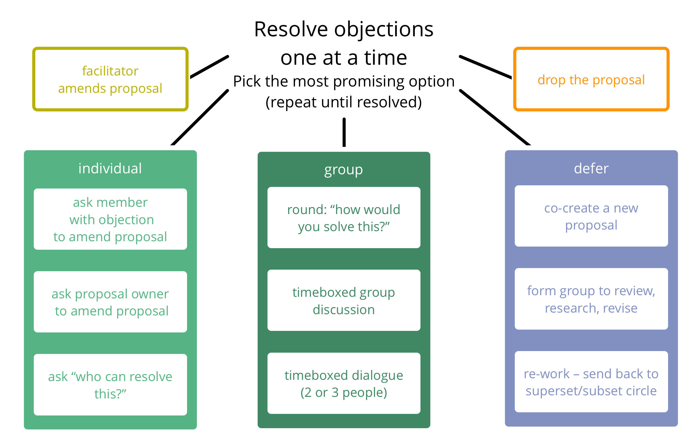

#### דרך לפתירת הסתייגויות

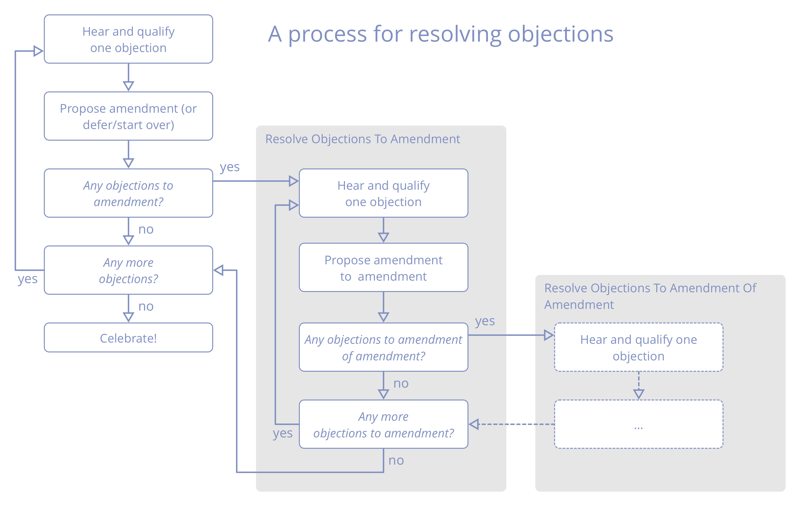

### הערכת הסכמים

סקירה סדירה של הסכמים היא נוהג חיוני עבור ארגון לומד; פיתוח תמידי של כל ההסכמים, ומניעת בזבוז:

- להסתגל להקשר משתנה
- שילוב למידה: 
    - *כיצד הסכם זה עזר לנו?*
    - *כיצד ניתן לשפר הסכם זה?*
    - *האם יש סיבה למה לא להמשיך עם הסכם זה?*

### הערכת הסכמים (המשך)

- הכנה
    
    - תזמון מועד לסקירה
    - לוודא שהמידע הנחוץ זמין

- בהמשך
    
    - להסכים על תאריך הבחינה הבאה
    - תיעוד / רישום הודעות
    - מעקב אחר משימות והחלטות
    - השפעות על הסכמים נלווים

### הערכת הסכמים (המשך)

- הערכת הסכמים יכולה להיות פשוטה כמו בדיקה האם זה עדיין רלוונטי, ואין הסתייגות להשאיר את ההסכם כפי שהוא 
- הסכמים לעיתים קרובות נסקרים שוב ב*פגישות מדיניות* 
- לפעמים זה מועיל לתזמן פגישה ייעודית לסקירה של הסכם 
- התאמת תדירות הסקירות על פי הצורך
- עריכת סקירה מוקדם יותר אם יש צורך
- אלמנטים של תהליך זה יכולים לשמש גם אנשים כדי להעריך את ההחלטות שהם עושים

### אלה שמושפעים מחליטים

ערבו את כל מי שיושפעו מההחלטה, כדי לשמור על שקילות ואחריות, והגדילו את כמות המידע הזמין על הנושא.

עבור קבוצות גדולות יותר:

- הנחו את התהליך במספר שלבים וצרו קבוצות קטנות יותר שיבחרו נציגים
- הגדירו תהליך וירטואלי, אסינכרוני, מוגבל בזמן ובשלבים

שקלו לכלול את אלה שמושפעים גם בסקירה ובהערכה של החלטות.

### גיבוש הצעה

**תהליך קבוצתי (מונחה) ליצירה משותפת של מענה לדרייבר.**

- מתבסס על האינטליגנציה הקולקטיבית ועל מגוון הפרספקטיבות בתוך קבוצה
- מערב אנשים ביצירה משותפת של הסכמים
- מטפח אחריות ותחושת בעלות

גיבוש ההצעה עשוי להיות גם בשימוש על ידי אדם יחיד.

#### שלבי גיבוש הצעה

- **הסכימו למניע** *האם המניע הזה רלוונטי עבורנו כדי להגיב אליו? האם הצהרת המניע מתארת תיאור מדויק של מה שקורה ומה שנדרש?*
- **העמקת הבנה משותפת של מניע**: מזמינה שאלות חיוניות כדי להבין פרטים נוספים על המניע.
- **אסוף שיקולים** המנוסחים כשאלות המתייחסות לפתרונות אפשריים. שאלות חושפות או אילוצים (שאלות איסוף מידע) או אפשרויות (שאלות יצרניות).
- **ענו** על כל שאלות איסוף המידע אם אפשר.
- **תתעדפו** שיקולים.
- **איספו רעיונות** כמרכיבים אפשריים עבור הצעה.
- **תכננו הצעה** על מנת לטפל במניע בהתחשב ברעיונות היצירתיים ובמידע שנאספו עד עכשיו. זה בדרך כלל נעשה על ידי קבוצה קטנה יותר (כווננים).

#### בחירת כווננים

- מי צריך להיות שם?
- מי רוצה להיות שם?
- מי עוד יכול לתת תרומה משמעותית?
- שקול מומחיות, מבט מבחוץ והשראה
- כל הסתייגות לקבוצה זו?

### בחירה לתפקיד

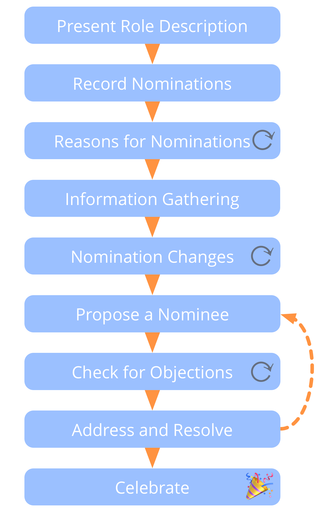

**תהליך קבוצתי לבחירת אנשים לתפקידים.**

- על אנשים להימנע מלהביע עניין לפני הבחירה
- מועמדויות נעשות על סמך חוזק הסיבה, לא על פי רוב
- אתה יכול להציע את עצמך או לוותר
- כאשר בודקים הסתייגויות, לשאול את האדם המועמד אחרון

הסתייגויות למועמד יכולות להיפתר בדרכים רבות, כולל תיקון תיאור התפקיד או על ידי מינוי אדם אחר.

**הערה:** תבנית זו יכולה לשמש גם עבור בחירה בין מגוון רחב של אפשרויות בנסיבות אחרות.

### מיפוי מניעים

פורמט של סדנה כדי לזהות מענה אפקטיבי למצב מורכב: לארגן סטארט-אפים, להריץ פרויקטים, להתמודד עם מכשולים או הזדמנויות גדולים, להתאים את המבנה הארגוני לזרימת הערך.

קבוצות קטנות או גדולות מזהות ומתעדפות מניעים, מתקדמות במהירות מן הרעיון לפעולה בצוותים בהתארגנות-עצמית.

### מיפוי מניעים (המשך)

#### מיפוי מניעים: תבנית עבור תחומים

## פיתוח עמיתים 

### בקשת עזרה

**פרוטוקול פשוט ללמידה, שיתוף מיומנויות, ובניית קשרים, עם כבוד לאוטונומיה של אנשים.**

שאל מישהו, "*האם אתה מוכן לעזור לי עם...*?" האדם שנשאל עונה עם "*כן*" או "*לא*" פשוטים.

- אם הבקשה נדחית, האדם המבקש מקבל את התשובה ללא משא ומתן או חקירה
- אם הבקשה אינה ברורה, שאל לגבי מידע נוסף
- אם אתה מקבל את הבקשה לעזרה, תמוך בעמית שלך בצורה הטובה ביותר שאתה יכול

### משוב עמיתים

הזמן עמיתים כדי לתת לך משוב בונה על:

- ביצועים בתפקיד
- משוב כללי על השתתפות ושיתוף הפעולה שלך
- איזשהו היבט מסוים שאתה עשוי להיות מעוניין בו

שיקולים:

- בקש מהעמיתים לקחת קצת זמן כדי להתכונן
- הזמן גם **הערכות** וגם **הצעות ישימות לשיפור**
- שאל שאלות כדי להבין טוב יותר את המשוב, והימנע מלדון או לשפוט אותו
- החלט עבור עצמך מה תעשה עם המשוב

### סקירת עמיתים

**אנשים תומכים אחד בשני כדי ללמוד ולהתפתח בתפקידים ובקבוצות שהם משרתים.**

נושא התפקיד - או הקבוצה - מוביל את סקירת העמיתים על ידי הגדרת התהליך ומדבר ראשון בכל שלב.

ודא להזמין אנשים עם פרספקטיבות משלימות לתרום לסקירה, וכן מנחה.

הצעות לשיפור חלות על התפתחות אישית, שיתוף פעולה, עדכונים לתיאור הדומיין (כולל הצהרת הדרייבר) ואסטרטגיה.

### סקירת עמיתים (המשך)

#### שיפור מתמיד ביכולתם של אנשים למלא באפקטיביות תפקידים או לשתף פעולה בקבוצות.

### תוכניות פיתוח

**תוכנית כיצד לפתח דרכים אפקטיביות יותר של לקיחת אחריות עבור דומיין, מוסכמת בין המאציל למואצל.**

תוכנית הפיתוח עשויה להתייחס לאדם בתפקיד, או לקבוצה (למשל, מחלקה, מעגל, צוות או דומיין פתוח).

הפיתוח עשוי להתרחש בצורה של דיוק תיאור הדרייבר והדומיין, תיקונים לאסטרטגיה, הסכמים חדשים או מעודכנים ופעולות ספציפיות שיש לנקוט, או בדומיין של המאציל, או בדומיין של המואצל.

תוכנית פיתוח (וכל ההמלצות הנלוות לשינויים בתיאור הדומיין ובהצהרת הדרייבר) מחייבת הסכמה של המאציל ושל המואצל.

## מאפשרים של יצירה משותפת 

### השתתפות מיומנת

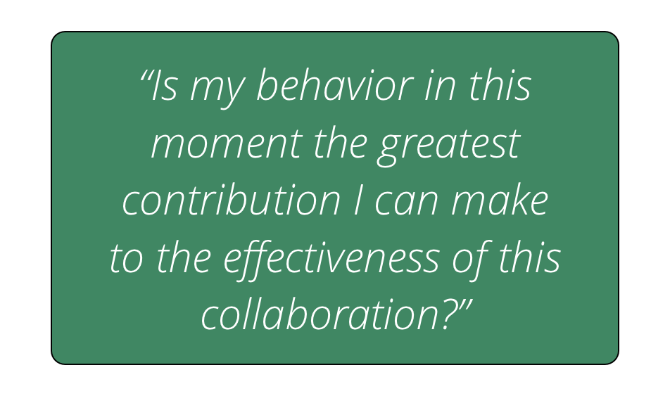

**מחויבות הפרט** להתפתחות אינטראקציות מועילות ושיתוף פעולה אפקטיבי:

- באופן פעיל **לקחת בחשבון ולעקוב אחר כל ההסכמים** שנעשו, בצורה הטובה ביותר האפשרית, בהתחשב בנסיבות
- **לפתח מודעות והבנה** לצרכים של הפרט והקולקטיב
- **לפתח את הכישורים הדרושים** כדי לעשות זאת
- **לתמוך באחרים** לעשות את אותו הדבר 
- הבאת חסמים לתשומת לבם של אחרים במידת הצורך

השתתפות מיומנת עשוייה לכלול הפרעה, הסתייגות או שבירה של הסכמים.

#### היתרונות של השתתפות מיומנת

- מאפשרת יצירה משותפת והתפתחות של הסכמים
- עוזרת ליצור צוותים חזקים יותר
- בונה אחריות אישית, יושרה ואמון
- יוצרת תרבות של תמיכה הדדית ושיתוף פעולה הדוק
- אפילו יותר חזקה כאשר מאומצת על ידי רבים

#### השתתפות מיומנת: הערכה עצמית

- איך אתמוך בעצמי ובאחרים בלהשתתף בצורה יותר מיומנת? 
- היכן האינטראקציות שלי עם אחרים אינן עוזרות או לא מועילות?
- אילו הסכמים קשה לי לקיים או לתרום להם? מה אוכל לעשות כדי לטפל בכך?
- אילו מיומנויות אני יכול לפתח, אשר יתמכו בי להשתתף בצורה יותר מיומנת?
- מה המשמעות של השתתפות מיומנת ביחס ל: 
    - פעילויות היומיומיות שלי?
    - שיתוף הפעולה ולאינטראקציה עם אחרים?
    - ארגון? ... לקוחות או לצרכנים שלנו?
    - סביבה הרחבה יותר?

### לאמץ את שבעת העקרונות

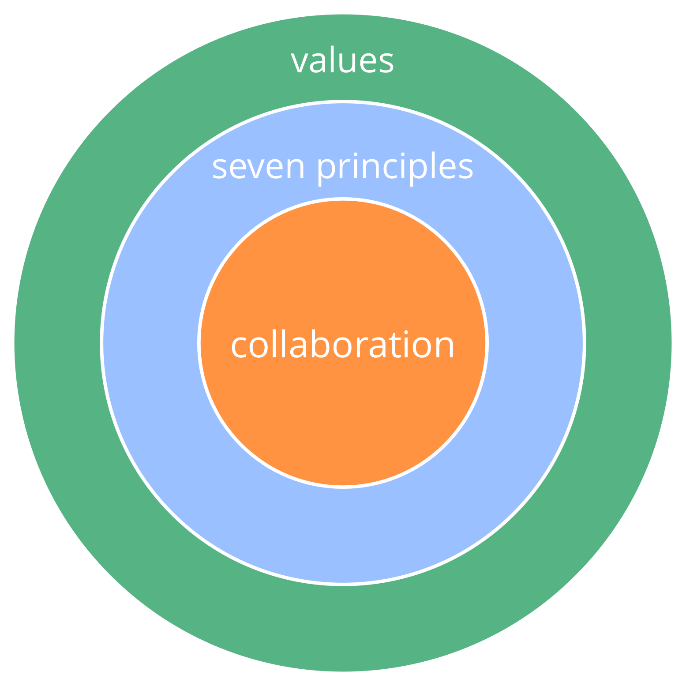

### לאמץ את שבעת העקרונות (המשך)

- תיאום שיתוף הפעולה עם שבעת העקרונות
- אימוץ שבעת העקרונות מקטין את מספר ההסכמים המפורשים הנדרשים, ומנחה את ההתאמה של תבניות S3 כך שיתאימו להקשר של הארגון
- הערכים בפועל של הארגון צריכים לאמץ את עקרונות סוציוקרטיה 3.0

### הסכמה על ערכים

**במכוון מעצבת את התרבות בארגון שלכם.**

***ערך** הוא עקרון שמנחה התנהגות. ערכים מגדירים מרחב לפעולה ולאילוצים אתיים.*

- כל חבר מביא את הערכים שלו לארגון בהתבסס על חוויות אישיות ואמונות
- קבוצה או ארגון יכולים **לבחור באופן קולקטיבי לאמץ ערכים** כדי להנחות את שיתוף הפעולה שלהם

### הסכמה על ערכים (המשך)

- ערכים מציעים הנחיות לקביעת הפעולה המתאימה, גם בהעדר הסכמים מפורשים
- הגדרת ערכים היא **אסטרטגיה** התומכת באפקטיביות הארגון: 
    - מפחיתה את הפוטנציאל ל-**אי הבנה**
    - **מישרת קו** בין קבלת החלטות ומעשים
    - **מושכת חברים חדשים, שותפים ולקוחות** שנמצאים בקו אחד עם הארגון
- ערכים הם הסכם ולכן כפופים **לסקירה סדירה**

### מנחה מדיניות (תפקיד)

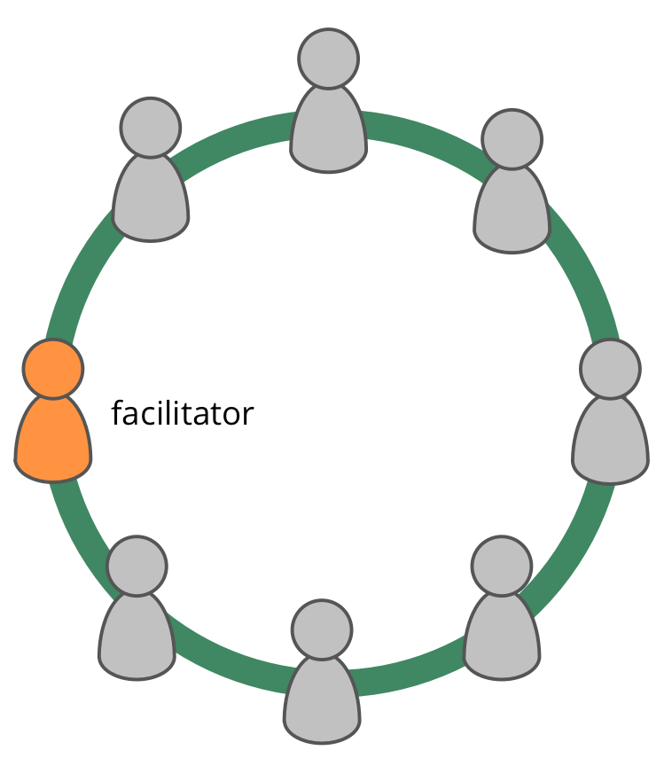

מנחה מדיניות:

- אחראי להבטיח שפגישות מדיניות מונחות, נשארות על המסלול, והן מוערכות
- הוא (בדרך כלל) נבחר על ידי קבוצה מבין חבריה
- מקנה לעצמו היכרות עם בקלוג המדיניות
- לעתים מזמין אחרים כדי להנחות חלק מהדברים שעל סדר היום

### מנחה מדיניות (המשך)

כאשר משתמשים ב-S3 למדיניות, המנחה צריך להקנות לעצמו היכרות עם התבניות הבאות:

- סבבים
- גיבוש הצעה
- קבלת החלטה בהסכמה
- בחירה לתפקיד
- הערכת פגישות
- פתירת הסתייגויות
- סקירת עמיתים

### שבירת הסכמים

- היא לפעמים **נחוצה**...
- אבל עלולה לבוא **במחיר** לקהילה
- היה אחראי! 
    - **נקה** הפרעות
    - **עדכנו ** בהקדם האפשרי את אלה שמושפעים או שנושאים באחריות
    - **זמו שינויים** במקום שוב ושוב לשבור את אותו ההסכם

### עריכת חוזים ואחריותיות

כאשר נכנסים להסכמים פורמליים או לא פורמליים עם אחרים:

- ודאו שכל הצדדים מבינים מה מצופה מהם והם מתכוונים לקיים את ההסכם
- ודאו שההסכם מטיב עם כל הצדדים, ושהציפיות מציאותיות

קחו אחריות על שבירת הסכמים.

### עריכת חוזים ואחריותיות (המשך)

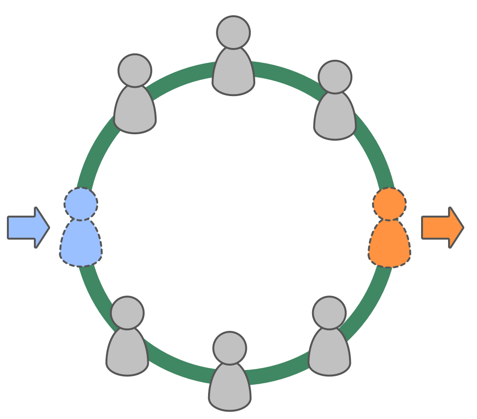

כדי לשמור על תרבות ארגונית, יש לשמור על אחריותיות-עצמית ולעזור שלחברים חדשים בארגון או במעגל תהיה התחלה חלקה:

- הגדרת ציפיות עבור חברים חדשים (הן בהתאמה התרבותית והן בכישורים הנדרשים)
- עריכת החוזה עפ"י התרבות הארגונית וגם עפ"י הדרישות המשפטיות
- שקלו תקופת מבחן
- שיהיו לכם נהלים ברורים להפרת החוזה

### שכר שקוף

- שכר שקוף צריך להיות הוגן
- להוגנות יש כמה ממדים 
- תפיסת ההגינות היא ספציפית להקשר הארגוני
- לקחת בחשבון חברים ובעלי עניין רלוונטיים (למשל, משקיעים)
- ליצור נוסחת שכר: 
    - קבועה: מבטיחה קיום
    - משתנה: חלוקה הוגנת של רווחים ועלויות
- לשקול גמול על שינוי התפקידים
- ליצור אסטרטגיה למעבר לחוזים חדשים והסכמי פיצויים

#### שתי דרכים לחשיפת משכורות

### תפקיד תומך

**החלת תבנית התפקיד על קבלנים חיצוניים.**

- להבהיר ולתאר את הדרייבר עבור התפקיד
- ליצור תיאור של הדומיין
- ליישם תהליך בחירה
- הגבלת תקופת החוזה
- סקירת עמיתים סדירה מובנית

תפקידים תומכים עשויים להיות תפעוליים בלבד, וקבלנים חיצוניים מסכימים לקחת אחריות על תפקידם.

### תקנון

אבטחו את העקרונות והתבניות של S3 בתקנון שלכם על פי הצורך כדי להגן על **תקינות משפטית** ועל **התרבות הארגונית**

שקלו:

- הסכמה ושקילות בקבלת החלטות
- תהליך בחירה לתפקידי מנהיגות
- מבנה ארגוני, ערכים ועקרונות
- השפעת הבעלים או בעלי המניות
- שיתוף רווחים ועלויות

## בניית ארגונים 

### האצלת השפעה

ביזור הכוח להשפיע במסגרת מגבלות שהוגדרו. מאפשר לאנשים להחליט ולפעול למען עצמם במענה למניעים של הארגון.

מאציל הסמכויות תומך באנשים בלספק ערך על ידי:

- הגדרת תחומי אחריות ואוטונומיה בבירור
- הבטחת למידה ופיתוח מתמשכים
- מתן תמיכה על פי הצורך

התאמת מגבלות באופן הדרגתי, בהתחשב ביכולות, במהימנות ובתוצאה.

ביזור ככל האפשר, שימור השפעה על פי הצורך.

### מעגל

_**מעגל** הוא קבוצת אנשים שקולה, בעלת משילות-עצמית וחצי-אוטונומית, המשתפת פעולה כדי לקחת אחריות על דומיין._

מעגל:

- יכול להיות קבוע או זמני
- עשוי להיות בהתארגנות-עצמית
- הוא אחראי על ההתפתחות של עצמו ועל אוסף ההסכמים שלו

### מעגל (המשך)

- **אוטונומיה-חלקית** 
    - המעגל פועל במסגרת מגבלות התחום שלו
    - כל מעגל יכול ליצור ערך באופן אוטונומי
- **משילות-עצמית**: 
    - מעגל מחליט באופן רציף מה לעשות כדי להיות אחראי לתחום שלו, וקובע מגבלות על איך ומתי הדברים ייעשו.

### תפקיד

**האצלת אחריות עבור תחום ליחידים.**

תפקיד הוא שטח אחריות המוגדר על ידי התחום ומוקצה ליחיד **(נושא התפקיד),** שיש לו אוטונומיה להחליט ולפעול במסגרת המגבלות של תחום התפקיד.

נושאי תפקידים מובילים ביצירת אסטרטגיה לאיך להיות אחראים על התחום שלהם, ולפתח את האסטרטגיה שלהם בשיתוף פעולה עם מאציל הסמכויות.

תפקיד הוא דרך פשוטה עבור קבוצה להאציל משימות חוזרות או שטח מסוים של עבודה לאחד מחבריה.

### תפקיד (המשך)

- אנשים יכולים להיות ביותר מתפקיד אחד, ותפקידים ניתנים למלוי על ידי יותר מאדם אחד
- נושאי תפקיד נבחרים בהסכמה ולתקופת זמן מוגבלת
- עמיתים תומכים אחד בשני על מנת להתפתח בתפקידים שהם ממלאים

נושא תפקיד יכול לתחזק יומן ובקלוג מדיניות כדי לפתח את הגישה שלו כלפי מתן ערך.

**הערה**: ב-S3, הנחיות, תהליכים או פרוטוקולים שנוצרו על ידי אנשים בתפקידים מטופלים כמו הסכמים.

#### תפקיד: דרך אחת להיות אחראי עבור תחום

### קישור

**מאפשר זרימת מידע והשפעה בין שתי קבוצות.**

קבוצה בוחרת את אחד מחבריה כדי לייצג את האינטרסים שלה בקבלת החלטות המדניות של קבוצה אחרת.

### קישור כפול

**מאפשר זרימה *דו-כיוונית* של מידע והשפעה בין שתי קבוצות.**

שתי קבוצות התלויות זו בזו כל אחת בוחרת את אחד מחבריה כדי לייצג את האינטרסים שלה בהחלטות המדיניות של הקבוצה השנייה.

- יוצר שקילות בין שתי קבוצות
- יכול לשמש כדי למשוך מידע בעל ערך במבנים היררכיים

### נציג (תפקיד)

נציגים (מוכר גם בשם קישורים):

- שומרים על האינטרסים של קבוצה אחת בקבוצה אחרת
- נבחרים לתקופת זמן מוגבלת
- משתתפים כחברים מלאים **בהחלטות המדיניות** של המעגל שאליו הואצלו להם סמכויות, והם יכולים: 
    - להעלות פריטים אל סדר היום
    - להשתתף בגיבוש הצעות
    - להסתייג להסכמים ולהצעות (כאשר יש סיבה לעשות זאת)

### צוות מסייע

קבוצה של אנשים עם המנדט לפעול על פי אוסף ספציפי של דרישות שהוגדרו על-ידי מאציל הסמכויות.

צוות מסייע:

- מהווה דרך למאציל הסמכויות להרחיב את היכולת שלו
- עשוי להיות בהתארגנות-עצמית או מונחה על ידי רכז שנבחר על ידי המאציל
- נשלט על ידי מאציל הסמכויות
- מפיק תועלת מתחום המוגדר בבירור

חברי הצוות המסייע:

- יכולים להסתייג להחלטות מאציל הסמכויות שמשפיעות עליהם
- יכולים להוסיף פריטים לבקלוג המדיניות של מאציל הסמכויות
- עשויים להיות מוזמנים לבחור נציג כדי שישתתף בקבלת החלטות המדיניות של מאציל הסמכויות

### תחום פתוח

**דרך לקבלת אחריות במתכוון עבור תחום ע"י הזמנה במקום מינוי.**

מאציל הסמכויות של התחום הפתוח מבהיר:

- מניע ראשי, אחריות והגבלות עיקריות של התחום הפתוח
- מי מוזמן לתרום לתחום הפתוח
- הגבלות הקשורות להשתתפותו של מאציל הסמכויות במדיניות של התחום הפתוח

מאציל הסמכויות של התחום הפתוח אחראי על הבטחת סקירה סדירה של התחום הפתוח.

בהתאם למגבלות שנקבעו על ידי מאצילי הסמכויות, התורמים רשאים להיות אחראים לעבודה ו/או למדיניות של התחום הפתוח.

### מערכות פתוחות

ארגון יכול להפיק תועלת מהתקשרות מכוונת ומלמידה מאחרים.

הכרה בתלות ההדדית שלו, ארגון יכול במודע להזמין **מידע, השפעה, או מיומנויות חיצוניים** כדי שיסייעו עם קבלת החלטות וכדי לתמוך בלמידה קולקטיבית.

### מערכות פתוחות (המשך)

- **מומחים חיצוניים** יכולים להציע נקודות מבט חיצונית ולהביא ידע, הבנה ומיומנויות
- **נציגים של צדדים מושפעים ** יכולים להביא מידע ולהשפיע על קבלת ההחלטות בדרכים המביאות תועלת ליעדים הכלליים (ראה אלה שמושפעים מחליטים)

## הכנסת S3 

### התאמת התבנית להקשר

**התאימו ופתחו את תבניות S3 כדי שיתאימו להקשר הספציפי שלכם.**

- ודאו כי כל מי שמושפע מההתאמה: 
    - מבין למה זה הכרחי להתאים את התבנית
    - נוכח או מיוצג כאשר עושים זאת
- השתמשו בעקרונות S3 כמדריך עבור ההתאמה
- עירכו ניסויים עם התאמות במשך מספיק זמן כדי ללמוד על היתרונות ועל מלכודות פוטנציאליות
- שקלו לשתף התאמות בעלי ערך עם קהילת S3

### צרו מערכת משיכה לשינוי ארגוני

**צרו סביבה המזמינה ומאפשרת לחברי הארגון להניע את השינויים.**

שנו דברים כאשר יש ערך לעשות זאת:

- הכניסו תבניות שפותרות בעיות נוכחיות ובעיות חשובות 
  - אל תקלקלו את מה שכבר עובד!
  - פגשו את כולם איפה שהם נמצאים…
  - ... ותנו להם לבחור את הקצב שלהם
- שקלו עשיית כל שינוי מרצון!

### היו השינוי

**הובילו ע"י מתן דוגמה.**

התנהגו ופעלו בדרכים שתרצו שאחרים יתנהגו ויפעלו.

### הזמינו את השינוי

**דרך המאפשרת ליחידים ליזום ולקדם שינוי.**

- היו השינוי שאתם רוצה לראות
- השתמשו והתאימו את תבניות S3 כדי לענות למניעים כאשר זה מועיל לעשות זאת
- ספרו את הסיפור על איך ולמה אתם משתמשים בתבניות מ-S3 כולל תיעוד תוצאות, הצלחות וכישלונות
- הזמינו אחרים להתנסות איתכם

### אימוץ S3 פתוח

**הזמינו את כולם ליצור ולהריץ ניסויים לפיתוח הארגון.**

- זהו את הדרייבר עבור משיכה של תבניות S3
- תזמנו אירועי מרחב פתוח באופן סדיר: 
    - הזמינו את כל החברים ליצור ולהריץ ניסויים
    - הגדירו מגבלות עבור ניסויים: למשל עקרונות S3
    - סקרו ולמדו מן הניסויים במרחב הפתוח הבא
    - חיזרו על התהליך

### שיפור תמידי של תהליך העבודה עם S3

**כדי לחשוף מניעים וליצור מערכת משיכה מבוססת מדדים לשינוי ארגוני.**

- הציגו את העיקרון של הסכמה *וניווט דרך מתח* כדי לפתח תהליך עבודה בצוות אחד
- שקלו בחירת מנחה והסכמה על ערכים
- עוררו שיפור תמידי (למשל באמצעות קנבן)
- חברי צוות ימשכו תבניות S3 עפ"י הנדרש
- הרחיבו את הטווח של הניסוי באופן איטרטיבי
- חפשו בכוונה מכשולים 

#### בזבוז ושיפור תמידי

**בזבוז*** זה כל דבר לא הכרחי עבור – או עומד בדרך ל – מענה אפקטיבי למניע.*

- בזבוז קיים בצורות שונות, ברמות שונות של הפשטה (משימות, תהליכים, מבנה ארגוני, מודלים מחשבתיים...)
- יצירת תהליך למניעה מתמשכת של בזבוז מאפשר התפתחות טבעית של ארגון לקראת אפקטיביות רבה יותר
- הסתגלות להקשר משתנה בנויה בתוך התהליך

## הגדרת הסכמים 

### מחזור החיים של הסכם

### הסכם

_* *הסכם** הוא הסכמה על קו מנחה, תהליך או פרוטוקול שנועד להנחות את הזרימה של הערך._

- הסכמים נוצרים כמענה למניעים 
- הסכמים הם **באחריותם של האנשים** שעושים אותם
- הסכמים **נסקרים באופן שוטף**

**הערה**: ב- S3, הנחיות, תהליכים או פרוטוקולים שנוצרו על ידי אנשים בתפקידים נחשבים הסכמים.

#### תבנית עבור הסכמים

### פיתוח אסטרטגיה

_**אסטרטגיה** היא גישה ברמה גבוהה כיצד אנשים ייצרו ערך על מנת לקחת אחריות בהצלחה עבור דומיין._

- ארגון, קבוצה או נושא תפקיד יכולים לפתח אסטרטגיה משלהם
- אסטרטגיה כוללת לעתים קרובות תיאור של התוצאה המיועדת
- מאחר שהמאצילים חולקים אחריות עבור הדומיין, חשוב שהם יסקרו את האסטרטגיה, יזהו מכשולים פוטנציאליים ויציעו שיפורים 
- האסטרטגיה היא הסכם משותף בין מאציל(י) הסמכויות לבין המואצל(ים) שנסקר באופן שוטף, ומעודכן במידת הצורך (*לשנות או להתמיד*)

### אסטרטגיה (המשך)

#### אסטרטגיות מיושמות, ומדויקות דרך התנסות ולמידה.

### הבהרת תחומים

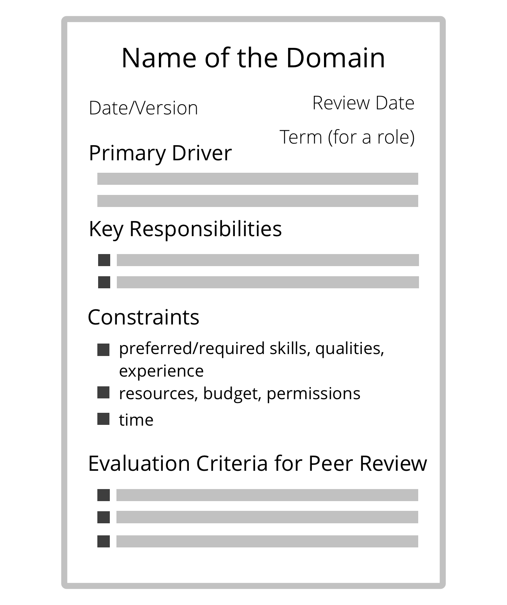

הבנה ברורה של תחומי האחריות והאוטונומיה של אנשים מאפשרת יעילות רבה יותר, שיתוף פעולה אפקטיבי וזמישות בכל רחבי הארגון.

דרך פשוטה כדי להבהיר את התחומים היא עם **תיאור תחום** המכיל:

- מניע ראשי
- תחומי אחריות עיקריים
- מגבלות
- קרטריונים להערכה עבור סקירת עמיתים
- תקופת כהונה (לתפקיד)
- (גירסאות קודמות)

### הבהרת תחומים (המשך)

ניתן ליצור תיאורי תחומים עבור תפקיד, עמדה, מעגל, צוות, תחום פתוח, מחלקה, יחידה או הארגון כולו.

אתם יכולים להתחיל או על ידי הבהרת תחומים קיימים או לפחות להבהיר את החדשים.

### תוצאה מיועדת

- תיאור תמציתי של התוצאה הצפויה של הסכם, פעילות, פרויקט או אסטרטגיה
- *הערכת קריטריונים* ומדדים מפורטים יכולה להיות לעזר עבור סקירת התוצאה בפועל

### תיאור תוצרים

**תוצר** הוא משהו שמסופק כתוצאה מהסכם כמענה למניע. תוצרים כוללים מוצרים, חומרי גלם, שירותים, חוויות, וטרנספורמציות.

בהקשר של הסכם, תיאור ברור של תוצרים תומך בהבנה משותפת:

- כולל את כמות הפרטים הדרושים
- הפניה למסמכים אחרים כאשר הם מועילים או נחוצים

### תיאור תוצרים (המשך)

הגדרה מפורשת של תוצרים יכולה להיות שימושית לשיפור:

- אסטרטגיה ארגונית
- אסטרטגיה של מעגל
- תוכניות פיתוח
- תיאורי התחום
- כל הסכם אחר (למשל יעדים עסקיים, מדיניות התהליך, תקשורת עם לקוחות)

### קריטריונים להערכה

קריטריונים להערכה המוגדרים היטב יכולים לסייע להבין אם להסכם יש או אין את התוצאה הרצויה.

- לכו על קריטריונים **פשוטים וחד משמעיים** ותעדו אותם (כדי למנוע דיון בעת סקירת ההסכמים שלכם)
- הגדירו **מדדים ישימים** כדי לעקוב ברציפות אחר השפעות ואיתור סטיות מן התוצאות המיועדות

### יומן (לוגבוק)

יומן הוא מערכת (דיגיטלית) לאחסון כל המידע הרלוונטי להפעלת הארגון והצוותים שלו. היומן נגיש לכל חברי הארגון, והמידע נשמר חסוי רק כאשר יש סיבה טובה לעשות זאת.

פלטפורמות נפוצות ליומנים הן דפי ויקי (לדוגמה, Dokuwiki or MediaWiki), מערכות ניהול תוכן (לדוגמה, וורדפרס), ו- G Suite, Evernote or Trello etc וכו'.

#### תוכן היומן

- ארגון:
    
    - מניע ראשי, אסטרטגיה וערכים ארגוניים
    - מבנה ארגוני (תחומים וקשרים)
    - הסכמים 

- מעגל:
    
    - תיאור המעגל והאסטרטגיה
    - הסכמים (כולל תיאורי התחום, אסטרטגיות ותוכניות פיתוח של המואצלים)
    - בקלוג (רשימת מטלות) ומידע אחר הנוגע לעבודה ולמדיניות של המעגל

#### יומן (המשך)

- יומנים אישיים 
    - תיאורי תחומים, אסטרטגיות ותוכניות פיתוח
    - בקלוג מדיניות ותפעולי
    - החלטות הקשורות באספקת ערך, בתפקיד

### יומנאי (תפקיד)

היומנאי אחראי לניהול היומן של המעגל על ידי:

- תיעוד פרטי ההסכמים, תיאורי התחום, בחירות, מועדי הערכה, פרוטוקולים של ישיבות וכו'.
- ארגון מידע רלוונטי ושיפור המערכת כאשר זה בעל ערך
- שמירה על רשומות מעודכנות
- הבטחת הנגישות לכל מי שבמעגל (ובארגון הרחב כפי שהוסכם)
- לשים לב לכל ההיבטים הטכניים של הטיפול ביומן (הלוגבוק)

## אינטראקציות ממוקדות 

### פגישת מדיניות

קבוצות נפגשות במרווחי זמן קבועים כדי להחליט מה לעשות כדי להשיג את היעדים, וכדי להגדיר אילוצים על איך ומתי דברים יעשו.

פגישת מדיניות בדרך כלל:

- מונחית 
- מוכנת מראש 
- קצובה בזמן של 90-120 דקות
- מתוזמנת כל 4 שבועות

### פגישת מדיניות (המשך)

פגישת מדיניות טיפוסית כוללת:

- סבב פתיחה: התכווננות אחד עם השני ועם המטרות (או הדרייבר) של הקבוצה
- עניינים מנהליים 
    - הסכמה לזיכרון דברים האחרון, תאריך לפגישה הבאה וכו'.
    - בדיקה האם יש תוספות של הרגע האחרון לפריטים על סדר היום והסכמה לסדר היום
- פריטים על סדר היום 
- הערכת הפגישה: הרהרו על האינטראקציות שלכם, תחגגו הצלחות ושתפו הצעות לשיפור
- סגירה

### פגישת מדיניות (המשך)

פרטי סדר יום טיפוסיים כוללים:

- דיווחים קצרים 
- הערכת הסכמים קיימים שהגיע מועד הסקירה שלהם
- דרייברים חדשים הדורשים החלטות שצריכות להיעשות, כולל: 
    - הבנה והסכמה על מצבים שדורשים תשומת לב 
    - גיבוש הצעות ועריכת הסכמים 
    - יצירת והגדרת תפקידים חדשים וקבוצות 
    - סקירת תפקידים קיימים או קבוצות
    - בחירת אנשים לתפקידים

### רטרוספקטיבה

בניית שיפור תמידי של תהליך העבודה באמצעות שיקוף ולמידה מניסיון העבר.

- תנובה: שינויים לתהליך העבודה, משימות חדשות, הסכמים תוך כדי עבודה, ודרייברים המחייבים הסכם
- פגישה מונחית (שעה 1)
- מרווחי זמן קבועים (1-4 שבועות)
- להסתגל למצב ולהקשר

#### התנובה של רטרוספקטיבה

#### חמשת השלבים של פגישת רטרוספקטיבה

1. הגדירו את השלב 
2. איספו נתונים
3. הפיקו תובנות
4. החליטו מה לעשות
5. סיימו את הרטרוספקטיבה

ניתן למצוא פעילויות שונות רבות עבור כל שלב בכתובת [plans-for-retrospectives.com](http://www.plans-for-retrospectives.com/)

### פגישה יומית קצרה

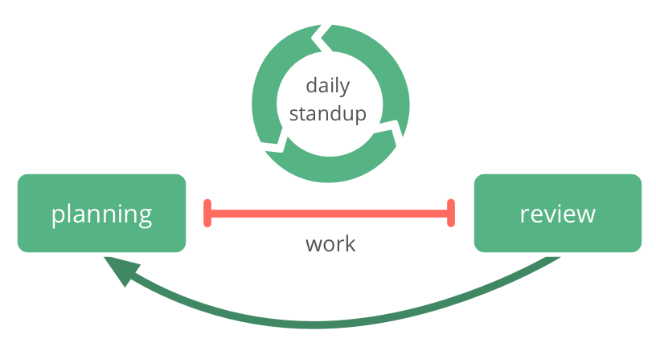

**פגישה לתיאום העבודה, להקלה על הלמידה, לשפור הפרודוקטיביות והאפקטיביות.**

- קצובה בזמן (בד"כ 15 דקות)
- נערכת כל יום באותה השעה
- הקבוצה מתאספת סביב לוח/כלי ניהול פרויקטים גלוי עבור: 
    - תיאום העבודה היומיומית
    - טיפול בחסמים/מעצורים
    - התאמה של הסכמים קיימים או יצירת הסכמים חדשים במקום

### פגישות תכנון וסקירה

אנשים נפגשים במרווחי זמן קבועים (1-4 שבועות) בפגישות מוקצבות בזמן כדי לתכנן ולסקור את העבודה.

- לבחור ולאמוד פריטי עבודה עבור האיטרציה הבאה בפגישת התכנון
- בחינת פריטי עבודה שהושלמו והחלטה על תיקונים ושינויים עבור האיטרציה (החזרה) הבאה בפגישת הסקירה

### פגישת תיאום

**נפגשים באופן קבוע (בדרך כלל שבועי) עבור דיווח על ותיאום העבודה.**

- הנחו את הפגישה, והשתמשו בסבבים במקום דיונים היכן שיש לזה ערך
- במידת האפשר, הרכיבו את סדר היום לפני הפגישה 
    - כללו דרישות מקדימות שעל המשתתפים להכין
    - פריטים נוספים עשויים להופיע כאשר שומעים דוחות מצב

### פגישת תיאום (המשך)

- דוחות מצב: 
    - מדדים של המעגל (אם קיימים)
    - פרוייקטים ומשימות
- פריטים על סדר היום: 
    - שיתוף מידע
    - הוסיפו או עדכנו פעילויות או פרוייקטים
    - הציעו הסכמים חדשים או עדכונים

## שיטות מפגש 

### סבבים

**טכניקה של הנחיית קבוצות לשמירה על שקילות.**

- עושים סבב במעגל כדי לתת לכולם הזדמנות לדבר
- מתחילים כל סבב עם אדם אחר, ומשנים כיוון (בכיוון השעון או נגד כיוון השעון) כדי ליצור גיוון למי מדבר ראשון ומי אחרון, ולסדר התרומות של האנשים.

קבוצות מנוסות עשויות לעיתים לבחור ללכת במסלול מהיר בסבבים מסוימים בתהליכי קבוצת S3.

### הנחיית פגישות

בחרו מישהו שינחה את הפגישה. אפילו מנחה לא מנוסה יכול לסייע למקד פגישה ולחולל שינוי חיובי.

- הכינו סדר יום של נושאים
- בחרו מנחה אשר: 
    - ינחה פעילות או מתכונת מתאימה עבור כל נושא
    - יחזיק את המרחב, ישמור על הזמנים וינווט את סדר היום במהלך הפגישה
    - ינחה הערכה של הפגישה בסוף

### הערכת פגישות

**קחו את הזמן ללמוד בסוף כל מפגש או סדנה.**

הרהרו על האינטראקציות, חגגו הצלחות ושתפו הצעות לשיפור.

- לפני סבב הסגירה
- שריינו 5 דקות לשעה אחת, ו-15 דקות לסדנה של יום שלם
- תעדו את הלמידה וסיקרו אותה לפני הפגישה הבאה
- גרסאות קצרות: 
    - יותר מ/פחות מ/להתחיל/להפסיק/להשאיר
    - שיפורים חיוביים/קריטיים/מוצעים

#### הערכת פגישות: גירסה ארוכה

בקשו מכולם בסבב לשקף על חלק או על כל הנושאים הבאים בשיתוף קצר על:

- האפקטיביות והפורמט
- ההנחייה וההשתתפות
- הטונים הרגשיים
- ההערכות וההישגים (אהבתי...)
- האתגרים וההצעות לשיפור (הלוואי...)
- רעיונות פרועים והצעות רדיקליות (מה אם...)

### מארח הפגישה (תפקיד)

מארח הפגישה אחראי על הכנה והמשך של מפגשים, סדנאות או אירועים אחרים.

התפקיד עשוי להיות משויך באופן זמני (קרי עבור אירוע ספציפי אחד) או עבור משך זמן.

#### האחריות של מארח הפגישה

- הכנה 
    - לזהות את המטרות ואת התוצרים
    - להכין ולהפיץ סדר יום ולוח זמנים
    - הערכת הזמן הנדרש
    - לזהות ולהזמין משתתפים
    - לקבוע מועד לפגישה/הסדנא
    - להזמין מקום (ותחבורה במידת הצורך)
    - להכין את המרחב, לספק את החומרים ואת המידע הנדרשים
    - להבטיח בחירת מנחה ומתעד שיכתוב זיכרון דברים, אם מתאים
- בהמשך 
    - לנקות את המקום, להחזיר מפתחות וכו'.
    - להבטיח שזכרון הדברים מופץ

### בקלוג מדיניות

_**בקלוג מדיניות** הוא רשימה גלוייה מתועדפת של פריטים (דרייברים) הקשורים למדיניות הדומיין ודורשים תשומת לב._

- הדוחות הבאים
- החלטות שצריך לקבל
- הצעות שיש ליצור ולשקול
- הסכמים שיש לסקור
- בחירת אנשים לתפקידים

## ארגון העבודה 

### בקלוג (צבר)

_**בקלוג** (רשימת מטלות) הוא רשימה גלויה (לעתים קרובות מתועדפת) של פריטי עבודה (דרייברים) שלא הושלמו שיש לטפל בהם._

סוגים של בקלוג כוללים:

- בקלוג תפעולי
- בקלוג ספרינט
- בקלוג מוצרים
- בקלוג מכשולים

### בקלוג (המשך)

- **יישום** 
    - **בקלוג אנלוגי**: פתקים דביקים על הקיר, או כרטיסיות, מגנטים, לוח ציור
    - **בקלוג דיגיטלי**: למשל גליונות גוגל, Trello, Kanban Flow, Jira

### בקלוג (המשך)

כל פריט בבקלוג (מתועדף) מכיל:

- **תיאור קצר** או הצהרת דרייבר
- **מספר הפניה ייחודי** (או קישור) עבור כל פריט עבודה
- (את **הסדר של פריטי העבודה**)
- **יחסי תלות** לפריטי עבודה או פרויקטים אחרים
- **תאריך הגשה** (אם יש צורך)
- (אופציונלי) מדד עבור **ערך** 
- (אופציונלי) מדד **להשקעה** (לעתים קרובות אומדן זמן או מורכבות)

### תיעדוף בקלוגים

סדרו ** את כל פריטי העבודה שלא הושלמו** כאשר הפריטים החשובים ביותר ראשונים:

- פריטי העבודה נמשכים מהחלק העליון בכל פעם שיש יכולת חדשה
- אין שני פריטים שיכולים להיות בעלי חשיבות שווה, כלומר יש צורך להסכים על סדרי עדיפויות ולעשות בחירות קשות
- **תועלות** 
    - התמקדות על הפריטים החשובים ביותר
    - הבנה משותפת של סדרי עדיפויות מאפשרת שיתוף פעולה אפקטיבי יותר

### נראות העבודה

שקיפות לגבי מצב כל פריטי העבודה הממתינים כעת, נמצאים בתהליך או הושלמו.

- בעלת ערך עבור התארגנות-עצמית ומערכות-משיכה
- המערכת חייבת להיות נגישה לכל מי שמושפע ממנה
- **אנלוגית**: פתקים דביקים על הקיר, או כרטיסיות, מגנטים, לוח ציור
- **דיגיטלית**: Trello, Kanbanery, Leankit, Jira, Google Sheets, etc.

#### דברים שיש לעקוב אחריהם:

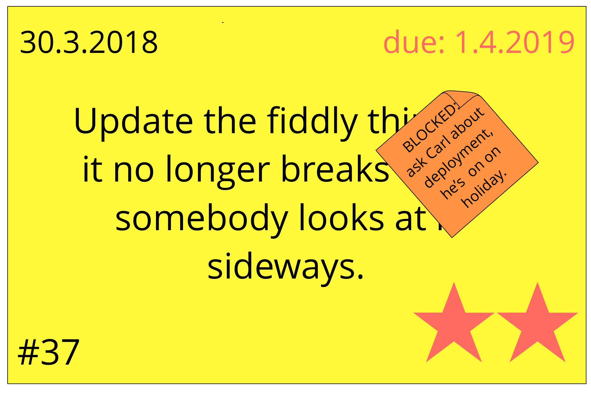

- **סוגים של פריטי עבודה** (למשל בקשות הלקוח, משימות הפרוייקט, משימות דיווח, ועבודה חוזרת)
- **תאריך התחלה** (ו**תאריך יעד** אם יש צורך)
- **סדרי עדיפויות**
- **שלבי ** העבודה (למשל "לעשות", "בתהליך", "סקירה", "נעשה")
- מכשולים/חסמים
- מי עובד על אילו פריטים
- הסכמים וציפיות המנחים את זרימת העבודה (למשל, הגדרה של נעשה, מדיניות, תקני איכות)
- השתמשו בצבעים, סמלים, מדגישים וכו'.

### מערכת-משיכה של עבודה

- אנשים מושכים פריטים חדשים כאשר יש להם יכולת (במקום שהעבודה תידחף לעברם)
- תעדוף פריטי עבודה זמינים כדי להבטיח שפריטים חשובים יעבדו עליהם קודם
- מונע עומס יתר על המערכת, במיוחד כאשר העבודה בתהליך (WIP) לאדם מוגבלת

### הגבלת עבודה בתהליך

**להגביל את מספר פריטי העבודה בכל שלב של תהליך העבודה שלך.**

עבודה בתהליך כוללת את:

- מספר הפריטים בבקלוג
- הפרוייקטים או הפעילויות הנוכחיים לקבוצות או ליחידים
- המוצרים בתיק העבודות

כאשר פעולה חורגת מעבר לגבול מוסכם של פריטי עבודה בתהליך, צריך להעלות את זה עם הקבוצה לפני שממשיכים.

### תיאום הזרימה

- בארגון אפקטיבי, **זרימת מידע והשפעה תומכים בזרימה רציפה של ערך**
- תיאום מושג ומתוחזק באמצעות שיפור מתמשך של הסכמים

#### זרימה של ערך

- זרימת הערך מונחית על ידי הסכמים והנחות (מפורשות ומרומזות)
- עבודה בתהליך נחשבת בזבוז משום שהיא קושרת משאבים
- זרימה רציפה של ערך מפחיתה את פוטנציאל הצטברות של בזבוז 
    - זה גם יוצר לולאות משוב קצרות יותר ומגביר את הלמידה

### רכז (תפקיד)

אדם בתפקיד רכז אחראי לתיאום **הפעולות של הדומיין** והוא **נבחר לתקופת זמן מוגבלת**

- הרכז יכול להיבחר על ידי הקבוצה עצמה, או על ידי המאציל
- מספר רכזים עשויים לשתף פעולה כדי לסנכרן את העבודה בין דומיינים מרובים
- במקום בחירת רכז, קבוצה יכול לבחור להתארגן-עצמית

## מבנה ארגוני 

המבנה הארגוני הוא הסידור בפועל של הדומיינים והקשרים שלהם. הוא משקף היכן הכוח להשפיע ממוקם, ועל הערוצים שדרכם מידע והשפעה זורמים.

מבנה ארגוני אפקטיבי:

- תומך בזרימת ערך
- מאפשר שיתוף פעולה
- מתייחס לתלויות והופך אותן מפורשות
- מבטיח שהמידע זמין לאלו שצריכים אותו
- מפיץ כוח כדי להשפיע על פי הצורך
- מתפתח תמידית כדי להסתגל להקשר משתנה

## מבנה ארגוני (המשך)

אבני הבניין הבסיסיות עבור מבנה ארגוני הינם דומיינים מחוברים התלויים זה בזה.

דומיינים יכולים להיות מקושרים כדי ליצור היררכיה או **הטירארכיה** (המוכרת גם בשם מערכת מורכבת מסתגלת או רֵשוּתנוּת, בה מספר מבנים פונקציונליים יכולים להתקיים).

### תבניות מבניות

סוציוקרטיה 3.0 מתארת מגוון רחב של תבניות לצמיחת מבנה ארגוני.

- תבניות חלות על שכבות שונות של הפשטה
- תבניות מבניות שונות משרתות דרייברים שונים
- תבניות מבניות ניתנות להתאמה ולשילוב לפי הצורך
- עוד תבניות נמצאות שם בחוץ והן תתגלינה
### מעגל שירות

**מיקור חוץ של שירותים הנדרשים על ידי שניים או יותר דומיינים.**

מעגל השירות יכול להיות מאוכלס על ידי חברי הדומיינים שהוא משרת ו/או גם על ידי אנשים אחרים.

### מעגל נציגים

**מחליטים ומתאמים כיצד לטפל בדרייברים המשפיעים על דומיינים מרובים.**

החלטות של מעגל הנציגים פועלים לפיהן בדומינים השונים שהוא משרת.

כל מעגל בוחר חבר אחד או יותר כנציג(ים) במעגל הנציגים.

מעגלי הנציגים מספקים דרך להיגוי ארגונים בהתאם לזרימה של הערך, ולהביא מגוון רחב של נקודות מבט להחלטות המדיניות.

### ארגון אפרסק

מספק ערך בסביבה תחרותית ומורכבת באמצעות **ביזור** (של משאבים והשפעה) **ומכוון את האינטראקציה ** בין אלה שיוצרים ערך, והלקוחות שהם משרתים.

- מעגלים בפריפריה מספקים ערך בהחלפה ישירה עם העולם החיצון (לקוחות, שותפים, קהילות, עיריות ועוד.) 
- המרכז מספק שירותי פנים כדי לתמוך בארגון
- הפריפריה מעמידה את המשאבים הכספיים ומנווטת את הארגון
- מקשר דומיינים כשנדרש כדי להזרים מידע והשפעה ומטפל בתלויות

### היררכיית קישור כפול

**מביאה שוויון למשילות בהיררכיה ארגונית טיפוסית.**

- הארגון בנוי ממעגלים של משילות-עצמית
- מעגלים בוחרים חבר לייצג את האינטרסים שלהם בהחלטות המדיניות של המעגל הגבוה הבא, ולהיפך
- ההיררכיה תפקודית עדיין אפשרית אם יש לזה ערך

### ארגון שירות

**שיתוף פעולה של בעלי עניין רבים והתיישרות כלפי דרייבר משותף.**

- משפר את פוטנציאל השקילות בין ישויות שונות
- מגביר את התיאום הבין-מחלקתי/ארגוני
- תומך בשיתוף פעולה רב-משרדי בין מחלקות/ארגונים בעלי מניעים ראשיים שונים, או שנמצאים בקונפליקט
- מתאים לפרוייקטים חד פעמיים או לשיתוף פעולה מתמשך

**הערה:** ארגון שירות מכונה לעתים קרובות **ארגון שידרה (backbone)**.

### ארגון פרקטלי

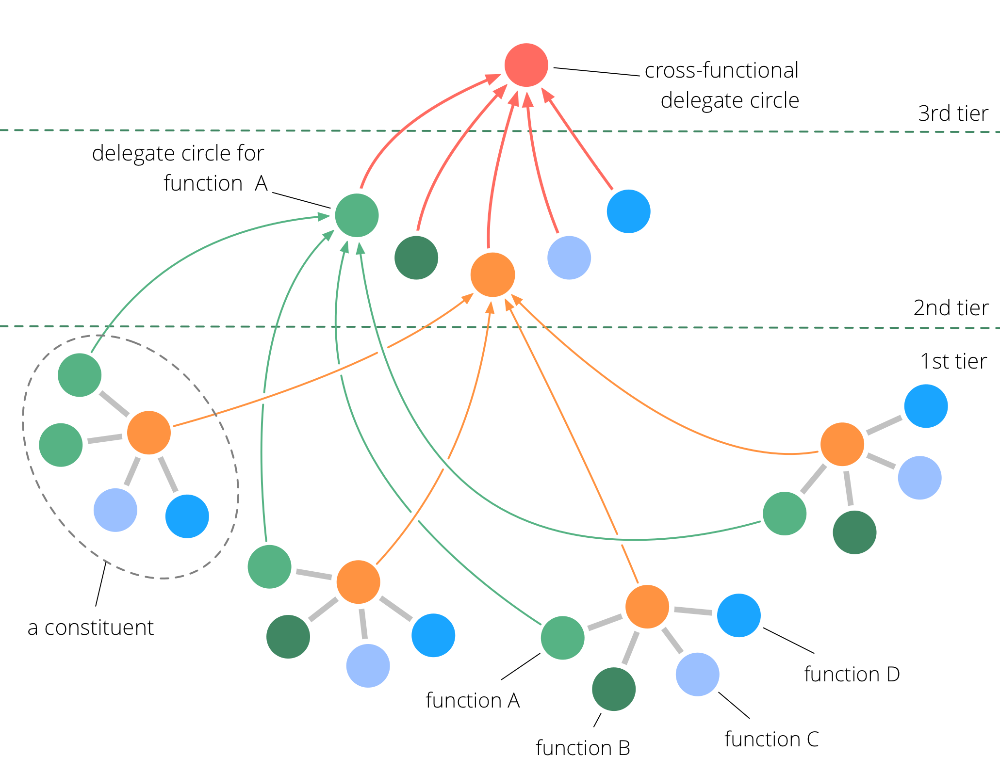

תבנית עבור ארגונים מרובים (או דומיינים) עם דרייבר משותף כדי לחלוק למידה ואם יש ערך, לתאם ולתמוך בפעולה.

- דרך לארגן, לתאם ולנווט מלמטה למעלה, תוך כדי שימור אוטונומיה ופעולה עצמאית של הגורמים השונים המעורבים
- מבנה שמיועד לאפשר חדשנות וחילופי למידה לאורכה ולרוחבה של קהילה גדולה על בסיס של "לפי הצורך"

# Appendix

# יומן שינויים

## יומן שינויים 2017-11-16

- תיקונים קטנים
- התאמת ערכי מילון המונחים עבור *מעגל* ו-*תפקיד* לתבנית טקסט
- *תוכנית פיתוח*: הבהרה של האחריות
- *תפקיד*: הובהרה האבולוציה של האסטרטגיה

## יומן שינויים 2017-11-10

- מגוון הבהרות ותיקונים קטנים
- *מעגל*: מובהר הקשר בין המעגל והדומיין
- *תפקיד*: תיאור מובהר
- *סבבים*: תיאור מעודכן
- *תחום פתוח*, *צוות מסייע* ו-*מערכות פתוחות* עברו לקטגוריה "מבנה ארגוני"
- נוספו כמה מונחים למילון מונחים

## יומן שינויים 2017-10-21

- ליליאנה דייוויד הוספה למחברים
- הושמט המונח "Framework" (הוחלף עם "מדריך מעשי")
- עודכן סדר התבניות
- הוספת אינדקס של כל התבניות 
- הוספת מילון מונחים 
- הוספת תודות
- מגוון הבהרות ותיקונים קטנים לטקסט ולאיורים
- תבניות מעודכנות עבור הסכם ותוכנית פיתוח

## יומן שינויים2017-10-21 (המשך)

- מבוא: 
    - הוספת "מה יוצא לי מזה?"
    - הוספת הגדרות עבור מדיניות, התארגנות-עצמית, אוטונומיה חלקית, תפעול למבוא
    - הבהרת תחומים והקשר שלהם לדרייברים
    - הרחבת מושגי היסוד
    - הפיכת כל העקרונות למעשיים

## יומן שינויים2017-10-21 (המשך)

- *השתתפות מיומנת*: תיאור מעודן יותר
- *הסכם*: מובהר שהרעיון של ההסכמים חל על אנשים בתפקידים
- *הבהרת תחומים*: תיאור מדוייק יותר
- *מעגל*: הגדרה מעודכנת, תיאור מדוייק יותר
- *דרייבר*: תיאור מעודכן
- *תוכנית פיתוח*: תבנית ותיאור מעודנים יותר
- * פיתוח אסטרטגיה </ 0>: הגדרה ברורה של אסטרטגיה, תיאור מעודן יותר</li> 
    
    - *היררכיית קישור כפול*: איור חדש</ul> 
    
    
    ## יומן שינויים2017-10-21 (המשך)
    
    - *הערכת הסכמים*: שאלות מתואמות לסקירת עמיתים
    - *בקלוג מדיניות*: עדכון הגדרה
    - *יומן רישום*: הוספו פרטים לגבי מדיניות ליומן רישום אישי
    - *התנגדות*: הבהרת תיקוף התנגדויות
    - *סקירת עמיתים*: תיאור מעודן יותר
    - *הענות לדרייבר ארגוני*: שולב מידע אודות תיקוף דרייברים
    - *תפקיד</0:> הבהרת נושא התפקיד עשוי לתחזק בקלוג מדיניות, הצגת מונח "נושא התפקיד" לאדם בתפקיד</li> 
        
        - *גיבוש הצעה*: הוספת קריטריונים לבחירת מכווננים, הוספת שלב עבור מתן עדיפות לשיקולים, הבהרות קטנות
        - *פתירת התנגדויות*: עדכון האיור כדי שישקף טוב יותר את התהליך</ul> 
        
        
        ## יומן שינויים2017-10-21 (המשך)
        
        **שינוי שם לתבניות:**
        
        - *ארגון שדרה* ל-*ארגון שירות*
        - *סקירה אפקטיבית* ל-*סקירת עמיתים*
        - *אסטרטגיה* ל-*פיתוח אסטרטגיה*
        - *תיאור תחום* ל-*הבהרת תחומים*
        - *תיאור תוצרים* ל-*תאר תוצרים*
        
        | נוספו                                                       | הוסרו                                                               |
        | ----------------------------------------------------------- | ------------------------------------------------------------------- |
        | _תאור מניעים  
        תחום פתוח_  
        _האצלת השפעה_ | _מעגל תיאום_  
        תחומים מקוננים_  
        _תיקוף מניעים_ |

## קישורים

**גירסה אחרונה של מדריך זה**: <http://sociocracy30.org/guide/>

**אתר סוציוקרטיה 3.0 ** <http://sociocracy30.org>

עיקבו אחרינו **בטוויטר**: [@sociocracy30](http://twitter.com/@sociocracy30)

## רישיון

עבודה זו נוצרה על ידי ברנהרד בוקלברינק, ג'יימס פריסט וליליאנה דוד במסגרת רישיון Creative Commons Attribution-ShareAlike 4.0 הבינלאומי. כדי לצפות בעותק של רישיון זה, בקרו ב <http://creativecommons.org/licenses/by-sa/4.0/>.

הגרסה האחרונה של מסמך זה זמינה בכתובת <http://sociocracy30.org>

## תודות

התוכן של סוציוקרטיה 3.0 משקף את הניסיון המצטבר וחוכמת התורמים לאורך הדורות. אנשים אלה חלקו מסע משותף לפיתוח דרכים מועילות, הרמוניות ומודעות יותר לשיתוף פעולה.

הכרה מיוחדת הולכת לג'רארד אננדנבורג ואחרים לאורך השנים אשר השקיעו זמן משמעותי לקראת פיתוח ותיעוד שיטת המעגל הסוציוקרטי, אשר תרמו לכיוון והיוו השראה עבור האבולוציה של סוציוקרטיה 3.0.

כמו כן, אנו רוצים להכיר בכל אלה שעבדו באופן נרחב על מנת לאפשר את הופעתה של חשיבה זריזה ורזה יותר, ובאלה שפיתחו וחלקו שיטות שונות עם העולם.

לבסוף להכיר בעמיתים רבים שלנו, לקוחות, קליינטים ומשתתפים בקורסים של סוציוקרטיה 3.0 אשר בחרו להתנסות עם סוציוקרטיה 3.0. אנו מודים לכם על שתרמתם את המשוב המתמשך שלכם כדי לעזור לנו לפתח את התבניות ולאפשר לכולנו ללמוד ולצמוח.

## תודות (המשך)

רשימה בהחלט לא ממצה, ברצוננו להציע את הערכתנו לאנשים הבאים אשר תרמו ישירות לפיתוח סוציוקרטיה 3.0, או שעבודתם השפיעה על מה שהיא היום:

Gojko Adzic, Lysa Adkins, Christopher Alexander, David J. Anderson, Ruth Andrade, Jurgen Appelo, Kent Beck, Sue Bell, Jesper Boeg, Kees Boeke, Mary Boone, John Buck, Betty Cadbury, Diana Leafe Christian, Mike Cohn, Stephen Covey, Gigi Coyle, Jef Cumps, David Deida, Esther Derby, Kourosh Dini, Jutta Eckstein, Frands Frydendal, Gerard Endenburg, Andreas Hertel, Andrei Iuoraia, Francois Knuckel, Diana Larsen, Helmut Leitner, Jim and Michele McCarthy, Pieter van der Meche, Daniel Mezick, Susanne Mühlbauer, Niels Pfläging, Mary and Tom Poppendieck, Karl Popper, Brian Robertson, Marshall Rosenberg, Dave Snowden, Hal and Sidra Stone, Ken Schwaber, Jeff Sutherland, Sharon Villines, Nathaniel Whitestone, Ken Wilber, Jack Zimmerman.

## ג'יימס פריסט

משרת ברחבי העולם, מספק ייעוץ לפיתוח ארגוני, ליווי למידה, וחונכות עבור אנשים המעוניינים לפתח ארגונים שיתופיים, מסתגלים בקנה מידה.

[thriveincollaboration.com](http://thriveincollaboration.com)

<james@thriveincollaboration.com>

## ברנהרד בוקלברינק

... הוא מאמן אג’יל, מכשיר ויועץ התומך באנשים, צוותים וארגונים בניווט אתגרים מורכבים ובפיתוח תרבות של שיתוף פעולה אפקטיבי, מודע ושמח.

[evolvingcollaboration.com](http://evolvingcollaboration.com)

<bernhard.bockelbrink@gmail.com>

## ליליאנה דייוויד

משרתת ברחבי העולם, מספקת הכשרות, הנחיה והדרכה לקבוצות וארגונים המעוניינים לפתח אפקטיביות ושקילות רבות יותר בשיתוף פעולה.

[thriveincollaboration.com](http://thriveincollaboration.com)

<lili@thriveincollaboration.com>

## מילון מונחים 

**SCM**: (שיטת המעגל הסוציוקרטית) שיטת משילוט שוויונית לארגונים המבוססים על חשיבה סוציוקרטית, שפותחה בהולנד על ידי ג'רארד אננדנבורג.

**אוטונומיה-חלקית**: אנשים עם אוטונומיה ליצור ערך, מוגבלת על ידי האילוצים של הדומיין שלהם.

**אחראי על (פ.)**: לקחת את האחריות על משהו, שיש צורך לטפל בו.

**אחריותיות**: הענה כשמשהו נדרש, עשה את מה שהסכמת לעשות וקח בעלות על מהלך הארגון.

**אסטרטגיה**: גישה ברמה גבוהה כיצד אנשים ייצרו ערך על מנת לקחת אחריות בהצלחה עבור דומיין.

**אפקטיביות**: הקדש זמן רק למה שמביא אותך קרוב יותר להשגת המטרות שלך.

**ארגון**: קבוצת אנשים משתפים פעולה לקראת מטרה משותפת (דרייבר).

**בזבוז**: כל דבר לא הכרחי עבור – או עומד בדרך ל – מענה אפקטיבי לדרייבר.

**בקלוג - צבר, רשימת מטלות**: רשימה גלויה (לעתים קרובות מתועדפת) של פריטי עבודה (דרייברים) שלא הושלמו שיש לטפל בהם.

**בקלוג מדיניות**: רשימה גלוייה מתועדפת של פריטים (דרייברים) הקשורים למדיניות הדומיין ודורשים תשומת לב.

**דומיין - תחום**: שטח מובהק של השפעה, פעילות וקבלת החלטות בארגון.

**דומיין עמית**: שני דומיינים עמיתים כלולים בתוך אותו דומיין-על מיידי, ויכולים להיות חופפים.

**דומיין-על**: דומיין שמכיל לחלוטין דומיין אחר.

**דרייבר - מניע**: המניע של אדם או של קבוצה להגיב על מצב מסוים.

**דרייבר ארגוני**: דרייבר הקשור (במישרין או בעקיפין) לדרייבר הראשי של הארגון.

**דרייבר ראשי**: הדרייבר שמגדיר דומיין נקרא הדרייבר הראשי של דומיין זה.

**דרייבר-על**: ראה תת-דרייבר.

**דרייברים עמיתים**: שני דרייברים הקיימים כתוצאה ישירה למענה לאותו דרייבר-על, נקראים דרייברים עמיתים.

**הסכם**: הסכמה על קו מנחה, תהליך או פרוטוקול שנועד להנחות את הזרימה של הערך.

**הסכמה**: לעשות דברים בהעדר סיבות לא לעשותם.

**הסתייגות**: הסיבה מדוע עשיית משהו עומדת בדרך של מענה אפקטיבי (יותר) לדרייבר.

**התאמה**: התהליך של הבאת הפעולות של כל החלקים של ארגון בקנה אחד עם יעדי הארגון.

**התארגנות-עצמית**: אנשים המתאמים עבודה במסגרת האילוצים שהוגדרו דרך מדיניות.

**חשש**: דעה שעשית משהו עלול לפגוע – או לפספס הזדמנות לשיפור – זרימת ערך לדרייבר ארגוני כלשהו.

**יומן**: מערכת (דיגיטלית) לאחסון כל המידע הרלוונטי להפעלת הארגון והצוותים שלו.

**מאציל**: יחיד או קבוצה המאצילים דומיין לאחר(ים) לקחת אחריות עליו.

**מדיניות, משילות**: להחליט ברציפות מה לעשות כדי להשיג מטרות, ולקבוע אילוצים על איך ומתי הדברים ייעשה.

**מואצל**: פרט או קבוצה המקבלים אחריות על דומיין שהואצל אליהם.

**מורכבות**: סביבה שבה הנעלמים לא ידועים, הסיבה והתוצאה ניתנות להבנה רק בדיעבד, והפעולות מובילות לשינויים בלתי צפויים. [סנודן ובון]

**מעגל**: קבוצת אנשים שקולה, בעלת משילות-עצמית ואוטונומית-חלקית, המשתפת פעולה כדי לקחת אחריות על דומיין.

**משילות-עצמית**: אנשים המנהלים את עצמם במסגרת אילוצים של דומיין.

**נסותנות**: בדוק את כל ההנחות באמצעות ניסויים, שינוי תמידי והפרכה.

**סוציוקרטיה**: הלך הרוח שבו אנשים המושפעים מהחלטות יכולים להשפיע עליהן על בסיס סיבות לעשות זאת.

**עקרון**: רעיון בסיסי או כלל המסביר או שולט איך משהו קורה או עובד.

**ערך**: החשיבות, הערך או השימושיות של משהו ביחס לדרייבר. כמו כן, "עיקרון עם משמעות כלשהי המנחה את ההתנהגות" (משתמשים בו בעיקר "בלשון רבים", "ערכים" או "ערכים ארגוניים").

**ערכים**: אוסף של עקרונות בעלי משמעות כלשהי המנחה התנהגות. לא להתבלבל עם "ערך" (יחיד) בהקשר של דרייבר.

**ערכים נבחרים**: סט של עקרונות שקבוצה (או ארגון) בחרה לאמץ באופן קולקטיבי להנחות את התנהגותם בהקשר של שיתוף הפעולה שלהם.

**פעולות (ביצוע העבודה)**: אנשים עושים את מה שצריך להיעשות, מודרכים על ידי תיאום ומדיניות.

**שיפור תמידי**: לעשות שינוי הדרגתי כדי לסגל למידה אמפירית קבועה.

**שקילות**: ערב אנשים בקבלה ובפיתוח החלטות שמשפיעות עליהם.

**שקיפות**: היפכו את כל המידע לנגיש לכל אדם בארגון, אלא אם כן יש סיבה לסודיות.

**תבנית**: תבנית לניווט בהצלחה של הקשר ספציפי.

**תוצרים**: משהו שמסופק כתוצאה מהסכם כמענה לדרייבר. התוצרים כוללים מוצרים, חומרי גלם, שירותים, חוויות וטרנספורמציות.

**תחומי אחריות עיקריים**: עבודה חיונית וקבלת החלטות הנדרשות בהקשר של הדומיין.

**תפקיד**: שטח של אחריותיות שהוגדר על-ידי דומיין ומוקצה לפרט.

**תת-דומיין**: דומיין שמוכל לחלוטין בתוך דומיין אחר.

**תת-דרייבר**: תת-דרייבר מתעורר כתוצאה מכך שאנשים נענים לדרייבר אחר (הדרייבר-על) וזה הכרחי להתייחס על מנת להענות לדרייבר-על.

