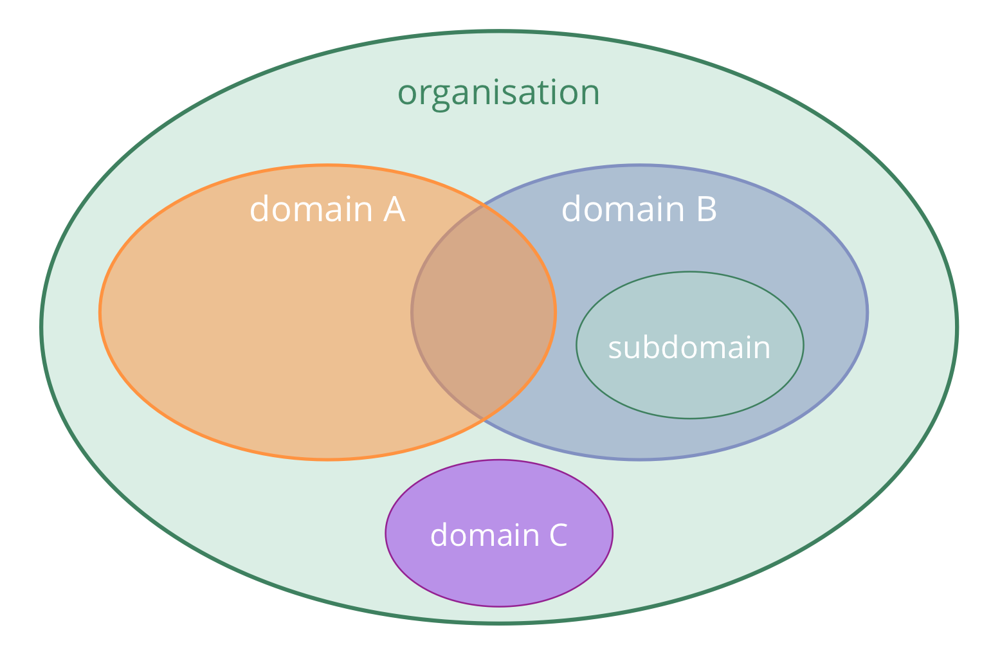
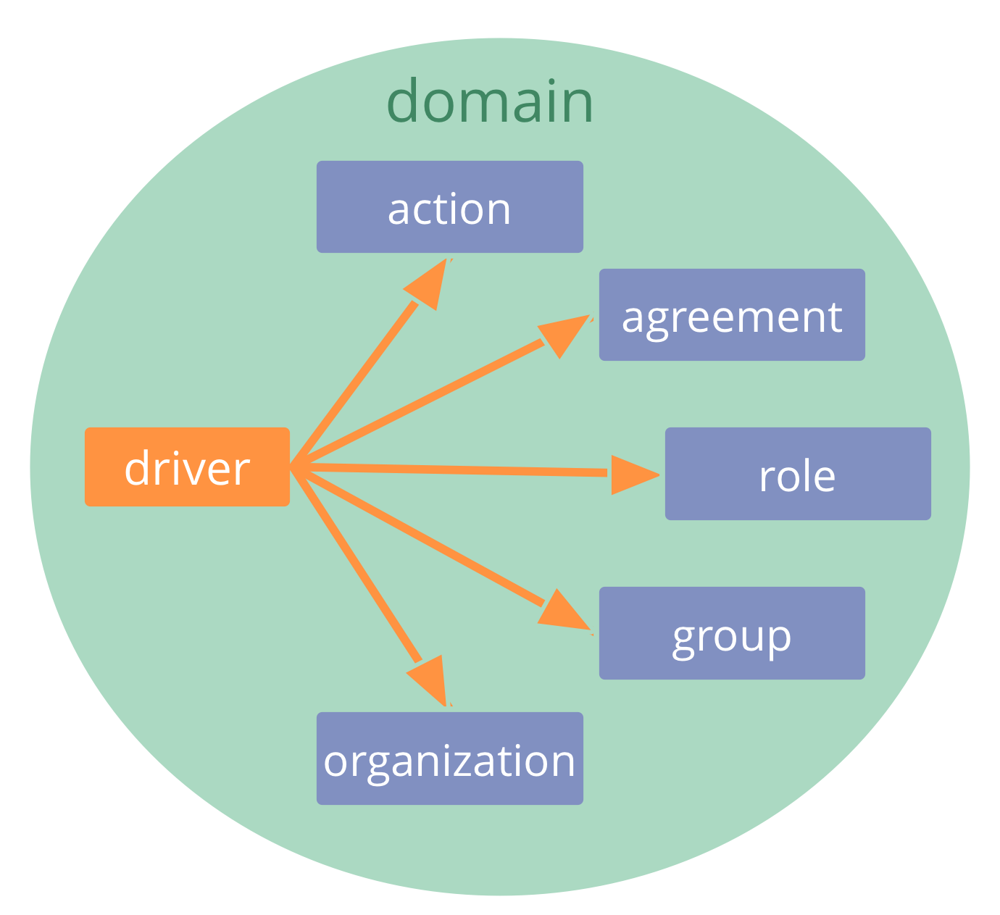
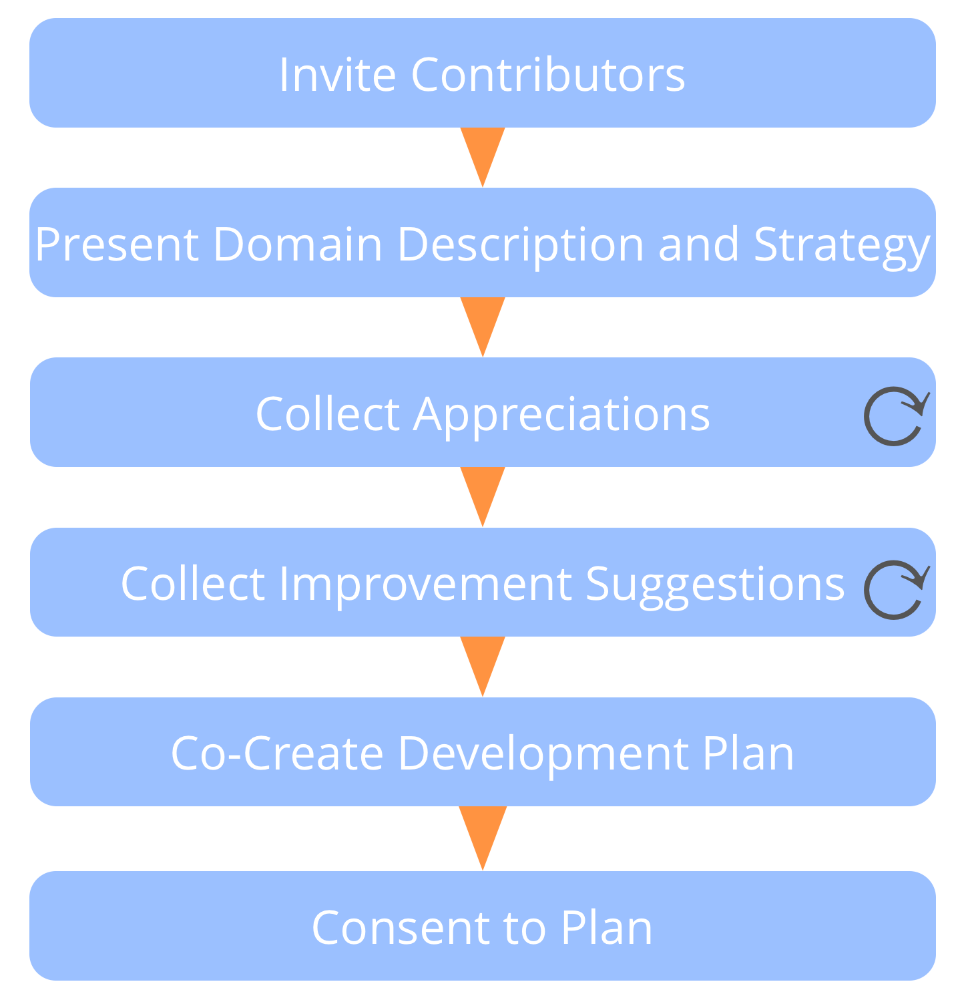
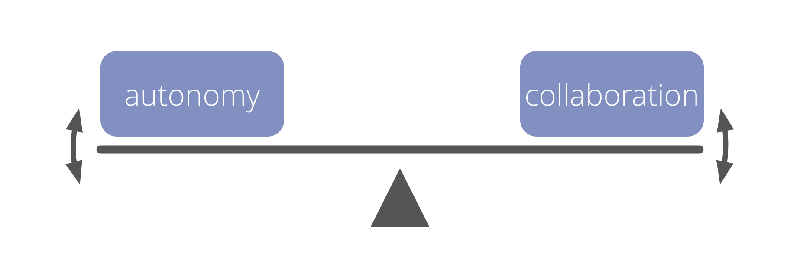
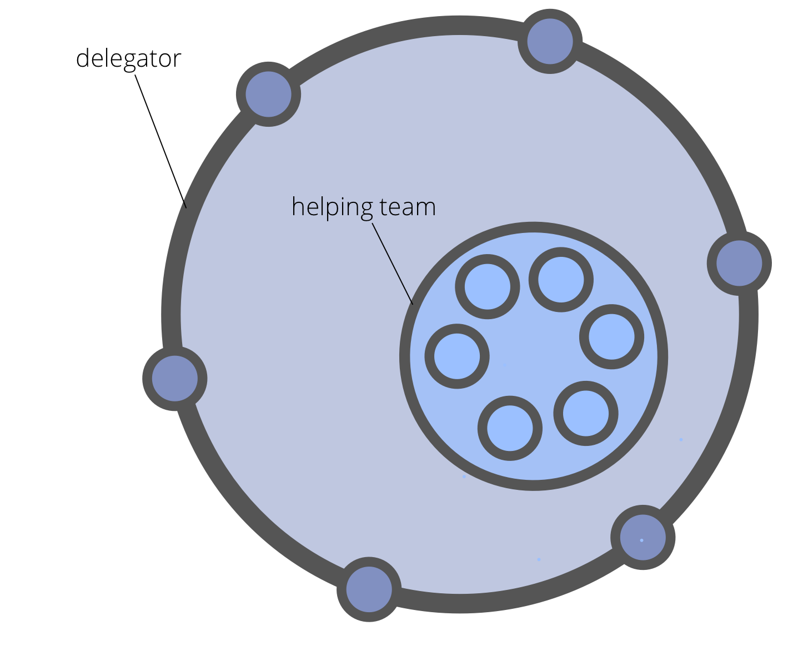
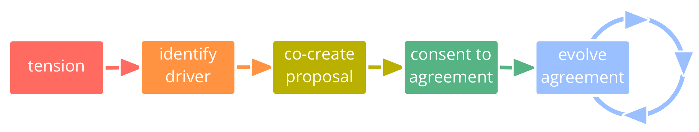
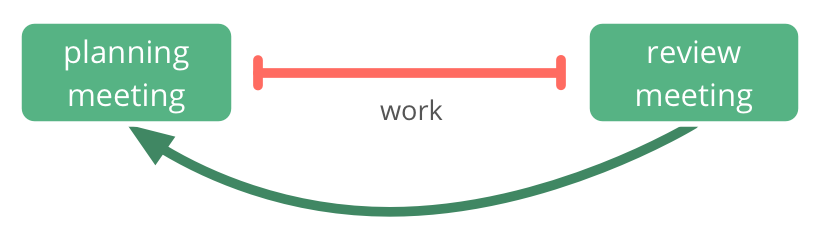
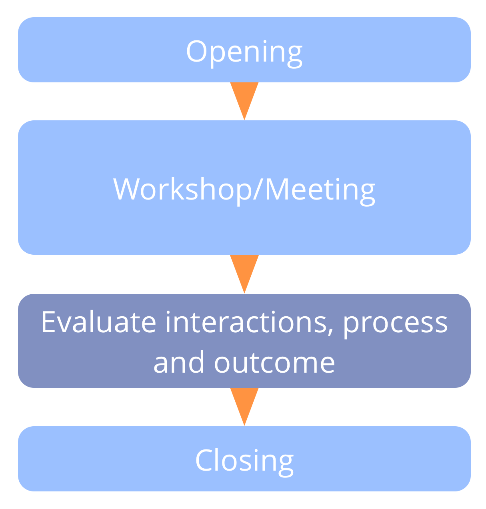

# הקדמה

## סוציוקרטיה 3.0 - מדריך מעשי לארגונים מתפתחים חסונים וזמישים

### שיתוף פעולה אפקטיבי בכל קנה מידה

- **מבוססת על עקרונות**: דרך עקבית ליצירת יושרה ארגונית ופיתוח דפוס חשיבה סוציוקרטי וזמיש
- **גמישות**: תבניות הניתנות להתאמה, עצמאיות ומחזקות זו את זו, כדי לעזור לכם עם כל ההיבטים של שיתוף הפעולה
- **חינם**: licensed under a Creative Commons Free Culture License

## מה יוצא לי מזה?

Sociocracy 3.0 — **a.k.a. "S3"** — brings you an extensive collection of guidelines and practices (patterns) that have proven helpful for organizations to **improve performance, alignment, fulfillment and wellbeing**.

S3 מסייעת לכם לגלות כיצד להגיע בצורה הטובה ביותר אל היעדים שלכם ולנווט מורכבות, צעד אחד בכל פעם, **ללא הצורך בהערכות מחדש רדיקלית פתאומית או תכנון יוזמת שינוי גדולה ארוכת טווח**:

- פשוט התחילו עם אזור הצורך הגדול ביותר שלכם, בחרו תבנית אחת או יותר לנסות, **נועו בקצב שלכם** ופתחו מיומנויות תוך כדי.

- **לא משנה מה העמדה שלכם בארגון**, אתם תמצאו תבנית רלוונטית ומועילה עבורכם.

## תוכן

- סקירה קצרה של כמה מושגים בסיסיים מאחורי S3
- תיאור של כל התבניות ב- S3
- נספח 
    - רשימת שינויים
    - מידע על המחברים ותודות
    - הרשיון
    - מילון מונחים ואינדקס

## השפעות והיסטוריה

## מניעים ליצירת סוציוקרטיה 3.0

> *בשנת 2014 התאחדנו כדי ליצור במשותף גוף של Creative Commons licensed learning resources, מסנתזים רעיונות מסוציוקרטיה, פיתוח תוכנה וניהול זמיש ורזה. גילינו שארגונים בכל הגדלים צריכים תפריט גמיש של שיטות ושל מבנים – המתאים להקשר הספציפי שלהם – אשר מאפשר את ההתפתחות של צורת חשיבה סוציוקרטית וזמישה כדי להשיג יעילות, התאמה, הגשמה, ורווחה רבות יותר.*

## מושגי יסוד

לפני הצלילה אל תוך התוכן, שקלו לקחת זמן כדי ללמוד אודות כמה מושגים בסיסיים מאחורי S3:

- מהי תבנית?
- שבעת העקרונות
- מניעים, ערך ובזבוז
- תחומים, האצלת סמכויות ואחריותיות
- מדיניות, התארגנות-עצמית ואוטונומיה-חלקית

עבור כל מושג שאתם לא מבינים בדקו במלון המונחים בסוף.

## תבניות

_**דפוס** זו תבנית לניווט בהצלחה של הקשר ספציפי._

- תבניות S3 מתגלות באמצעות תצפיות על ארגונים רבים בזמן שהם פותרים בעיות ונענים להזדמנויות
- תבניות S3 יכולות להתפתח, ולהיות מותאמות כדי שיהלמו הקשרים נבדלים
- התבניות מקובצות לפי נושא לעשר קטגוריות

## כל התבניות מבוססות על שבעת העקרונות

## שבעת העקרונות

**עקרון המועילות:** *הקדישו זמן רק למה שמביא אתכם קרוב יותר להשגת המטרות שלכם.*

**עקרון ההסכמה:** *העלה, חפש ופתור הסתייגויות להחלטות ופעולות.*

**עקרון הנסותנות:** *בדקו את כל ההנחות באמצעות ניסויים ותיקונים מתמשכים.*

## שבעת העקרונות (...)

**עיקרון השיפור התמידי:** *עשיית שינוי בהדרגתיות כדי לסגל למידה אמפירית יציבה.*

**עקרון השקילות:** *עירוב אנשים בקבלה ובפיתוח החלטות שמשפיעות עליהם.*

**עקרון השקיפות:** *הפיכת כל המידע לנגיש לכל אדם בארגון, אלא אם כן יש סיבה לסודיות.*

**עיקרון האחריותיות:** *להיענות כשמשהו נדרש, עשו את מה שהסכמתם לעשות וקחו בעלות על מהלך הארגון.*

## עיקרון האחריותיות

*להיענות כשמשהו נדרש, עשו את מה שהסכמתם לעשות וקחו בעלות על מהלך הארגון.*

פעל במסגרת המגבלות של כל ההסכמים המסדירים את התחום שיש לך אחריותיות עליהם, כולל הארגון עצמו, קבוצות שאתה חלק מהן ותפקידים שאתה נושא.

האחריותיות הראשית של כולם היא שיתוף פעולה אפקטיבי במענה למניעים ארגוניים.

יחידים אחראים גם על עבודתם, על למידה מתמשכת ופיתוח, ועל תמיכה אחד בשני.

כולם בארגון אחראים על התאמת הפעילות עם הערכים הארגוניים.

## מניעים

_**מניע** הוא הסיבה של אדם או של קבוצה להגיב למצב מסוים._

מניעים:

- יכולים לשמש כדי להפיק מטרות, יעדים, כוונות, שליחות, חזון, תכלית
- יכולים להשתנות לאורך הזמן

### מניעים: ערך ובזבוז

_**ערך** הוא החשיבות, הערך או השימושיות של משהו ביחס למניע._

_**בזבוז** זה כל דבר לא הכרחי עבור — או עומד בדרך ל — מענה אפקטיבי (יותר) למניע._

על ידי אימוץ התפיסה של ערך ובזבוז, שיטות ורעיונות רבים מ-**ייצור רזה** ו-**פיתוח תוכנה רזה** יכולים להיות מנוצלים על ידי כך שארגונים ימשכו תבניות S3:

- מיפוי זרימת הערך
- אסטרטגיות שונות עבור מניעת בזבוז
- שיטת קנבן

## תחומים

_* *תחום** הוא שטח מובהק של השפעה, פעילות וקבלת החלטות בארגון._

כל התחומים נמצאים בתוך תחום הכללי של ארגון ועשויים להיות חופפים ו/או להיות כלולים באופן מלא בתחומים אחרים.

תחומים מואצלים לאנשים (למשל ליחידה, מחלקה, צוות או יחידים), שלוקחים אחריות עבור התחום ופועלים במסגרת המגבלות המוגדרות שלו על השפעה ואוטונומיה.

## האצלת סמכויות לתחומים

אלה שמאצילים סמכויות לתחום (*המאצילים*) עדיין שומרים על אחריות כוללת עבור תחום זה, ולעתים קרובות מגדירים:

- **אחראויות עיקריות** (עבודה וקבלת החלטות חיוניות שהואצלו)
- **מגבלות לאוטונומיה ולהשפעה** לאלה שהתחום מואצל אליהם (ה*מואצלים*), בדרך כלל קשור לארגון עצמו (למשל תקציב, משאבים, רמת יפויי הכוח, דיווח)

## מניעים ותחומים

ניתן גם להבין תחום ביחס למניעים ארגוניים:

- התחום של **המניע העיקרי** - המניע הראשי שהאנשים שאחראים לתחום זה (*המואצלים*) מגיבים אליו
- המערכת של התת-מניעים שהארגון עשוי להפיק תועלת מלהתייחס אליהם כאשר מגיבים למניע העיקרי, הכוללים: 
    - **אחריות מפתח** (כל מניע הבא ישירות מן המניע העיקרי של התחום)
    - drivers for **constraints of the domain** (which typically relate to the organization's wider context)

## משילות, אוטונומיה-חלקית והתארגנות-עצמית

**משילות**: לקבל ולפתח החלטות לגבי מה לעשות כדי להשיג מטרות, וקביעת מגבלות על איך ומתי הדברים יעשו.

**משילות-עצמית**: אנשים המנהלים את עצמם במסגרת מגבלות של תחום.

**התארגנות-עצמית**: אנשים המארגנים עבודה במסגרת המגבלות שהוגדרו באמצעות מדיניות.

**תפעול** (עשיית העבודה): העבודה הנעשית כדי ליצור ולהעביר ערך, המונחה על ידי המדיניות.

**אוטונומיה-חלקית**: האוטונומיה של אנשים ליצור ערך, מוגבלת על ידי המגבלות של התחום (כולל ההשפעה של המאציל ושל הנציגים), ועל ידי הסתייגויות מאחרים.

## משילות או תפעול?

*האם זה דורש או מפיק תועלת מהחלטה של יחידים או של קבוצה?*

- כן: משילות 
    - אינו מכוסה על ידי הסכם קודם
    - זה צריך להיות מוסכם, מוחלט או מתוקן
- לא: תפעול 
    - זה מכוסה על ידי הסכם קודם (אלה שאחראים חופשיים לפעול)
    - זה צריך להיעשות

# התבניות

## יצירה משותפת והתפתחות 

###  תבנית1.1: מענה למניעים ארגוניים

**הבהירו את המניעים הארגוניים (כלומר מה קורה ומה נדרש ביחס לארגון), והענו כנדרש.**

מענים למניעים ארגוניים כוללים:

- פעולה ישירה (תפעול)
- ארגון איך העבודה תתבצע 
- קבלת החלטות מדיניות

המענה למניע ארגוני מטופל בדרך כלל כניסוי המוערך ומתפתח לאורך זמן.

#### תיקוף מניעים ארגוניים

מניע נחשב **מניע ארגוני** אם היענות אליו תעזור לארגון לייצר ערך, למנוע בזבוז או למנוע נזק.

דרך פשוטה לתקף האם המניע נופל בתחום של הארגון היא על ידי בדיקה:

*האם זה יעזור לארגון אם נענה למניע זה? או שזה יפגע בנו אם לא?*

###  תבנית1.2: ניווט דרך מתח

**Pay attention to tension you experience in relation to the organization, investigate the cause and pass on any organizational drivers you discover to the people accountable for the appropriate domain.**

**אתגרים והזדמנויות ** עבור ארגון נחשפים כאשר אנשים מביאים מודעות לסיבות מדוע הם חווים מתח.

**הערה:** בהקשר זה, *מתח* הוא חוויה אישית: סימפטום של דיסוננס בין תפיסתם של היחידים למצב, לבין הציפיות (או ההעדפות) שלהם.

כדי **לגלות מניעים**, חקרו מה מעורר מתח ותארו מה קורה ומה נדרש. לפעמים חקירה מגלה תפיסות מוטעות והמתח נעלם.

###  תבנית1.3: תיאור מניעים ארגוניים

**תארו את המניעים הארגוניים על מנת להבין, לתקשר ולזכור אותם.**

דרך פשוטה לתאר מניע היא עם **הצהרה קצרה** המסבירה:

- **מה קורה...:** 
    - **המצב הנוכחי**
    - **האפקט** של מצב זה על הארגון
- ...**ומה נדרש:** 
    - **הצורך** של הארגון ביחס למצב הזה
    - **ההשפעה** של ההתייחסות לצורך זה

בהתאם לנקודת המבט שלהם, אדם או קבוצה עשויים להחליט לתאר מניע כבעיה שיש לפתור או כהזדמנות למינוף.

_** הצהרת מניע ** היא סיכום קצר אך מקיף של המידע הדרוש להבנת המניע._

הצהרת המניע מכילה בדיוק מספיק מידע כדי לתקשר את הצורך בפעולה או החלטה. בדרך כלל, ניתן לסכם את הצהרת המניע במשפט אחד או שניים.

בנוסף להצהרת המניע הקצרה, מידע נוסף על היקף המניע ופרטיו עשוי להירשם ביומן.

### דוגמה של הצהרת מניע:

> *"המטבח מבולגן: אין כוסות נקיות, הכיור מלא כלים, ולא ניתן לתפוס במהירות קפה ולחזור חזרה לעבודה. אנחנו צריכים את המטבח במצב שמיש כך שנוכל להישאר ממוקדים בעבודה שלנו."*

### 1. המצב הנוכחי

> *"המטבח מבולגן: אין כוסות נקיות, הכיור מלא כלים..."*

תארו את המצב הנוכחי:

- בקצרה ליכדו את עיקרי הדברים של מה שקורה.
- היו אובייקטיביים: תארו תצפיות והימנעו מהערכה.

### 2. אפקט

> *"...לא ניתן לתפוס במהירות קפה ולחזור חזרה לעבודה."*

הסבירו את האפקט של מצב זה על הארגון:

- הבהירו **מדוע** המצב מצריך תשומת לב: איך הוא משפיע על הארגון? 
- היו מפורשים לגבי האפקטים בין אם הם נוכחיים או צפויים. 
- הסבירו את האתגרים, ההפסדים, ההזדמנויות או הרווחים. 

### 3. צורך

> *"אנחנו צריכים את המטבח במצב שמיש..."*

הסבירו את הצורך של הארגון ביחס למצב זה:

- **צורך של ארגון** הוא כל דבר שקבוצה (או יחיד) צריכים להיות אחראים באופן מועיל עבור תחום. 
- היו ספציפיים לגבי של מי הצורך הזה ("אנחנו צריכים", "הם צריכים", "אני צריך").
- אם יש מחלוקת לגבי הצורך, זה עוזר להתרחק מפתרונות ספציפיים ולהתמקד במה שחסר לארגון במצב הזה.

### 4. השפעה

> *"...כדי שנוכל להישאר ממוקדים בעבודה שלנו".*

תארו את ההשפעה של ההתייחסות לצורך זה:

- הסבירו את התוצאה המיועדת, תועלות או הזדמנויות פוטנציאליות.
- ההשפעה עשויה להיות ברורה או משתמעת, במיוחד כאשר האפקטים של המצב הנוכחי כבר מתוארים.

#### סקירת הצהרות המניע

הקפידו לסקור את הצהרות המניע על בסיס קבוע, על מנת להעמיק את ההבנה של מה קורה, ומה נדרש.

שאלות מועילות לסקירה כוללות:

- האם התיאור של המצב (עדיין) נכון?
- האם אנחנו עדיין משייכים את אותם הצרכים עם המצב?
- האם המניע עדיין נמצא בתוך התחום שלנו?
- האם המניע עדיין רלוונטי?

###  תבנית1.4: קבלת החלטה בהסכמה

**תהליך קבוצתי (מונחה) לצורך קבלת החלטות: מזמין הסתייגויות, ושוקל מידע וידע שהתגלו כדי לפתח עוד יותר הצעות או הסכמים קיימים.**

הצעות הופכות להיות הסכמים כאשר הן נחשבות *טובות מספיק לעכשיו ובטוחות מספיק כדי לנסות* עד הסקירה הבאה.

הסתייגויות לא מטופלות מונעות מהצעות להפוך להסכמים.

הימנעות מהסתייגויות יכולה לפגוע במטרות של הקבוצה או הארגון.

#### חוזה משתמע של הסכמה

1. בהעדר הסתייגויות נגד הסכם, אני מתכוון להמשיך עם ההסכם על פי מיטב יכולתי.
2. אני מסכים לשתף הסתייגויות ברגע שאני אהיה מודע אליהן.

###  תבנית1.5: הסתייגות

_** הסתיגות ** זו הסיבה מדוע עשיית משהו עומדת בדרך של מענה אפקטיבי (יותר) למניע ארגוני (כלומר דרישה ארגונית)._

הסתייגויות מכילות מידע החושף** תוצאה ודאית או סבירה של נזק ** ו/או **הזדמנויות לשיפור מיידי** של הצעות, החלטות, הסכמים או פעולות קיימות.

### הסתייגות (...)

זו האחריות של יחידים להעלות הסתייגויות פוטנציאליות.

הימנעות מהסתייגויות יכולה לפגוע ביכולת של יחידים, קבוצות או של כל הארגון מלתת מענה למניעים ארגוניים.

היכולת להעלות הסתייגויות *פוטנציאליות* בכל רגע אומרת שהחלטות צריכות רק להיות *טובות מספיק לעכשיו ובטוחות מספיק לנסות*.

אלו שאחראים לפעולה או להסכם (המוצע) הנדון, אחראים על *לקיחה בחשבון של טיעונים וטיפול בהסתייגויות תקפות.*

כאשר מחפשים הסתייגויות אפשריות, קחו בחשבון:

- מדוע התוצאה המיועדת לא תושג (במלואה): **מועילות**
- למה זה יהיה בזבזני להמשיך כפי שהוצע (או כפי שהסכימו בעבר): **יעילות**
- ההשלכות השליליות שיהיו למשהו במקום אחר (באותו תחום, או בארגון הרחב יותר או מעבר לו): **תופעות לוואי**

המידע הנחשף על ידי הסתייגויות יכול לשמש לשיפור:

- פעולה נוכחית או מתוכננת
- איך אנשים מבצעים החלטות
- הסכמים קיימים
- הצעות
- הבנה משותפת של מניעים

### תיקוף הסתייגויות

לא כל הטיעונים שהועלו הם הסתייגויות. הפרידו בין הסתייגויות, אשר תמיד חושפות מידע שימושי, וטיעונים אחרים המבוססים רק על דעה, העדפה או דאגה.

כדי לגלות אם טיעון תקף כהסתייגות, בהקשר קבוצתי, יכול המנחה לשאול:

*"האם אתם חושבים שהטיעון הזה נחשב כהתנגדות?"*

אם אף אחד לא חולק על הטענה, ההסתייגות בדרך כלל תקפה. אחרת כוונו לגלות את ההסתייגות בפועל או לחשוף תפיסות מוטעות כלשהן.

### הבנת הסתייגויות

כמה שאלות מועילות:

- איך הטענה מתייחסת להצעה או להסכם ספציפי זה?
- האם הטיעון חושף כיצד **פעולה או הסכם (מוצעים או נוכחיים)**: 
    - פוגעים במענה למניע ארגוני כלשהו?
    - ניתנים לשיפור עכשיו?
    - מונעים או מצמצמים את התרומה של מישהו כלפי מענה למניע?
    - מתנגשים עם ערכי הארגון?
    - נחשבים לא בטוחים מספיק לנסות?

### חששות

_** חשש ** היא הדעה שלעשות משהו (אפילו בהעדר הסתייגויות) ** עשוי ** לעמוד בדרך למענה יעיל (יותר) למניע הארגוני._

ב_קבלת החלטות בהסכמה_, חששות יכולים ליידע על דרכים להתפתחות נוספת של הסכמים (כולל קריטריונים להערכה ותדירות הערכה).

העלו חששות אם אתם מחשיבים אותם כחשובים לפחות רישמו אותם יחד עם הקריטריונים להערכה.

אם יש לך ספק האם יש לך הסתייגות או חשש, בדוק את זה עם אחרים האם הם חושבים שזה תקף כהסתייגות.

###  תבנית1.6: פתירת הסתייגויות

###  תבנית1.7: להעריך ולפתח הסכמים

**ללא הרף לפתח את החלק העיקרי של הסכמים, ולסלק את הפסולת.**

סקירה סדירה של הסכמים היא תרגול חיוני עבור ארגון לומד:

- התאימו הסכמים בהתאם להקשר המשתנה
- שלבו למידה כדי להפוך אותם למועילים יותר

וודאו שלכל ההסכמים יש תאריך סקירה ראוי.

### להעריך ולפתח הסכמים (...)

הערכת הסכמים יכולה להיות פשוטה כמו בדיקה האם זה עדיין רלוונטי, ואין הסתייגות להשאיר את ההסכם כפי שהוא.

הסכמים נסקרים לעיתים קרובות ב_פגישות המדיניות_, אולם לפעמים זה מועיל לתאם מפגש ייעודי.

התאימו את תדירות הסקירות לפי הצורך, וסיקורו מוקדם יותר אם נדרש.

אלמנטים של תבנית זו יכולים לשמש גם אנשים כדי להעריך את ההחלטות שהם עושים.

### פורמט קצר להערכת הסכמים

- *כיצד הסכם זה עזר לנו?*
- *האם יש סיבה לבטל הסכם זה?*
- *כיצד ניתן לשפר הסכם זה?*
- הסכמה על תאריך הסקירה הבאה.

### פורמט ארוך להערכת הסכמים

הכנה:

- תזמון מועד לסקירה.
- לוודא שכל המידע הנחוץ זמין.

מעקב:

- הסכמה על תאריך הסקירה הבאה.
- לתעד החלטות ומשימות, ולשתף עם האנשים הרלוונטיים.
- לקחת בחשבון השפעות על כל ההסכמים הקשורים.

###  תבנית1.8: אלה שמושפעים מחליטים

**עירבו אנשים בקבלת החלטות המשפיעות עליהם, כדי לשמור על שקילות ואחריות, ולהגדיל את כמות המידע הזמין בנושא.**

עבור קבוצות גדולות יותר:

- הנחו את התהליך במספר שלבים וצרו קבוצות קטנות יותר שיבחרו נציגים
- use an online tool and conduct an asynchronous, time-boxed and staged process

שקלו לכלול את אלה שמושפעים גם בסקירות ובפיתוח החלטות.

###  תבנית1.9: יצירה משותפת של הצעה

**חברו בין אנשים כדי ליצור הצעות משותפות כמענה למניעים ארגוניים: עשו שימוש באינטליגנציה הקולקטיבית, בנו תחושת בעלות והגדילו את המעורבות ואת האחריות.**

ישנן דרכים רבות ליצור במשותף הצעות. הן בדרך כלל הולכות אחר דפוס פעולה דומה:

1. הסכמה על המניע (או בעיה / הזדמנות / צורך)
2. לחקור את הנושא ולהבין אילוצים
3. ליצור רעיונות
4. תכנון הצעה (לעתים קרובות נעשה על ידי קבוצה קטנה יותר)

דרך אחת משותפת ליצור הצעות היא להשתמש בתבנית _גיבוש הצעה_ של S3.

### יצירה משותפת ההצעה (...)

כדי לקבל השראה עבור שלבים 2 ו- 3, הסתכלו על טכניקות הנחיית קבוצות קלאסיות או תכננו פעילויות חשיבה.

מלבד מבסדנת פנים אל פנים, באפשרותכם להתאים את התהליך הזה עבור פגישות מקוונות. תוכלו אפילו להשתמש בזה באופן א-סינכרוני (וגם על פני תקופה ארוכה של זמן) כדי לכלול אנשים רבים.

###  תבנית1.10: גיבוש הצעה

**תהליך קבוצתי (מונחה) ליצירה משותפת של מענה למניע.**

- מתבסס על האינטליגנציה הקולקטיבית ועל מגוון הפרספקטיבות בתוך קבוצה
- מערב אנשים ביצירה משותפת של הסכמים
- מטפח אחריות ותחושת בעלות

*גיבוש הצעה* עשוי להיות גם בשימוש על ידי אדם יחיד.

#### שלבי גיבוש הצעה

- **הסכימו למניע** *האם המניע הזה רלוונטי עבורנו כדי להגיב אליו? האם הצהרת המניע מתארת תיאור מדויק של מה שקורה ומה שנדרש?*
- **העמקת הבנה משותפת של מניע:** מזמינה שאלות חיוניות כדי להבין את המניע בפירוט רב יותר.
- **אסוף שיקולים** המנוסחים כשאלות המתייחסות לפתרונות אפשריים. שאלות חושפות אחת מן השתיים או מגבלות (שאלות איסוף מידע) או אפשרויות (שאלות יצרניות).
- **ענו** על כל שאלות איסוף המידע אם אפשר.
- **תתעדפו** שיקולים.
- **איספו רעיונות** כמרכיבים אפשריים עבור הצעה.
- **תכננו הצעה** על מנת לטפל במניע בהתחשב ברעיונות היצירתיים ובמידע שנאספו עד עכשיו. זה בדרך כלל נעשה על ידי קבוצה קטנה יותר "כווננים".

#### בחירת מכווננים

שקלו:

- מי צריך להיות שם?
- מי רוצה להיות שם?
- מי עוד יכול לתת תרומה משמעותית?
- שקול מומחיות, מבט מבחוץ והשראה

בין שניים או שלושה מכווננים זה בדרך כלל מתאים.

בדקו אם יש הסתייגויות למכוונן(ים) המוצע(ים).

###  תבנית1.11: בחירה לתפקיד

**תהליך קבוצתי לבחירת אדם לתפקיד על סמך חוזק הסיבה.**

במקום פשוט להקצות אנשים לתפקידים, או לעשות בחירה המבוססת רק על הרוב, השתמשו בתהליך בחירה לתפקיד כדי:

- לנצל את האינטליגנציה הקולקטיבית על ידי שמיעה ובחינה של הסיבות למועמדויות
- להגדיל את הבעלות על ההחלטה
- להבטיח תמיכה לנושא בתפקיד על-ידי אלה שמושפעים.

### בחירה לתפקיד (...)

** 1. הציגו את תיאור התפקיד: ** במידת האפשר, שלחו מראש את תיאור התחום של התפקיד.

** 2. רישום מועמדויות: **המשתתפים כותבים את שם המועמד שלהם על פיסת נייר. אנשים יכולים למנות את עצמם, מישהו אחר, או להימנע.

** 3. סיבות למועמדויות ** כל אדם משתף את מי הוא הציע ומדוע.

** 4. איסוף מידע:** המשתתפים משתפים או מבקשים כל מידע שעשוי לתמוך בקבוצה בבחירה המתאימה.

### בחירה לתפקיד (...)

** 5. שינויים במועמדויות: ** בדקו אם מישהו רוצה לשנות את המועמד שלו לאור הסיבות והמידע ששותף עד כה, ושמעו את הסיבות עבור כל שינוי.

** 6. הצעת מועמד ** לתפקיד: המנחה מנחה את התהליך כדי לזהות מועמד מתאים על סמך הסיבות שנשמעו, למשל. על ידי:

- הצעת מועמד בעצמם או לבקש מחבר בקבוצה
- הזמנת (כמה) מועמדים להסכים מי צריך להיות מוצע
- הזמנת דיאלוג קבוצתי כדי לסייע לחשוף את המועמד החזק ביותר

### בחירה לתפקיד (...)

** 7. בדקו את ההסתייגויות:** שאל את המשתתפים (כולל את המועמד המוצע) לציין בו זמנית אם יש להם הסתייגות.

**8. התייחסו ופתרו הסתייגויות,** התחילו עם אחת כלשהי לגבי המועמד המוצע. ניתן לפתור הסתייגויות בדרכים רבות, כולל תיקון תיאור התחום של התפקיד או על ידי מינוי אדם אחר. כאשר כל ההסתייגויות נפתרות, בדקו שוב עם המועמד (הסופי) אם הוא מקבל את התפקיד.

**9. לחגוג:** הכירו בהגעה להסכמה והודו לאדם שמעכשיו ישא בתפקיד.

### בחירה לתפקיד (...)

כדי להימנע מהשפעה על אחרים, יש להימנע מלהביע עניין אישי או דעות לפני שהבחירה מתרחשת.

לפעמים בחירה לתפקיד מגלה חוסר יכולת, ניסיון רלוונטי, תכונות או מיומנות. קבוצה תצטרך אז לשקול מועמדים מבחוץ, לשקול מחדש סדרי עדיפויות או למצוא דרך חלופית לקחת אחריות על התחום.

דפוס זה יכול לשמש גם בכל מצב בו יש צורך לבחור בין מגוון רחב של אפשרויות.

###  תבנית1.12: מיפוי מניעים

פורמט של סדנה לזיהוי מענה אפקטיבי למצב מורכב: לארגן סטארט-אפים, להריץ פרויקטים, להתמודד עם מכשולים או הזדמנויות משמעותיים, לפתח מבנה ארגוני כדי לאפשר טוב יותר את זרימת הערך.

קבוצות קטנות או גדולות מזהות ומתעדפות מניעים, מתקדמות במהירות מהרעיון לפעולה בקבוצות בהתארגנות-עצמית.

### מיפוי מניעים (...)

#### מיפוי מניעים: תבנית עבור תחומים

## פיתוח עמיתים 

###  תבנית2.1: בקשת עזרה

**פרוטוקול פשוט ללמידה, שיתוף מיומנויות, ובניית קשרים, עם כבוד ליכולת הפעולה העצמאית של האנשים.**

שאל מישהו, "*האם אתה מוכן לעזור לי עם ...*?" האדם שנשאל יסכים או ידחה עם "*כן*" או "*לא*" פשוטים.

- אם הבקשה נדחית, האדם המבקש מקבל את התשובה ללא משא ומתן או חקירה
- אם הבקשה אינה ברורה, שאל לגבי מידע נוסף
- אם אתה מקבל את הבקשה לעזרה, תמוך בעמית שלך בצורה הטובה ביותר שאתה יכול

###  תבנית2.2: משוב עמיתים

הזמן עמיתים כדי לתת לך משוב בונה על:

- הביצועים שלך בתפקיד
- השתתפותך ותרומתך הכללית
- איזשהו היבט מסוים שאתה עשוי להיות מעוניין בו

שיקולים:

- הזמן עמיתים לקחת קצת זמן כדי להתכונן
- הזמן גם **הערכות** וגם **הצעות ישימות לשיפור**
- שאל שאלות כדי להבין טוב יותר את המשוב, והימנע מלדון או לשפוט אותו
- החלט בעצמך מה תעשה עם המשוב שתקבל

###  תבנית2.3: סקירת עמיתים

**תמכו זה בזה כדי ללמוד ולגדול בתפקידים ובקבוצות שבהם אתם משרתים.**

נושא התפקיד — או הקבוצה — מוביל את סקירת העמיתים על ידי הגדרת התהליך ומדבר ראשון בכל שלב.

ודא להזמין אנשים עם פרספקטיבות משלימות לתרום לסקירה, וכן מנחה.

הצעות לשיפור עשויות להתייחס להתפתחות אישית, לשיתוף פעולה, לעדכונים לתיאור התחום (כולל הצהרת המניע) ולאסטרטגיה.

### סקירת עמיתים (...)

#### שיפור מתמיד ביכולתם של אנשים לשמור על תפקידים או שיתוף פעולה יעיל בקבוצות.

###  תבנית2.4: תוכניות פיתוח

**תוכנית כיצד לפתח דרכים אפקטיביות יותר של לקיחת אחריות עבור תחום, מוסכמת בין מאציל הסמכויות למואצל.**

תוכנית הפיתוח עשויה להתייחס לאדם בתפקיד, או לקבוצה (למשל, מחלקה, מעגל, צוות או תחום פתוח).

הפיתוח עשוי להתרחש בצורה של דיוק התיאור של המניע והתחום, עשיית תיקונים לאסטרטגיה או להסכמים חדשים או מעודכנים ופעולות ספציפיות שיש לנקוט או בתחום של מאציל הסמכויות, או בתחום של המואצל.

תוכנית פיתוח (וכל ההמלצות הנלוות לשינויים בתיאור התחום ובהצהרת המניע) מחייבת הסכמה של מאציל הסמכויות ושל המואצל.

## מאפשרים של יצירה משותפת 

###  תבנית3.1: השתתפות מיומנת

**להתחייב לעשות כמיטב יכולתך להתנהג ולפעול בדרכים המאפשרות שיתוף פעולה יעיל.**

השתתפות מיומנת עשוייה לכלול הפרעה, הסתייגות או שבירה של הסכמים.

### השתתפות מיומנת (...)

* השתתפות מיומנת* היא ** מחויבות אישית ** ל:

- באופן פעיל **לקחת בחשבון ולעקוב אחר כל ההסכמים** שנעשו, בצורה הטובה ביותר האפשרית, בהתחשב בנסיבות
- **לפתח מודעות והבנה** לצרכים של הפרט והקולקטיב
- **לפתח את הכישורים הדרושים**
- **תמוך באחרים** להשתתף בצורה מיומנת
- להביא לתשומת הלב של אחרים מכשולים והצעות לשיפור במידת הצורך

#### היתרונות של השתתפות מיומנת

השתתפות מיומנת:

- מאפשרת יצירה משותפת והתפתחות של הסכמים
- עוזרת ליצור צוותים חזקים יותר
- בונה אחריות אישית, יושרה ואמון
- יוצרת תרבות של תמיכה הדדית ושיתוף פעולה הדוק
- היא יותר חזקה כאשר מאומצת על ידי רבים

#### השתתפות מיומנת: הערכה עצמית

- כיצד אוכל לתמוך בעצמי ובאחרים להשתתף בצורה יותר מיומנת? 
- היכן האינטראקציות שלי עם אחרים אינן עוזרות או לא מועילות?
- אילו הסכמים קשה לי לקיים? מה אוכל לעשות כדי לטפל בכך?
- אילו מיומנויות אני יכול לפתח, אשר יתמכו בי להשתתף בצורה יותר מיומנת?
- מה המשמעות של השתתפות מיומנת ביחס ל: 
    - פעילויות היומיומיות שלי?
    - שיתוף הפעולה ולאינטראקציה עם אחרים?
    - ארגון? ... לקוחות או לצרכנים שלנו?
    - סביבה הרחבה יותר?

###  תבנית3.2: לאמץ את שבעת העקרונות

### לאמץ את שבעת העקרונות (...)

**תיאום שיתוף הפעולה עם שבעת העקרונות.**

אימוץ שבעת העקרונות מקטין את מספר ההסכמים המפורשים הנדרשים, ומנחה את ההתאמה של תבניות S3 כך שיתאימו להקשר של הארגון.

ערכי הארגון צריכים לכלול את שבעת העקרונות.

###  תבנית3.3: הסכמה על ערכים

**במכוון מפתחת את התרבות בארגון שלכם.**

_**ערכים** הם עקרונות מוערכים המנחים התנהגות. ערכים מגדירים את היקף הפעולה ואת המגבלות האתיות._

- כל חבר מביא את הערכים שלו לארגון בהתבסס על חוויות אישיות ואמונות
- קבוצה או ארגון יכולים **לבחור באופן קולקטיבי לאמץ ערכים** כדי להנחות את שיתוף הפעולה שלהם

### הסכמה על ערכים (...)

ערכים מציעים הנחיות לקביעת הפעולה המתאימה, גם בהעדר הסכמים מפורשים.

Collectively adopting a set of values supports the effectiveness of an organization:

- מפחיתה את הפוטנציאל ל-**אי הבנה**
- עוזר **ליישר קו** בין קבלת החלטות ומעשים
- **מושכת חברים חדשים, שותפים ולקוחות** שנמצאים בקו אחד עם הארגון

הערכים שנבחרו הם הסכם הנהנה מ**סקירה סדירה**.

###  תבנית3.4: מנחה מדיניות (תפקיד)

**בחר מישהו להנחיית פגישות מדיניות.**

מנחה מדיניות:

- מבטיח כי ישיבות המדיניות יישארו על המסלול ושהם עוברים הערכה
- הוא (בדרך כלל) נבחר על ידי קבוצה מבין חבריה (ולתקופה מסוימת)
- מתוודע בעצמו עם _בקלוג המדיניות_
- לעתים מזמין אחרים כדי להנחות חלק מהדברים שעל סדר היום

### מנחה מדיניות (...)

כמנחה מדיניות, שקול ללמוד על השימוש בתבניות הבאות מ- S3 כדי לטפל ביעילות במדיניות:

- _סבבים_
- _גיבוש הצעה_
- _קבלת החלטה בהסכמה_
- _בחירה לתפקיד_
- _הערכת פגישות_
- _פתירת הסתייגויות_
- _סקירת עמיתים_

###  תבנית3.5: שבירת הסכמים

שבירת הסכמים היא לפעמים **הכרחית**, אך עשוייה להגיע **במחיר** לקהילה.

היו אחראים:

- **נקו** הפרעות
- **עירכו מעקב** בהקדם האפשרי עם אלה שנפגעו
- **שנו את ההסכם** במקום שוב ושוב לשבור אותו

###  תבנית3.6: חוזה לשיתוף פעולה מוצלח

**תמכו בשיתוף פעולה מוצלח מההתחלה ובנו אמון בין הצדדים על-ידי יצירה משותפת של תועלת הדדית וחוזים חזקים מבחינה חוקית.**

**חוזה** הוא אוסף של הבטחות ששני צדדים או יותר מסכימים להפוך מחייב מבחינה משפטית, כלומר אם ההבטחות הללו מופרות, הצד הנפגע זוכה לגישה משפטית (או חליפית) לתקנות.

פיתוח הבנה משותפת לגבי הצרכים והציפיות חיוני עבור שיתוף פעולה מוצלח.

תוך כדי משא ומתן והסכמה על חוזה, עצבו את תרבות שיתוף הפעולה שאתם רוצים להשיג, ובנו מערכת יחסים חיובית עם הצדדים האחרים המעורבים.

### חוזה לשיתוף פעולה מוצלח (...)

תבנית זו מתייחסת לחוזים הקשורים לשיתוף פעולה סביב כל עסקה עסקית בין ארגון לבין צדדים אחרים (כגון עובדים, יועצים, ספקי שירותים, בעלי מניות או לקוחות). ובמיוחד בעניינים הנוגעים לערך או התחייבויות משמעותיים. לדוגמא:

- חוזי עבודה וחוזים עם קבלנים חיצוניים או יועצים בתפקידי תמיכה (כולל כל הסכם המביא שינוי של שכר או שעות עבודה)
- חוזים המסדירים את שיתוף הפעולה עם לקוחות, ספקים או נותני שירות
- הסכמים עם בעלי מניות

**הערה:** הסכמים רבים בנושא שיתוף פעולה בתוך ארגון אינם דורשים חוזים ייעודיים, מאחר שהם כבר מוסדרים על ידי או כפופים לחוזים קיימים.

### קריטריונים לברית מוצלחת בין הצדדים שעורכים הסכם

בעת ניהול משא ומתן על חוזה, ודאו ש:

- יש הבנה משותפת לסיבה לשיתוף הפעולה, כמו גם לתוצאה המיועדת ולמגבלות חשובות
- כל הצדדים מבינים מה מצופה מהם
- כל הצדדים המושפעים מהחוזה מעורבים ביצירת החוזה, ונכנסים אליו בהתנדבות
- הציפיות מציאותיות
- ההסכם מועיל לכל הצדדים
- כולם מתכוונים לשמור על ההסכם שנעשה

אם מסיבה כלשהי אחד או יותר מהקריטריונים הללו לא ניתן לקיימו, זה כנראה חכם לא להמשיך.

### יצירה משותפת של החוזה

הדרך שבה משא-ומתן על חוזה מתקיים יכולה לתרום באופן משמעותי לקראת בניית אמון בין הצדדים. גשו ליצירת החוזה מנקודת המבט של יצירת הסכם בין שותפים, לא יריבים: צרו במשותף את החוזה, התאימו אותו להקשר הספציפי שלו, והבטיחו שהוא חוקי מבחינה משפטית.

- כללו את כל הציפיות של הצדדים המעורבים, והסבירו כל אחד מהם בפירוט הולם
- השתמשו בשפה פשוטה וברורה כך שכל הצדדים יכולו להבין, והיו ברורים וחד משמעיים לגבי ההשלכות המשפטיות
- אם עליכם להשתמש במושגים טכניים או משפטיים ספציפיים שאחד הצדדים עשוי לא להכיר, הסבירו אותם במילון מונחים שהוא חלק מהחוזה
- התייעצו עם עורך דין אשר תומך בתרבות שאתם שואפים אליה והוא מוסמך בתחום של העסקים שאתם נושאים ונותנים

### כאשר יוצרים במשותף חוזה:

- וודאו שלכול הצדדים יש משלחת הכוללת ייצוג של כל התחומים המושפעים (למשל: לא רק מכירות, אלא גם פיתוח/ייצור/תמיכה, וכו')
- במפורש תארו את התרבות שברצונכם לפתח, עם לקיחה בחשבון של הרקע המשותף ושל ההבדלים התרבותיים בין הצדדים
- ציינו את הסיבות לשיתוף הפעולה המוצע, והיו שקופים לגבי הציפיות והצרכים של כל הצדדים
- חישפו את כל המידע הרלוונטי (אם יש צורך תחת הסכם סודיות)
- הסכימו תחילה על תנאי היחסים והציפיות של כל הצדדים, ואז שיקלו כיצד באפשרותכם להפוך אותם לחזקים מבחינה משפטית
- עירכו רשימה של חוקים ותקנות ספציפיים שהחוזה צריך לציית אליהם
- עירכו משא ומתן במספר חזרות, המאפשר זמן לשקול השלכות ולהציע תיקונים
- שימרו על פרוטוקול של כל פגישה כדי להפחית את הפוטנציאל לתפיסות מוטעות

#### תמכו במחזור החיים המלא של שיתוף הפעולה:

ניתן לשנות כל חוזה בכל עת, בתנאי שכל החתומים מסכימים. עם זאת, זה מקטין מאוד את הפוטנציאל לעימות מאוחר יותר אם אתם לוקחים בחשבון את מחזור החיים המלא של שיתוף הפעולה בחוזה:

- נקטו באמצעים כדי להתחיל בהצלחה על ידי הגדרת נהלים לחפיפה
- have a probationary period — where all parties can try out the collaboration — and a clear protocol for how to end the contract in the probationary period
- להגדיר ולבנות בתוך החוזה, פגישות ביקורת סדירות שבהן החתומים באים יחד כדי לשתף למידה ולהחליט כיצד החוזה עשוי להיות מתוקן כדי להתאים להקשר המשתנה
- כללו נהלים ברורים להפרת החוזה
- שקלו יצירת אמצעים חלופיים זמינים עבור סכסוכים, כגון: גישור, פיוס או בוררות
- שקלו להגביל את החוזה לתקופת זמן קבועה ולאחר מכן החוזה יפוג וניתן יהיה לחדשו אם נדרש

#### תרבות

כל חוזה משפיע על תרבות שיתוף הפעולה שהוא מסדיר, גם כאשר זה נראה שהוא רק מתאר *מה* צריך להיות מועבר:

- בכוונה צרו את התרבות של שיתוף הפעולה שברצונכם לראות על-ידי הכללת הציפיות של *איך* הדברים צריכים להיעשות 
- התאימו את החוזה לתרבות הארגונית (של כל הצדדים) ולדרישות החוק
- בנו חוזים המאפשרים ומעודדים אחריותיות

אם אתם מוצאים כי חוזים סטנדרטיים בתעשייה שלכם לא תואמים עם התרבות שאתם רוצה ליצור, בנו מאגר משלכם של תבניות עבור חוזים וסעיפים ושקלו לשתף אותו עם אחרים, כך שתוכלו למנף את ניסיון העבר בעת יצירת חוזים חדשים.

###  תבנית3.7: שקיפות שכר

**צרו נוסחת שכר הוגן והפכו אותה לשקופה.**

Transparent salary (also referred to as "open salary") is the practice of making the salary formula — and often individual compensation as well — transparent to all members of an organization, and sometimes to the public.

נוסחת שכר שקופה צריכה להתאים להקשר של הארגון, ולהתפס כהוגנת על ידי כל בעלי העניין.

תפיסת הוגנות משתנה מאדם לאדם, לפי ההקשר, ולכן יצירת נוסחה לשכר מחייבת פיתוח הבנה משותפת של מה נחשב הוגן.

### שקיפות שכר (...)

כאשר מחליטים (או מסכימים) על נוסחת שכר עבור ארגון או מחלקה, שקלו:

- מה יהיה מתאים להבטחת קיום קבוע
- כיצד לחשב פיצוי לפי הצורך, השקעה, פרודוקטיביות או הצטיינות
- כיצד לחלק את רווחי הארגון וכיסוי הפסדים בהתאם לציפיות ולצרכים של בעלי העניין השונים

להחליט כיצד לטפל בגמול על שינוי תפקיד וליצור אסטרטגיה כיצד לעבור לחוזים חדשים ולהסכמי פיצוי.

#### שתי דרכים לחשיפת משכורות

###  תבנית3.8: תפקיד תומך

**החלת תבנית התפקיד על קבלנים חיצוניים.**

- להבהיר ולתאר את המניע עבור התפקיד
- ליצור תיאור של התחום
- אם בעל ערך, ליישם תהליך בחירה
- הגבלת תקופת החוזה
- סקירת עמיתים סדירה מובנית

קבלנים חיצוניים מסכימים לקחת על עצמם את התפקיד.

ראו גם: [חוזה עבור שיתוף פעולה](contract-for-successful-collaboration)

###  תבנית3.9: תקנון

אבטחו את העקרונות והתבניות של S3 בתקנון שלכם על פי הצורך כדי להגן על **תקינות משפטית** ועל **התרבות הארגונית**

שקלו:

- הסכמה ושקילות בקבלת החלטות
- תהליך בחירה לתפקידי מנהיגות
- מבנה ארגוני, ערכים ועקרונות
- השפעת הבעלים או בעלי המניות
- שיתוף רווחים ועלויות

## בניית ארגונים 

###  תבנית4.1: האצלת השפעה

**מפזרת את הכוח להשפיע, כדי לאפשר לאנשים להחליט ולפעול בעצמם בתוך אילוצים מוגדרים.**

מאציל הסמכות יכול לתמוך בנציגים לספק ערך על ידי:

- הגדרה ברורה של תחומי אוטונומיה ואחריות
- הבטחה שישנן הזדמנויות ללמידה ופיתוח
- מתן תמיכה אם נדרש

התאמת מגבלות באופן הדרגתי, בהתחשב ביכולות, במהימנות ובתוצאה.

ביזור ככל האפשר, ושימור השפעה על פי הצורך.

###  תבנית4.2: מעגל

_**מעגל** זה קבוצת אנשים שקולה, בעלת משילות-עצמית וחצי-אוטונומית, המשתפים פעולה כדי לקחת אחריות על תחום._

מעגל:

- יכול להיות קבוע או זמני
- עשוי להיות בהתארגנות-עצמית
- אחראי להתפתחות של עצמו ולהסכמים שלו

- **אוטונומיה-חלקית**: 
    - חברי מעגל פועלים במסגרת מגבלות התחום שלהם.
    - כל מעגל יכול ליצור ערך באופן אוטונומי.
- **משילות-עצמית**: 
    - חברי מעגל באופן קבוע ומתמשך מחליטים יחד מה לעשות כדי להיות אחראים לתחום שלהם, ומציבים מגבלות על איך ומתי הדברים יעשו.
- **שקילות של חברי המעגל** 
    - כל חברי המעגל אחראים במידה שווה למדניות של תחום המעגל.

###  תבנית4.3: תפקיד

**האצלת אחריות עבור תחום ליחידים.**

תפקיד הוא אזור של אחריותיות (תחום) המואצל לפרט (**נושא התפקיד**), מי שיש לו אוטונומיה להחליט ולפעול במסגרת המגבלות של תחום התפקיד.

נושא התפקיד מוביל ביצירת אסטרטגיה על האופן שבו הם יקחו אחריות התחום שלהם.

תפקיד הוא דרך פשוטה לארגון (או קבוצה) להאציל משימות חוזרות או אזור מסוים של עבודה וקבלת החלטות לאחד מחבריה.

### תפקיד (...)

- אנשים יכולים לקחת אחריות על יותר מתפקיד אחד
- במקום להגדיר רשמית קבוצה חדשה, לפעמים זה פשוט יותר לחלוק תפקיד אחד בין כמה אנשים
- נושאי תפקיד נבחרים בהסכמה ולתקופת זמן מוגבלת
- עמיתים תומכים אחד בשני על מנת להתפתח בתפקידים שהם ממלאים

שומר תפקיד יכול לקיים בקלוג של מדיניות, ויומן כדי לרשום ולעזור לו לפתח את הגישה שלו לקראת מתן ערך.

**הערה**: ב-S3, הנחיות, תהליכים או פרוטוקולים שנוצרו על ידי אנשים בתפקידים מטופלים כמו הסכמים.

###  תבנית4.4: קישור

**מאפשר את זרימת המידע וההשפעה בין שתי קבוצות.**

קבוצה בוחרת את אחד מחבריה כדי לייצג את האינטרסים שלה בקבלת החלטות המדניות של קבוצה אחרת.

###  תבנית4.5: קישור כפול

**מאפשר את הזרימה *הדו-כיוונית* של מידע והשפעה בין שתי קבוצות.**

שתי קבוצות התלויות זו בזו כל אחת בוחרת את אחד מחבריה כדי לייצג את האינטרסים שלה בהחלטות המדיניות של הקבוצה השנייה.

קישור כפול מאפשר שקילות בין שתי קבוצות ויכול לשמש למשיכת מידע בעל ערך במבנים היררכיים.

###  תבנית4.6: נציג (תפקיד)

**בחרו חבר בקבוצה על מנת שישתתף בקבלת החלטות המשילות של קבוצה אחרת כדי לאפשר זרימת מידע והשפעה.**

נציגים (מוכר גם בשם קישורים):

- מייצגים את האינטרסים של קבוצה אחת בקבוצה אחרת
- נבחרים לתקופת זמן מוגבלת
- משתתפים **בקבלת החלטות המדיניות** of the group they link with, and can: 
    - להעלות פריטים אל סדר היום
    - להשתתף בגיבוש הצעות
    - raise objections to proposals and existing agreements

###  תבנית4.7: צוות מסייע

**Bring together a group of equivalent people with the mandate to execute on a specific set of requirements defined by a delegator.**

צוות מסייע:

- מהווה דרך למאציל הסמכויות להרחיב את היכולת שלו
- עשוי להיות בהתארגנות-עצמית או מונחה על ידי רכז שנבחר על ידי מאציל הסמכויות
- נשלט על ידי מאציל הסמכויות
- מפיק תועלת מתחום המוגדר בבירור

### צוות מסייע (...)

חברי הצוות המסייע:

- יכולים להסתייג להחלטות מאציל הסמכויות שמשפיעות עליהם
- יכולים להוסיף פריטים לבקלוג המדיניות של מאציל הסמכויות
- עשויים להיות מוזמנים לבחור נציג שישתתף בקבלת החלטות המדיניות של מאציל הסמכות

###  תבנית4.8: תחום פתוח

**באופן מכוון לוקח אחריות עבור תחום ע"י הזמנה במקום הקצאה ובקשה מאלו שהוזמנו לתרום מתי שהם יכולים.**

מאציל הסמכויות של התחום הפתוח מבהיר:

- את המניע הראשי, את האחריות העיקרית ואת ההגבלות של התחום הפתוח
- מי מוזמן לתרום לתחום הפתוח
- הגבלות הקשורות להשתתפותו של מאציל הסמכויות במדיניות של התחום הפתוח

### תחום פתוח (...)

בהתאם למגבלות שנקבעו על ידי המאציל, התורמים יכולים רק לארגן ולעשות עבודה, או לקחת חלק גם במשילות.

מאציל אחראי לביצוע סקירות קבועות כדי לתמוך באפקטיביות של העבודה ושל כל החלטה שנעשית בתחום פתוח.

###  תבנית4.9: מערכות פתוחות

**במכוון תתקשרו ותלמדו מאחרים מחוץ למערכת שלכם.**

יחידים, קבוצות וארגונים שלמים יכולים להכיר בתלות הדדית ולהזמין בכוונה אנשים מחוץ למערכת שלהם **להביא ידע, ניסיון והשפעה** כדי לסייע בקבלת החלטות ותמיכה בלמידה קולקטיבית.

### מערכות פתוחות (...)

- **מומחים חיצוניים** יכולים להציע נקודת מבט חיצונית ולהביא ידע, הבנה ומיומנויות
- **נציגים של צדדים מושפעים** יכולים להביא מידע ולהשפיע על קבלת ההחלטות בדרכים המביאות תועלת ליעדים הכלליים (ראה אלה שמושפעים מחליטים)

## הכנסת S3 

###  תבנית5.1: התאמת התבנית להקשר

**התאימו ופתחו את תבניות S3 כדי שיתאימו להקשר הספציפי שלכם.**

ודאו שכל מי שמושפע:

- מבין מדוע שינוי התבנית נחוץ (או מועיל)
- נוכח או מיוצג כאשר מחליטים כיצד לשנות אותה
- השתמשו בעקרונות S3 כמדריך להסתגלות.

הריצו ניסויים עם התאמות במשך מספיק זמן כדי ללמוד על היתרונות ועל מלכודות פוטנציאליות.

שתפו התאמות בעלי ערך עם קהילת S3.

###  תבנית5.2: צרו מערכת משיכה לשינוי ארגוני

**צרו סביבה המזמינה ומאפשרת לחברי הארגון להניע את השינויים.**

שנו דברים כאשר יש ערך לעשות זאת:

- הכניסו תבניות שפותרות בעיות נוכחיות ובעיות חשובות.
- אל תקלקלו את מה שכבר עובד!
- פיגשו את כולם היכן שהם נמצאים…
- ... ותנו להם לבחור את הקצב שלהם.

###  תבנית5.3: היו השינוי

**הובילו ע"י מתן דוגמה.**

התנהגו ופעלו בדרכים שתרצו שאחרים יתנהגו ויפעלו.

###  תבנית5.4: הזמינו את השינוי

**הבהירו את הסיבה לשינוי והזמינו אנשים לקחת חלק.**

הזמנה במקום כפיית שינויים מסייעת בהפחתת ההתנגדות ומאפשרת לאנשים לבחור בעצמם.

כשעושים את ההזמנה:

- היו שקופים לגבי הסיבה לשינוי
- הבהירו ציפיות ואילוצים
- הימנעו מכפייה או מניפולציה
- הכירו בכל הספקנות והספקות

Include the people involved and affected in regular evaluation of outcomes.

###  תבנית5.5: מרחב פתוח לשינוי

**הזמינו את כולם ליצור ולהריץ ניסויים לפיתוח הארגון.**

- הבהירו את המניע לשינוי
- תזמנו אירועי מרחב פתוח באופן סדיר: 
    - הזמינו את כל החברים ליצור ולהריץ ניסויים
    - הגדירו אילוצים עבור הניסויים המאפשרים פיתוח של חשיבה סוציוקרטית וזמישה (למשל עקרונות S3)
    - סיקרו ולימדו מן הניסויים במרחב הפתוח הבא

###  תבנית5.6: שיפור תמידי של תהליך העבודה עם S3

**לחשוף את המניעים וליצור מערכת משיכה מבוססת מדדים לשינוי ארגוני, באמצעות שיפור ודיוק מתמיד של תהליך העבודה.**

- הציגו את העיקרון של הסכמה _וניווט דרך מתח_ כדי לפתח תהליך עבודה בקבוצה
- שיקלו בחירת מנחה כדי להנחות תהליכים קבוצתיים ולבחירת ערכים להנחיית הקבוצה
- initiate a process of continuous improvement, e.g. through Kanban or regular retrospectives
- חברי הקבוצה ימשכו תבניות S3 עפ"י הנדרש
- אם זה בעל ערך, הרחיבו באופן איטרטיבי את הטווח של הניסוי לקבוצות אחרות
- חפשו בכוונה מכשולים 

#### בזבוז ושיפור תמידי

_**בזבוז** זה כל דבר לא הכרחי עבור — או עומד בדרך ל — מענה אפקטיבי (יותר) למניע._

בזבוז קיים בצורות שונות, ברמות שונות של הפשטה (משימות, תהליכים, מבנה ארגוני, מודלים מחשבתיים...)

יצירת תהליך עבור מניעה מתמשכת של בזבוז מאפשר התפתחות טבעית של ארגון לקראת יעילות רבה יותר והסתגלות להקשר משתנה.

## הגדרת הסכמים 

### מחזור החיים של הסכם

###  תבנית6.1: הסכם

_* *הסכם** הוא הסכמה על קו מנחה, תהליך או פרוטוקול שנועד להנחות את הזרימה של הערך._

- הסכמים נוצרים כמענה למניעים ארגוניים 
- **אחריותיות כוללת** להסכם טמונה באנשים שעושים אותו
- הסכם יכול לכלול **האצלה של אחריות ספציפית** ליחידים או לקבוצות
- הסכמים **נסקרים באופן קבוע**, ומפותחים על פי הצורך
- רישמו הסכמים אלו ייתכן שתרצו להתייחס אליהם מאוחר יותר

**הערה**: ב-S3, הנחיות, תהליכים או פרוטוקולים שנוצרו על ידי אנשים בתפקידים מטופלים גם כהסכמים.

#### תבנית עבור הסכמים

###  תבנית6.2: פיתוח אסטרטגיה

_**אסטרטגיה** היא גישה ברמה גבוהה של איך אנשים ייצרו ערך על מנת לקחת אחריות בהצלחה עבור תחום._

זה בדרך כלל יעיל יותר אם קבוצה או נושא התפקיד מובילים בפיתוח האסטרטגיה שלהם.

אסטרטגיה כוללת לעתים קרובות תיאור של התוצאה המיועדת.

מאחר שמאצילי הסמכויות חולקים באחריות על התחומים שהם מאצילים, חשוב שהם יסקרו את האסטרטגיה של הנציג, כדי לבדוק את המכשולים הפוטנציאליים ולהציע דרכים לשיפור.

אסטרטגיה היא הסכם משותף בין מאציל(י) הסמכויות לבין המואצל(ים) שנסקר באופן שוטף, ומעודכן במידת הצורך (*לשנות או להתמיד*)

### פיתוח אסטרטגיה (...)

אסטרטגיות מקבלות תוקף ומחודדות דרך התנסות ולמידה.

###  תבנית6.3: הבהרת תחומים

**הבנה ברורה של תחומי האחריות והאוטונומיה של אנשים מאפשרת יעילות רבה יותר, שיתוף פעולה אפקטיבי וזמישות ברחבי הארגון.**

דרך פשוטה כדי להבהיר את התחומים היא עם **תיאור תחום** המכיל:

- מניע ראשי
- תחומי אחריות עיקריים
- מגבלות
- קרטריונים להערכה עבור סקירת עמיתים
- תקופת כהונה (לתפקיד)
- (גירסאות קודמות)

### הבהרת תחומים (...)

ניתן ליצור תיאורי תחומים עבור תפקיד, עמדה, מעגל, צוות, תחום פתוח, מחלקה, יחידה או הארגון כולו.

אחת הדרכים להבהרת תחום היא על ידי מילוי [טופס האצלת הסמכויות של S3](http://s3canvas.sociocracy30.org/s3-delegation-canvas.html).

###  תבנית6.4: הבהרת תוצאה מיועדת

**היו מפורשים לגבי התוצאות הצפויות של הסכמים, פעולות, פרויקטים ואסטרטגיות.**

תעדו והסכימו על תיאור תמציתי של התוצאה המיועדת.

ניתן להשתמש בתוצאה המיועדת להגדרת *קריטריונים להערכה* ומדדים לבדיקת התוצאות בפועל.

###  תבנית6.5: תיאור תוצרים

**תארו בבירור תוצרים בהקשר של הסכם, כדי לתמוך בהבנה משותפת של הציפיות.**

_** תוצר ** הוא מוצר, שירות, חומר גלם, ניסיון או טרנספורמציה, המסופק כתוצאה מהסכם._

כאשר מתארים תוצרים:

- כולל את כמות הפרטים הדרושים
- הפניה למסמכים אחרים כאשר הם מועילים או נחוצים

### תיאור תוצרים (...)

הגדרה מפורשת של תוצרים יכולה להיות מועילה לשיפור:

- אסטרטגיה ארגונית
- האסטרטגיה של קבוצות או יחידים
- תוכניות פיתוח
- תיאורי התחום
- כל הסכם אחר (למשל יעדים עסקיים, מדיניות התהליך, תקשורת עם לקוחות)

###  תבנית6.6: קריטריונים להערכה

**פתחו קריטריונים להערכה מוגדרים היטב כדי לקבוע אם לפעולה על פי ההסכם הייתה את האפקט הרצוי.**

- לכו על קריטריונים **פשוטים וחד משמעיים** ותעדו אותם (כדי להימנע מדיון או דיאלוג בעת סקירת ההסכמים שלכם)
- הגדירו **מדדים ישימים** כדי לעקוב ברציפות אחר השפעות ואיתור סטיות מן התוצאה המיועדת
- שקלו להוסיף קריטריונים אשר יעשו את זה מפורשות, מתי התוצאה של הסכם תיחשב **לא מוצלחת**
- בעת סקירת הסכם, שקלו **לפתח את הקריטריונים להערכה** בהתבסס על מה שלמדתם

###  תבנית6.7: יומן (לוגבוק)

**שימרו על מערכת עקבית ונגישה המאחסנת את כל המידע הדרוש לשיתוף פעולה.**

יומן הוא מערכת (דיגיטלית) לאחסון כל המידע הרלוונטי להפעלת הארגון והצוותים שלו. היומן נגיש לכל חברי הארגון, והמידע נשמר חסוי רק כאשר יש סיבה טובה לעשות זאת.

פלטפורמות נפוצות עבור יומני מסע הם Wikis (e.g. [Dokuwiki](https://www.dokuwiki.org/), [MediaWiki](https://www.mediawiki.org/), [Confluence](https://www.atlassian.com/software/confluence)),מערכות ניהול תוכן (e.g. [Wordpress](https://wordpress.org/)), [G Suite](https://gsuite.google.com), [Evernote](https://evernote.com/business) or even [Trello](https://trello.com/).

#### תוכן היומן

תוכן הקשור לארגון כולו:

- מניע ראשי, אסטרטגיה וערכים ארגוניים
- מבנה ארגוני (תחומים, והקשרים ביניהם)
- הסכמים 

תוכן הקשור לקבוצה או תפקיד מסויימים:

- תיאור התחום והאסטרטגיה
- הסכמים (כולל תיאורי התחום, אסטרטגיות ותוכניות פיתוח של המואצלים)
- בקלוגים ומידע נוסף הקשורים לעבודה ולמדיניות

###  תבנית6.8: יומנאי (תפקיד)

**בחרו חבר בקבוצה שלכם שיהיה אחראי באופן ספציפי לשמירה על רשומות מעודכנות של כל המידע שהקבוצה דורשת.**

היומנאי אחראי לניהול היומן של קבוצה על-ידי:

- תיעוד פרטי ההסכמים, תיאורי התחום, בחירות, מועדי הערכה, פרוטוקולים של ישיבות וכו'.
- ארגון מידע רלוונטי ושיפור המערכת כאשר זה בעל ערך
- שמירה על רשומות מעודכנות
- הבטחת הנגישות לכל מי שבקבוצה (ובארגון הרחב כפי שהוסכם)
- לשים לב לכל ההיבטים הטכניים של הטיפול ביומן (הלוגבוק)

## אינטראקציות ממוקדות 

###  תבנית7.1: פגישת מדיניות

**קבוצות נפגשות במרווחי זמן קבועים כדי להחליט מה לעשות כדי להשיג את היעדים, וכדי להגדיר מגבלות על איך ומתי דברים יעשו.**

פגישת מדיניות בדרך כלל:

- מונחית 
- מוכנת מראש 
- קצובה בזמן של 90-120 דקות
- מתוזמנת כל 2-4 שבועות

### פגישת מדיניות (...)

פגישת מדיניות טיפוסית כוללת:

- opening: opening: check in with each other and attune to the objective of the meeting
- עניינים מנהליים 
    - לבדוק הסכמה לפרוטוקול של המפגש האחרון
    - להסכים על תאריך הפגישה הבאה
    - לברר אם יש פריטי סדר יום כלשהם של הרגע האחרון, והסכימו על סדר היום
- פריטים על סדר היום 
- הערכת הפגישה: הרהרו על האינטראקציות שלכם, תחגגו הצלחות ושתפו הצעות לשיפור
- סגירה: לבדוק מה המצב אחד עם השני. לפני שאתם עוזבים את הפגישה

### פגישת מדיניות (...)

פרטי סדר יום טיפוסיים כוללים:

- דיווחים קצרים 
- הערכת הסכמים קיימים שהגיע מועד הסקירה שלהם
- בחירת אנשים לתפקידים 
- מניעים חדשים הדורשים החלטות שצריכות להיעשות, כולל: 
    - גיבוש הצעות
    - עשיית הסכמים 
    - תכנון תחומים, וקבלת החלטה על לקיחת אחריות עבורם (למשל: תפקידים, מעגלים, צוותים או תחומים פתוחים חדשים)

###  תבנית7.2: רטרוספקטיבה

**הקדישו זמן כדי להרהר על ניסיון העבר, למדו והחליטו כיצד לשפר את תהליך העבודה.**

- תנובה: שינויים לתהליך העבודה, משימות חדשות, הסכמים ומניעים על הדרך, המחייבים הסכם
- פגישה מונחית (שעה 1)
- מרווחי זמן קבועים (1-4 שבועות)
- להסתגל למצב ולהקשר

#### התנובה של רטרוספקטיבה

#### חמשת השלבים של פגישת רטרוספקטיבה

1. הגדירו את השלב 
2. איספו נתונים
3. הפיקו תובנות
4. החליטו מה לעשות
5. סיימו את הרטרוספקטיבה

ניתן למצוא פעילויות שונות רבות עבור כל שלב בכתובת [plans-for-retrospectives.com](http://www.plans-for-retrospectives.com/)

###  תבנית7.3: פגישה יומית קצרה

**היפגשו מדי יום כדי לארגן עבודה, להנחות למידה ולשפר את הפרודוקטיביות והאפקטיביות שלכם.**

- קצובה בזמן (בד"כ 15 דקות)
- נערכת כל יום באותה השעה
- הקבוצה מתאספת סביב לוח/כלי ניהול פרויקטים גלוי כדי: 
    - לארגן עבודה יומית
    - לטפל במכשולים/חסמים
    - להסתגל להסכמים קיימים או ליצור הסכמים חדשים על המקום

###  תבנית7.4: פגישות תכנון וסקירה

**אנשים נפגשים במרווחי זמן קבועים (1-4 שבועות) בפגישות מוקצבות בזמן כדי לתכנן ולסקור את העבודה.**

**תכנון פגישה**: לבחור ולהעריך פריטי עבודה לאיטרציה הבאה (חזרה הבאה).

**סקירת הפגישה**: לסקור פריטי עבודה שהושלמו ולהחליט על עבודה מחדש ושינויים עבור האיטרציה הבאה.

###  תבנית7.5: פגישת תיאום

**נפגשים באופן קבוע (בדרך כלל שבועי) עבור דיווח על ותיאום העבודה בין תחומים.**

- הנחיית הפגישה (דיאלוג מוקצב בזמן ושימוש בסבבים היכן שיש לזה ערך)
- כאשר שימושי, להכין סדר יום לפני הפגישה ולשתף אותו עם המשתתפים מראש 
    - כללו פרטים על כל התנאים המוקדמים שיכולים לעזור למשתתפים להתכונן
    - פריטים נוספים לסדר היום עשויים להופיע כאשר שומעים דוחות מצב

### פגישת תיאום (...)

פריטים על סדר היום:

- סנכרון ותיאום בין תחומים
- סדרי עדיפויות והפצה של עבודה 
- להגיב למכשולים

## שיטות מפגש 

###  תבנית8.1: סבבים

**בפגישה קבוצתית, לעשות סבב במעגל נותן לכולם את ההזדמנות לדבר בתורם.**

סבבים הם טכניקת הנחיית קבוצות לשמירה על שקילות ותמיכה בדיאלוג מועיל.

להיות ברורים לגבי המטרה והתוצאה המיועדת של כל סבב.

Sit in a circle, begin each round with a different person, and change direction (clockwise or counterclockwise) to bring variation to who speaks first and last, and to the order of contributions.

###  תבנית8.2: הנחיית פגישות

**בחרו מישהו שינחה את הפגישה כדי לעזור לקבוצה לשמור על מיקוד, לשמור שהפגישה תהיה על המסלול ולמשוך את היצירתיות והתבונה של המשתתפים.**

לפני כל פגישה, הכינו סדר יום של נושאים ובחרו מנחה כדי:

- שיחזיק את המרחב, ישמור על הזמנים וינווט את סדר היום במהלך הפגישה
- שינחה פעילות מתאימה עבור כל נושא
- שינחה הערכה בסוף של הפגישה

לשקול בחירת מנחה לתקופה זמן מסויימת. אפילו מנחה לא מנוסה יכול לגרום לשינוי חיובי.

###  תבנית8.3: להתכונן לפגישות

**התכוננו מראש כדי להפוך את הפגישות למעילות יותר.**

כמה שיקולים להכנה מוצלחת של פגישה:

- להבהיר ולהעביר את המניע, ואת התוצאה המיועדת של הפגישה
- להחליט את מי להזמין 
- ליצור סדר יום
- לתזמן את הפגישה מספיק זמן מראש, כך שלאנשים יהיה זמן להתכונן
- לבחור משך זמן מתאים לפגישה 
- להיות ברורים מי ינחה את הפגישה, מי ירשום את פרוטוקול הפגישה, מי ידאג למעקב נדרש

### הכנת סדר היום

ערבו אנשים בהכנה תעדוף סדר היום ושלחו את זה מראש

לכל פרט בסדר היום הסכימו על:

- המניע 
- התוצאה המיועדת
- התהליך
- הזמן שאתם רוצים להשקיע בו 
- מה אנשים צריכים לעשות כדי להתכונן

### תמיכה בהתכוננות של המשתתפים

- לחשוב מה ניתן לעשות מראש כדי להתכונן לפגישה
- להודיע לאנשים על ציפיות ועל תנאים מוקדמים
- לעשות את כל המשאבים שאנשים עשויים להזדקק להם כדי להתכונן זמינים

### כמשתתף

- לשקול את תבנית _השתתפות מיומנת_
- לסקור את סדר היום ולשקול איך אתה יכול לתרום לכל פריט
- להעלות הסתייגויות לסדר היום, ואם אפשר לפתור אותן לפני הפגישה
- לסקור הצעות לשיפור מהערכת הפגישה הקודמת ולשקול כיצד **אתה** עשוי לפעול על פיהן

###  תבנית8.4: צ'ק-אין (דו''ח מצב)

**עוזר לאנשים להיות מודעים לעצמם ולאחרים ולהתמקד, להיות נוכחים ומעורבים.**

כדי לעשות צ'ק-אין, חשוף בקצרה משהו לגבי מה המצב איתך ואיך אתה, חשוף מחשבות, רגשות, הסחות דעת או צרכים.

צ'ק-אין עשוי להופיע בצורת סבב פתיחה או סגירה בישיבה קבוצתית, או רק בחילופי דברים קצרים בפגישה 1:1.

ניתן גם לבקש צ'ק-אין קבוצתי במהלך פגישה, או אפילו לבחור לבצע צ'ק-אין באופן אישי כאשר אתה חושב שזה חשוב עבור הקבוצה.

בצ'ק-אין קבוצתי, אפשר לאנשים לוותר אם יבחרו.

כאשר עושים צ'ק-אין, במתכונת חדשה, אנשים יכול גם להגיד את שמם ומהיכן הם באים, כדרך להציג את עצמם. (עצה: להימנע מלדבר על תפקיד, דרגה וכו', אלא אם כן יש סיבה לעשות זאת)

###  תבנית8.5: הערכת פגישות

**קחו את הזמן ללמוד בסוף כל מפגש או סדנה.**

הרהרו על האינטראקציות, חגגו הצלחות ושתפו הצעות לשיפור לפני סגירת הפגישה.

- שריינו 5 דקות לשעה אחת, ו-15 דקות לסדנה של יום שלם
- תעדו את הלמידה וסיקרו אותה לפני הפגישה הבאה

פורמטים קצרים שניתן להשתמש בהם:

- יותר מ/פחות מ/להתחיל/להפסיק/להשאיר
- שיפורים חיוביים/קריטיים/מוצעים

#### הערכת פגישות: גירסה ארוכה

בקש מכולם בסבב לשקף על אחד מהנושאים הבאים או על כולם בשיתוף קצר, ולדווח על נקודות מפתח שתרצה לזכור לפעם הבאה:

- האפקטיביות והפורמט
- ההנחייה וההשתתפות
- הטונים הרגשיים
- ההערכות וההישגים (אהבתי...)
- האתגרים וההצעות לשיפור (הלוואי...)
- רעיונות פרועים והצעות רדיקליות (מה אם...)

###  תבנית8.6: מארח הפגישה (תפקיד)

**בחרו מישהו שיקח אחריות להכנה ולמעקב של מפגשים, סדנאות או אירועים אחרים.**

אדם עשוי ליטול על עצמו את התפקיד של מארח הפגישה עבור אירוע ספציפי או עבור מספר אירועים על פני תקופה של זמן.

#### האחריות של מארח הפגישה

הכנה:

- לזהות את המטרות ואת התוצרים
- להכין ולהפיץ את סדר היום
- לזהות ולהזמין את המשתתפים
- להעריך את הזמן הנדרש ולתזמן את הפגישה/הסדנה
- להזמין את המקום (ותחבורה במידת הצורך)
- להכין את המרחב ולספק את החומרים ואת המידע הדרושים
- להבטיח בחירת מנחה ומתעד שיכתוב זיכרון דברים, אם מתאים

**לאחר הפגישה**: לנקות את המקום, להחזיר את המפתחות, לקשור את כל הקצוות הפתוחים ולוודא שהפרוטוקול מופץ.

###  תבנית8.7: בקלוג מדיניות

_**בקלוג מדיניות** הוא רשימה גלוייה מתועדפת של פריטים (מניעים) הקשורים למדיניות התחום ודורשים תשומת לב._

בקלוג מדיניות מכיל:

- עניינים הדורשים החלטה
- הצעות שיש ליצור ולשקול
- בחירת אנשים לתפקידים

**הערה:** דיווחים והסכמים קרבים שמועד סקירתם הגיע מתווספים בדרך כלל ישירות אל סדר היום (ולא לבקלוג).

## ארגון העבודה 

###  תבנית9.1: בקלוג (צבר)

_A **backlog** (to-do-list) is a list of (often prioritized) uncompleted work items (deliverables), or (drivers) that need to be addressed._

Consider making backlogs visible, not only to other members of a group, but also to the wider organization.

סוגים של בקלוג כוללים:

- בקלוג מדיניות
- בקלוג תפעולי
- בקלוג ספרינט
- בקלוג מוצרים
- בקלוג מכשולים

### בקלוג (...)

**Implementation:**

- **בקלוג אנלוגי**: פתקים דביקים על הקיר, או כרטיסיות, מגנטים, לוח ציור
- **בקלוג דיגיטלי**: e.g. [Google Sheets](https://www.google.com/sheets/about/), [Trello](https://trello.com/), [Kanban Flow](https://kanbanflow.com/), [Jira](https://www.atlassian.com/software/jira), [Asana](https://asana.com/)

### בקלוג (...)

Each item on a (prioritized) backlog typically contains:

- **תיאור קצר** או הצהרת מניע
- **מספר הפניה ייחודי** (או קישור) עבור כל פריט עבודה
- (את **הסדר של פריטי העבודה**)
- **יחסי תלות** לפריטי עבודה או פרויקטים אחרים
- **תאריך יעד** (אם יש צורך)
- (אופציונלי) מדד עבור **ערך** 
- (אופציונלי) מדד **להשקעה** (לעתים קרובות אומדן זמן או מורכבות)

###  תבנית9.2: תעדוף בקלוגים

**לסדר את כל פריטי העבודה שלא הושלמו עם הפריטים החשובים ביותר תחילה, ולאחר מכן למשוך פריטי עבודה מלמעלה בכל פעם שיש קיבולת חדשה.**

אין שני פריטים שיכולים להיות בעלי חשיבות שווה, כלומר יש צורך להסכים על סדרי עדיפויות ולעשות בחירות קשות.

בקלוג מתועדף עוזר **לשמור את המיקוד** על הפריטים החשובים ביותר.

###  תבנית9.3: נראות העבודה

**מקיימת מערכת המאפשרת לכל בעלי העניין לסקור את המצב של כל הפריטי העבודה שכרגע בהמתנה, בתהליך או שהושלמו.**

- בעלת ערך עבור התארגנות-עצמית ומערכות-משיכה
- המערכת חייבת להיות נגישה לכל מי שמושפע ממנה
- **אנלוגית**: פתקים דביקים על הקיר, או כרטיסיות, מגנטים, לוח ציור
- **דגיטלית**: \[Trello\](https://trello.com/, [Kanbanery](https://kanbanery.com/), [Leankit](https://leankit.com/), [Jira](https://www.atlassian.com/software/jira), [Google Sheets](https://www.google.com/sheets/about/), etc.

#### דברים שיש לעקוב אחריהם:

- **סוגים של פריטי עבודה** (למשל בקשות הלקוח, משימות הפרוייקט, משימות דיווח, ועבודה חוזרת)
- **תאריך התחלה** (ו**תאריך יעד** אם יש צורך)
- **סדרי עדיפויות**
- **שלבי ** העבודה (למשל "לעשות", "בתהליך", "סקירה", "נעשה")
- מכשולים/חסמים
- מי עובד על אילו פריטים
- הסכמים וציפיות המנחים את זרימת העבודה (למשל, הגדרה של נעשה, מדיניות, תקני איכות)
- השתמשו בצבעים, סמלים, מדגישים וכו'.

###  תבנית9.4: מערכת-משיכה של עבודה

**אנשים מושכים פריטי עבודה חדשים כאשר יש להם יכולת (במקום שהעבודה תוקצה או תידחף אליהם).**

תעדוף פריטי עבודה ממתינים כדי להבטיח שפריטים חשובים יעבדו עליהם תחילה.

משיכת עבודה מונעת עומס יתר על המערכת, במיוחד כאשר העבודה בתהליך (WIP) לאדם מוגבלת.

###  תבנית9.5: הגבלת עבודה בתהליך

**להגביל את מספר פריטי העבודה בכל שלב של תהליך העבודה שלך.**

עבודה בתהליך כוללת את:

- מספר הפריטים בבקלוג
- הפרוייקטים או הפעילויות הנוכחיים לקבוצות או ליחידים
- המוצרים בתיק העבודות

כאשר פעולה חורגת מעבר לגבול מוסכם של פריטי עבודה בתהליך, צריך להעלות את זה עם הקבוצה לפני שממשיכים.

###  תבנית9.6: פעילויות קצובות בזמן

**הגדרת אילוץ זמן כדי להישאר ממוקדים, מביאה את המודעות לזמן שיש לכם וכיצד אתם משתמשים בו.**

זמן קצוב הוא פרק זמן קבוע המוקדש לפעילות ספציפית (שאינה בהכרח מסתיימת עד סוף הזמן הקצוב):

- כדי לקבל ערך מהזמן הקצוב, היו ברורים מה אתם רוצים להשיג
- הסכימו על משך הזמן הקצוב ועשו את הזמן גלוי לעין
- נהלו משא ומתן והסכימו להאריך את הזמן הקצוב לפני שהזמן נגמר
- חלקו פעילויות ארוכות יותר לזמנים קצובים שקל לנהל אותם
- שקלו סקירה תכופה של ההתקדמות
- שקלו בחירה במישהו ("שומר הזמן") כדי לסייע לאחרים להישאר מודעים לזמן

### פעילויות קצובות בזמן (...)

אתם יכולים לקצוב זמן ל:

- פגישות, שיחות, דיאלוג
- משימות
- ניסויים
- ניסיון לפתור בעיה
- בדיקת מיילים
- הפסקות
- מחזור ארוך של עבודה (ספרינט)

###  תבנית9.7: תיאום הזרימה

**כדי לתמוך בזרימה רציפה של ערך, העבירו את קבלת ההחלטות קרוב למקום שבו נוצר הערך, וסדרו את זרימת המידע בהתאם.**

**זרימה של ערך**: תוצרים עוברים דרך ארגון לכיוון הלקוחות או בעלי עניין אחרים.

משיגה ושומרת על התאמת הזרימה דרך ההתפתחות המתמשכת של אוסף ההסכמים של הארגון:

- וודאו שכל ההחלטות המשפיעות על זרימת הערך אכן תומכות בזרימה של הערך
- אפשרו לאנשים בעלי מיומנויות רלוונטיות וידע להשפיע על החלטות
- הופכת כל מידע מועיל לזמין
- מכוונת ללולאות משוב קצרות יותר ומגבירה את הלמידה.

כאשר קבלת ההחלטות מתבצעת קרוב למקום שבו נוצר הערך וזרימת המידע תומכת בזרימה רציפה ויציבה של הערך, פוטנציאל הצטברות הפסולת מצטמצם.

###  תבנית9.8: רכז (תפקיד)

אדם הממלא תפקיד של רכז אחראי לתיאום **הפעולות של התחום** והוא **נבחר לתקופת זמן מוגבלת**

הרכז יכול להיבחר על ידי הקבוצה עצמה, או על ידי מאציל הסמכויות.

מספר רכזים עשויים לשתף פעולה כדי לסנכרן את העבודה בין תחומים מרובים.

במקום בחירת רכז, קבוצה יכולה לבחור להתארגן-עצמית.

## מבנה ארגוני 

המבנה הארגוני הוא הסידור בפועל של התחומים והקשרים שלהם. הוא משקף היכן הכוח להשפיע ממוקם, ועל הערוצים שדרכם מידע והשפעה זורמים.

באופן מתמשך פתחו את מבנה הארגון שלכם על מנת:

- לתמוך בזרימה הרציפה של הערך
- לאפשר שיתוף פעולה יעיל סביב תלות
- להבטיח שהמידע זמין לאלו שצריכים אותו
- להפיץ כוח להשפיע על פי הצורך

## מבנה ארגוני (...)

אבני הבניין הבסיסיות עבור מבנה ארגוני הינם תחומים מחוברים התלויים זה בזה.

דומיינים יכולים להיות מקושרים כדי ליצור היררכיה או **הטירארכיה** (המוכרת גם בשם מערכת מורכבת מסתגלת או רֵשוּתנוּת, בה מספר מבנים פונקציונליים יכולים להתקיים).

### תבניות מבניות

סוציוקרטיה 3.0 מתארת מגוון רחב של תבניות לצמיחת מבנה ארגוני.

- תבניות חלות על שכבות שונות של הפשטה
- תבניות מבניות שונות משרתות מניעים שונים
- תבניות מבניות ניתנות להתאמה ולשילוב לפי הצורך
- עוד תבניות נמצאות שם בחוץ והן תתגלינה
###  תבנית10.1: מעגל שירות

**מיקור חוץ של שירותים הנדרשים על ידי שני תחומים או יותר.**

מעגל השירות יכול להיות מאוכלס על ידי חברי התחומים שהוא משרת ו/או גם על ידי אנשים אחרים.

###  תבנית10.2: מעגל נציגים

**האצלת קבלת החלטות לכיצד להיענות למניעים המשפיעים על תחומים מרובים, לנציגים.**

כדי לקבל החלטות מדיניות בשמם, בעלי העניין שולחים נציגים כדי ליצור מעגל של נציגים.

החלטות מדיניות שנעשות במעגל הנציגים פועלים על פיהן בתחומים השונים שהוא משרת.

מעגלי נציגים מספקים דרך להנהיג ארגונים בהתאם לזרימת הערך, ולהביא מגוון של נקודות מבט לתהליך קבלת החלטות המדיניות.

מעגל נציגים עשוי להביא אנשים אחרים (למשל מומחים חיצוניים) כדי לסייע בהחלטות ספציפיות, או אפילו כחברים במעגל.

###  תבנית10.3: ארגון אפרסק

**מספק ערך בסביבה תחרותית ומורכבת באמצעות *ביזור* (של משאבים והשפעה) *ומכוון את האינטראקציה* בין אלה שיוצרים ערך, והלקוחות שהם משרתים.**

קבוצות בפריפריה:

- מספק ערך בהחלפה ישירה עם העולם שבחוץ (לקוחות, שותפים, קהילות, רשויות מקומיות ועוד.) 
- מנהל את המשאבים הכספיים ומנווט את הארגון

המרכז מספק שירותים פנימיים כדי לתמוך בארגון.

תחומים מקושרים כפי שנדרש כדי להזרים מידע והשפעה, ולתמוך בשיתוף פעולה סביב יחסי תלות.

###  תבנית10.4: היררכיית קישור כפול

**מאצילה את כל קבלת ההחלטות למעגלים עם משילות-עצמית המקושרים זה לזה בכל רמות ההיררכיה, כדי לעבור מהיררכיה מסורתית כלפי מבנה המתאים יותר לניצול האינטליגנציה הקולקטיבית ולבניית מעורבות.**

1. מעבירה קבלת החלטות מדיניות מיחידים לקבוצות על ידי יצירת מעגלים עם משילות-עצמית בכל רמות הארגון שלכם.

2. כל חברי המעגל בוחרים אחד מהקבוצה שלהם כדי לייצג את האינטרסים שלהם ולהשתתף בהחלטות המדיניות של המעגל העליון הבא, ולהיפך.

היררכיית קישור כפול:

- מביאה שקילות למשילות
- שומרת על הפוטנציאל להיררכיה תפקודית (אם היא מאפשרת את זרימת הערך).

###  תבנית10.5: ארגון שירות

**שיתוף פעולה של בעלי עניין רבים והתיישרות כלפי מניע (או יעד) משותף.**

- משפר את פוטנציאל השקילות בין ישויות שונות
- מגביר את התיאום הבין-מחלקתי/ארגוני
- תומך בשיתוף פעולה רב-משרדי בין מחלקות/ארגונים בעלי מניעים ראשיים שונים, או שנמצאים בקונפליקט
- מתאים לפרוייקטים חד פעמיים או לשיתוף פעולה מתמשך

**הערה:** ארגון שירות לפעמים מכונה **ארגון שדרה (backbone)**.

###  תבנית10.6: ארגון פרקטלי

**מרכיבים שונים (ארגונים או פרוייקטים) בעלי מניע עיקרי ומבנה משותף (או דומה) יכולים לחלוק את הלמידה על פני תחומים תפקודיים, לתאם פעולה ולבצע החלטות מדיניות ברמה גבוהה (לדוגמה, האסטרטגיה הכוללת) **.

יצירת ארגון פרקטלי יכול לאפשר רשת גדולה למענה במהירות להקשרים משתנים.

במידת הצורך, ניתן לחזור על התבנית על מנת לחבר מספר רב של ארגונים פרקטלים לאחד.

### תנאים מקדימים

ארגון פרקטלי יכול להיווצר או על ידי מספר רב של ארגונים תלויים (-הדדית) החולקים מניע (עיקרי) משותף, או על ידי מספר סניפים, מחלקות או פרויקטים בתוך ארגון גדול יותר.

These constituents (i.e. organizations, branches, departments or projects) need to share at least some — and typically most — functional domains (e.g. accounting, product management, or development).

### שכבות

לארגון פרקטלי יש לפחות שלוש רמות:

- שכבה ראשונה: **המרכיבים** (כלומר ארגונים, סניפים, מחלקות או פרויקטים)
- שכבה שנייה: **מעגלי נציגים לתפקיד ספציפי** כדי לשתף למידה וליצור הסכמים בשמם של תחומים לתפקיד ספציפי
- שכבה שלישית: **מעגל נציגים חוצה תפקידים** כדי ליצור ולפתח הסכמים במענה למנעים המשפיעים על הרוב הכולל של המרכיבים

### יצירת ארגון פרקטלי

1. יצירת **השכבה השניה**: בתוך כל מרכיב, החברים של כל תחום תפקודי (ומשמעותי) משותף, מחליטים מי מביניהם ייצג אותם ב-**מעגל נציגים לתפקיד ספציפי**, שבו הם חולקים ידע ולמידה ולתרום לביצוע ופיתוח הסכמים. נציגים נבחרים לתקופה מוגבלת (לאחר מכן בחירה חדשה נעשית).
2. יצירת **השכבה השלישית**: כל מעגל נציגים בשכבה שנייה בוחר נציג כדי ליצור את **מעגל הנציגים חוצה התפקידים**.

### השפעה על הארגון(ים)

כל מרכיב:

- מקבל גישה אל מגוון רחב של ניסיון, חוכמת ומיומנויות כדי להגדיל יעילות וחדשנות.
- יכול לשתף משאבים, תשתית וניסיון עם שאר המרכיבים לפי הצורך והיכולת

השכבה השנייה והשלישית:

- יכולות לבחון החלטות בעת ובעונה אחת על פני מספר מופעים של תחום תפקיד ספציפי, מתן משוב מקיף ולמידה מהירה
- מארגנות, מתאימות ומנווטות את כל המערכת תוך שמירה על אוטונומיה ועשייה של המרכיבים הבודדים

# נספח

## יומן שינויים

### יומן שינויים 17-08-2018

**שינויים כלליים**

- הוסף ועודכן הסיכום הקצר עבור תבניות רבות
- הוסרו נקודות תבליט לטובת משפטים מלאים בתבניות רבות
- הרבה שיפורים קטנים בדקדוק ובשפה
- הכללה של כתובת האתר לגירסת האינטרנט של המדריך המעשי 

**מילון מונחים**:

- **עודכנו**: אחראי על (פ), חשש, תוצר, מדיניות, הסתייגות, תפעול, מניע ראשי, עיקרון, תפקיד, התארגנות-עצמית, אוטונומיה-חלקית, תת-מניע, ערכים
- **הוספו**: מרכיב, תיאום, נציגות, הצהרת מניע, לפתח, זרימה של ערך, צוות מסייע, תחום פתוח
- **הוסר**: מניע עמיתים

### יומן שינויים 17-08-2018 (...)

**שינויים למבוא**

- הוסף המניע ליצירת סוציוקרטיה 3.0
- שבעת העקרונות: 
    - *העיקרון של נסותנות*: הוסרה ההפניה אל "הפרכה" 
    - *העיקרון של הסכמה* מוסבר כעת בצורה ברורה יותר כ"העלאה, חיפוש ופתירת הסתייגויות להחלטות ולפעולות" 
- *מדיניות, אוטונומיה-חלקית והתארגנות-עצמית*: צמצמנו את ההגדרות של מדיניות, תפעול והתארגנות עצמית, הסרנו את כל ההתייחסויותת ל"תיאום" והבהרנו את ההבחנה בין מדיניות לתפעול
- *מניעים ותחומים* - הבהרנו כיצד תחומים יכולים להיות מובנים ביחס למניעים ארגוניים

### יומן שינויים 17-08-2018 (...)

- _הסכמה על ערכים_: תיאור משופר
- _תיאום הזרימה_: תיאור ואיור משופרים
- _התאמת תבניות להיקשר_: תיאור משופר
- _הסכם_: תיאור משופר, תבנית מעודכנת
- _הבהרת תוצאה מיועדת_ (ששונה מ- *תוצאה מיועדת*): תיאור משופר
- _קבלת החלטות בהסכמה_: תיאור משופר, איור מעודכן
- _שיפור תמידי של תהליך העבודה_: תיאור משופר
- _מפגש תיאום_: הבהרת פריטים על סדר היום, איור מעודכן
- _מעגל נציגים_: שיפור תיאור
- _האצלת השפעה_: תיאור משופר
- _תיאור תוצרים_: תיאור משופר

### יומן שינויים 17-08-2018 (...)

- _תיאור מניעים ארגוניים_: צויין במפורש כי הצהרת המניע היא בדרך כלל רק 1-2 משפטים, סעיף מתוקן בנוגע להסברת הצורך, העברת הקטע אודות סקירת הצהרות מניעים מתוך *הענות למניעים ארגוניים</1 >לתבנית זו, והוסף איור חדש המסביר *כיצד * לתאר מניעים ארגוניים</li> 
    
    - _קישור כפול_: תיאור תואם *לקישור*
    - _היררכיית קישור-כפול_: מסובר יותר בפירוט מה זו ההיררכיית קישור-כפול ואיך הוא נוצר
    - _הערכת ופיתוח הסכמים_: סידור מחדש של הטקסט כך שיהיה ברור שיש פורמט ארוך וקצר
    - _קריטריונים להערכה_: הצעה להבהרת סף להצלחה, והסברנו לגביי פיתוח קריטריונים להערכה עם הסכמים
    - _הנחיית פגישות_: שיפור תיאור
    - _ארגון פרקטלי_: תיאור מורחב ומשופר
    - _בקלוג מדיניות_: תיאור משופר</ul> 
    
    
    ### יומן שינויים 17-08-2018 (...)
    
    - _פגישת מדיניות_: תיאור משופר, הבהרת פריטי סדר היום
    - _הזמינו שינוי_: התיאור כעת מתמקד *באיך* להזמין שינוי
    - _קישור_: התאמת התיאור _לקשור כפול_
    - _יומן_: מובהר כי אין שום הבדל בין יומנים עבור קבוצות ויומנים עבור תפקידים
    - _נווט באמצעות מתח_: תיאור משופר, הוסף איור חדש כדי להבהיר את ההבחנה בין *נווט באמצעות מתח*, *תיאור מניעים ארגוניים* ו*מענה למניעים ארגוניים *
    - _הסתייגויות_: הבהרת ההבדל בין הסתייגות לבין חשש, הובהר מה נחשב כהסתייגות, וכיצד לתקף הסתייגויות בהקשר קבוצתי
    - _תחום פתוח_: תיאור משופר ואיור מעודכן
    - _מערכות פתוחות_: תיאור משופר
    - _מרחב פתוח לשינוי_: השם שונה מ*אימוץ S3 פתוח*, תיאור משופר
    
    
    ### יומן שינויים 17-08-2018 (...)
    
    - _ארגון אפרסק_: מובהר הקשר בין הפריפריה והמרכז
    - _גיבוש הצעה_: הטקסט והאיור שונו כדי להפוך את תהליך בחירת המכווננים ליותר ברור, תבנית מעודכנת לגיבוש הצעה כדי שתהיה תואמת לתבנית של הסכם
    - _נציג_: תיאור משופר
    - _פתירת הסתייגויות_: עדכון שני האיורים
    - _היענות למניע ארגוני_: תיאור משופר, תיקוף פשוט של מניעים ארגוניים
    - _תפקיד_: תיאור משופר
    - _בחירה לתפקיד_: תיאור משופר, הוספו תיאורים של כל שלב
    - _סבבים_: תיאור משופר
    - _שכר שקוף_: הוספו עוד פרטים על הגינות ועל כיצד לפתח נוסחה לשכר
    
    
    ### יומן שינויים 17-08-2018 (...)
    
    **שינוי שם לתבניות:**
    
    - *הערכת הסכמים* ל-*הערכת ופיתוח הסכמים*
    - *תוצאה מיועדת* ל-*הבהרת התוצאה המיועדת* 
    - *אימוץ S3 פתוח* ל-*מרחב פתוח לשינוי*
    
    **תבניות שהוספו:**
    
    - _צ'ק-אין (דו''ח מצב)_
    - _יצירה משותפת של הצעה_
    - _הכנות לפגישות_
    - _פעילויות קצובות בזמן_
    
    
    ### יומן שינויים 21-03-2018
    
    - שינוי שם התבנית *תיאור מניעים* *לתיאור מניעים ארגוניים*
    - _תיאור מניעים ארגוניים _: הסבר על ארבעת ההיבטים של המניע: המצב הנוכחי, האפקט של המצב על הארגון, הצורך של הארגון ביחס למצב זה, ואת ההשפעה של ההתייחסות לצורך זה
    - הוספת *צורך* למילון המונחים
    
    
    ### יומן שינויים 16-11-2017
    
    - תיקונים קטנים
    - התאמת ערכי מילון המונחים עבור *מעגל* ו-*תפקיד* לתבנית טקסט
    - *תוכנית פיתוח*: הבהרה של האחריות
    - *תפקיד*: הובהרה האבולוציה של האסטרטגיה
    
    
    ### יומן שינויים 10-11-2017
    
    - מגוון הבהרות ותיקונים קטנים
    - *מעגל*: הבהרת הקשר בין המעגל והתחום
    - *תפקיד*: תיאור משופר
    - *סבבים*: תיאור משופר
    - *תחום פתוח*, *צוות מסייע* ו-*מערכות פתוחות* עברו לקטגוריה "מבנה ארגוני"
    - הוספו מספר מונחים למילון המונחים
    
    
    ### יומן שינויים 21-10-2017
    
    - ליליאנה דייויד הוספה למחברים
    - הושמט המונח "Framework" (הוחלף עם "מדריך מעשי")
    - עודכן סדר התבניות
    - הוספת אינדקס של כל התבניות 
    - הוספת מילון מונחים 
    - הוספת תודות
    - מגוון הבהרות ותיקונים קטנים לטקסט ולאיורים
    - תבניות מעודכנות עבור הסכם ותוכנית פיתוח
    
    
    ### יומן שינויים 21-10-2017 (...)
    
    - מבוא: 
        - הוספת "מה יוצא לי מזה?"
        - נוספו הגדרות למבוא עבור משילות, התארגנות-עצמית, אוטונומיה חלקית, תפעול
        - הבהרת תחומים והקשר שלהם למניעים
        - הסבר מורחב של מושגי היסוד
        - הפיכת כל העקרונות למעשיים
    
    
    ### יומן שינויים 21-10-2017 (...)
    
    - *השתתפות מיומנת*: תיאור משופר
    - *הסכם*: מובהר שהרעיון של ההסכמים חל על אנשים בתפקידים
    - *הבהרת תחומים*: תיאור משופר
    - *מעגל*: הגדרה מעודכנת של "מעגל", תיאור משופר
    - *מניע*: הגדרה מעודכנת של מניע, תיאור משופר
    - *תוכנית התפתחות*: תיאור משופר, תבנית מעודכנת
    - *פיתוח אסטרטגיה*: הגדרה מעודכנת של "אסטרטגיה", תיאור משופר
    - *היררכיית קישור כפול*: איור חדש
    
    
    ### יומן שינויים 21-10-2017 (...)
    
    - *הערכת הסכמים*: שאלות מתואמות לסקירת עמיתים
    - *בקלוג מדיניות*: תיאור משופר
    - *יומן רישום*: הוספו פרטים לגבי משילות ליומן רישום אישי
    - *הסתייגות*: הבהרת תיקוף הסתייגויות
    - *סקירת עמיתים*: תיאור משופר
    - *היענות למניע ארגוני*: שולב מידע אודות תיקוף מניעים
    - *תפקיד</0:> הבהרת נושא התפקיד עשוי לתחזק בקלוג משילות, הצגת מונח "נושא התפקיד" לאדם בתפקיד</li> 
        
        - *גיבוש הצעה*: הוספת קריטריונים לבחירת מכווננים, הוספת שלב עבור מתן עדיפות לשיקולים, הבהרות קטנות
        - *פתירת הסתייגויות*: עדכון האיור כדי שישקף טוב יותר את התהליך</ul> 
        
        
        ### יומן שינויים 21-10-2017 (...)
        
        **שינוי שם לתבניות:**
        
        - *ארגון שדרה* ל-*ארגון שירות*
        - *סקירה אפקטיבית* ל-*סקירת עמיתים*
        - *אסטרטגיה* ל-*פיתוח אסטרטגיה*
        - *תיאור תחום* ל-*הבהרת תחומים*
        - *תיאור תוצרים* ל-*תאר תוצרים*
        
        
        ### יומן שינויים 21-10-2017 (...)
        
        **תבניות שהוספו:**
        
        - *האצלת השפעה*
        - *תיאור מניעים*
        - *תחום פתוח*
        
        **תבניות שהוסרו**
        
        - *מעגל תיאום*
        - *תחומים מקוננים*
        - *תיקוף מניעים*

## קישורים

**הגרסה האחרונה של המדריך המעשי**:

- גרסה מקוונת: <http://patterns.sociocracy30.org> (עם אינדקס תבניות [הניתן לחיפוש](http://patterns.sociocracy30.org/pattern-index.html))
- פורמטים שונים ושפות אחרות: [ http://sociocracy30.org/guide/ ](http://sociocracy30.org/guide/)

**More S3 Resources**: [http://sociocracy30.org/resources/](http://sociocracy30.org/resources)

**Main S3 website**: <http://sociocracy30.org>

עיקבו אחרינו **בטוויטר**: [@sociocracy30](http://twitter.com/@sociocracy30)

## רישיון

עבודה זו נוצרה על ידי ברנהרד בוקלברינק, ג'יימס פריסט וליליאנה דייוויד במסגרת רישיון Creative Commons Attribution-ShareAlike 4.0 הבינלאומי. כדי לצפות בעותק של רישיון זה, בקרו באתר <http://creativecommons.org/licenses/by-sa/4.0>.

## תודות

התוכן של סוציוקרטיה 3.0 משקף את הניסיון המצטבר וחוכמת התורמים לאורך הדורות. אנשים אלה חלקו מסע משותף לפיתוח דרכים מועילות, הרמוניות ומודעות יותר לשיתוף פעולה.

הכרה מיוחדת הולכת לג'רארד אננדנבורג ואחרים לאורך השנים אשר השקיעו זמן משמעותי לקראת פיתוח ותיעוד שיטת המעגל הסוציוקרטי, אשר תרמו לכיוון והיוו השראה עבור האבולוציה של סוציוקרטיה 3.0.

כמו כן, אנו רוצים להכיר בכל אלה שעבדו באופן נרחב על מנת לאפשר את הופעתה של חשיבה זריזה ורזה יותר, ובאלה שפיתחו וחלקו שיטות שונות עם העולם.

לבסוף להכיר בעמיתים רבים שלנו, לקוחות, קליינטים ומשתתפים בקורסים של סוציוקרטיה 3.0 אשר בחרו להתנסות עם סוציוקרטיה 3.0. אנו מודים לכם על שתרמתם את המשוב המתמשך שלכם כדי לעזור לנו לפתח את התבניות ולאפשר לכולנו ללמוד ולצמוח.

## תודות (...)

רשימה בהחלט לא ממצה, ברצוננו להציע את הערכתנו לאנשים הבאים אשר תרמו ישירות לפיתוח סוציוקרטיה 3.0, או שעבודתם השפיעה על מה שהיא היום:

Gojko Adzic, Lysa Adkins, Christopher Alexander, David J. Anderson, Ruth Andrade, Jurgen Appelo, Kent Beck, Sue Bell, Angelina Bockelbrink, Jesper Boeg, Kees Boeke, Mary Boone, John Buck, Betty Cadbury, Diana Leafe Christian, Mike Cohn, Stephen Covey, Gigi Coyle, Jef Cumps, David Deida, Esther Derby, Kourosh Dini, Jutta Eckstein, Frands Frydendal, Gerard Endenburg, Andreas Hertel, Andrei Iuoraia, François Knuchel, Diana Larsen, Helmut Leitner, Jim and Michele McCarthy, Pieter van der Meche, Daniel Mezick, Susanne Mühlbauer, Niels Pfläging, Mary and Tom Poppendieck, Karl Popper, Brian Robertson, Marshall Rosenberg, Dave Snowden, Hal and Sidra Stone, Ken Schwaber, Jeff Sutherland, Sharon Villines, Nathaniel Whitestone, Ken Wilber, Jack Zimmerman.

## ג'יימס פריסט

משרת ברחבי העולם, מספק ייעוץ לפיתוח ארגוני, ליווי למידה, וחונכות עבור אנשים המעוניינים לפתח ארגונים שיתופיים, מסתגלים בקנה מידה.

[thriveincollaboration.com](http://thriveincollaboration.com)

<james@thriveincollaboration.com>

## ברנהרד בוקלברינק

... הוא מאמן אג’יל, מכשיר ויועץ התומך באנשים, צוותים וארגונים בניווט אתגרים מורכבים ובפיתוח תרבות של שיתוף פעולה אפקטיבי, מודע ושמח.

[evolvingcollaboration.com](http://evolvingcollaboration.com)

<bernhard.bockelbrink@evolvingcollaboration.com>

## ליליאנה דייוויד

משרתת ברחבי העולם, מספקת הכשרות, הנחיה והדרכה לקבוצות וארגונים המעוניינים לפתח אפקטיביות ושקילות רבות יותר בשיתוף פעולה.

[thriveincollaboration.com](http://thriveincollaboration.com)

<lili@thriveincollaboration.com>

## מילון מונחים 

**Operations Backlog**: רשימה גלויה של פריטי עבודה (תוצרים) שלא הושלמו (בדרך כלל מתועדפים).

**Sociocratic Circle-Organisation Method (SCM)**: שיטת ממשל שוויונית לארגונים המבוססים על חשיבה סוציוקרטית, שפותחה בהולנד על ידי ג'רארד אננדנבורג.

**אוטונומיה-חלקית**: האוטונומיה של אנשים ליצור ערך, מוגבלת על ידי המגבלות של התחום (כולל ההשפעה של המאציל ושל הנציגים), ועל ידי הסתייגויות מאחרים.

**אחראי על (פ.)**: לקחת אחריות על משהו.

**אחריותיות (עיקרון)**: להיענות כשמשהו נדרש, עשו את מה שהסכמתם לעשות וקחו בעלות על מהלך הארגון.

**אסטרטגיה**: גישה ברמה גבוהה של איך אנשים ייצרו ערך על מנת לקחת אחריות בהצלחה עבור תחום.

**ארגון**: קבוצת אנשים המשתפים פעולה לקראת מניע (או יעד) משותף.

**בזבוז**: כל דבר לא הכרחי עבור — או עומד בדרך ל — מענה אפקטיבי (יותר) למניע.

**בקלוג - צבר, רשימת מטלות**: A list of (often prioritized) uncompleted work items (deliverables), or (drivers) that need to be addressed.

**בקלוג מדיניות**: רשימה גלוייה מתועדפת של פריטים (מניעים) הקשורים למדיניות התחום ודורשים תשומת לב.

**האצלת סמכויות**: הענקת הסמכות על ידי צד אחד (המאציל) לאחר (המואצל) כדי לתת דין וחשבון לתחום, (כלומר לעשות דברים מסוימים ו/או לקבל החלטות מסוימות), אשר עבורם המאציל שומר על אחריות כוללת.

**הסכם**: הסכמה על קו מנחה, תהליך או פרוטוקול שנועד להנחות את הזרימה של הערך.

**הסכמה (עקרון)**: העלה, חפש ופתור הסתייגויות להחלטות ופעולות.

**הסתייגות**: הסיבה_מדוע עשיית משהו עומדת בדרך של מענה אפקטיבי (יותר) למניע ארגוני (כלומר דרישה ארגונית).

**הצהרת מניע**: סיכום קצר אך מקיף של המידע הדרוש להבנת המניע.

**התאמה**: התהליך של הבאת הפעולות של כל החלקים של ארגון בקנה אחד עם יעדי הארגון.

**התארגנות-עצמית**: אנשים המארגנים עבודה במסגרת המגבלות שהוגדרו באמצעות מדיניות.

**זרימה של ערך**: תוצרים עוברים דרך ארגון לכיוון הלקוחות או בעלי עניין אחרים.

**חשש**: הדעה שלעשות משהו (אפילו בהעדר הסתייגויות) ** עשוי ** לעמוד בדרך למענה יעיל (יותר) למניע הארגוני.

**יומן**: מערכת (דיגיטלית) לאחסון כל המידע הרלוונטי לניהול הארגון.

**מאציל הסמכויות**: יחיד או קבוצה המאצילים תחום לאחר(ים) לקחת אחריות עליו.

**מדיניות, משילות**: לקבל ולפתח החלטות לגבי מה לעשות כדי להשיג מטרות, וקביעת מגבלות על איך ומתי הדברים יעשו.

**מואצל**: פרט או קבוצה המקבלים אחריות על תחום שהואצל אליהם.

**מועילות (עקרון)**: הקדישו זמן רק למה שמביא אתכם קרוב יותר להשגת המטרות שלכם.

**מורכבות**: סביבה שבה הנעלמים לא ידועים, הסיבה והתוצאה ניתנות להבנה רק בדיעבד, והפעולות מובילות לשינויים בלתי צפויים. [סנודן ובון]

**מניע**: המניע של אדם או של קבוצה להגיב על מצב מסוים.

**מניע ארגוני**: מניע נחשב **מניע ארגוני** אם היענות אליו תעזור לארגון לייצר ערך, למנוע בזבוז או למנוע נזק.

**מניע ראשי**: המניע הראשי של תחום הוא המניע העיקרי שאנשים שאחראים לתחום מגיבים אליו.

**מניע-על**: ראה תת-מניע.

**מעגל**: קבוצת אנשים שקולה, בעלת משילות-עצמית וחצי-אוטונומית, המשתפים פעולה כדי לקחת אחריות על תחום.

**מרכיב**: קבוצת אנשים (למשל מעגל, צוות, מחלקה, סניף, פרוייקט או ארגון) המאצילים סמכות לנציג לפעול בשמם בקבוצות או בארגונים אחרים.

**משילות-עצמית**: אנשים המנהלים את עצמם במסגרת מגבלות של תחום.

**מתח**: חוויה אישית, סימפטום של דיסוננס בין תפיסתו של אדם לגבי המצב, לבין ציפיותיו או העדפותיו.

**נסותנות (עקרון)**: בדקו את כל ההנחות באמצעות ניסויים ותיקונים מתמשכים.

**סוציוקרטיה**: הלך הרוח שבו אנשים המושפעים מהחלטות יכולים להשפיע עליהן על בסיס סיבות לעשות זאת.

**עקרון**: רעיון בסיסי או כלל המנחה התנהגות או מסביר או שולט איך משהו קורה או עובד.

**ערך**: החשיבות, הערך או השימושיות של משהו ביחס למניע. כמו כן, "עיקרון עם משמעות כלשהי המנחה את ההתנהגות" (משתמשים בו בעיקר "בלשון רבים", "ערכים" או "ערכים ארגוניים").

**ערכים**: עקרונות מוערכים המנחים התנהגות. לא להתבלבל עם "ערך" (יחיד) בהקשר של מניע.

**ערכים נבחרים**: סט של עקרונות שקבוצה (או ארגון) בחרה לאמץ באופן קולקטיבי להנחות את התנהגותם בהקשר של שיתוף הפעולה שלהם.

**פתח (פ)**: כדי לפתח בהדרגתיות.

**צ'ק אין (לבדוק מה קורה)**: גילוי קצר שבו אתה משתף משהו לגבי איך הדברים עבורך ואיך אתה, חשוף מחשבות, רגשות, הסחות דעת או צרכים.

**צוות מסייע**: קבוצה שקולה של אנשים עם המנדט לפעול על פי סט ספציפי של דרישות.

**צורך**: העדר של משהו רצוי או שנחשב הכרחי (דרישה).

**שיפור מתמיד (עקרון)**: עשיית שינוי בהדרגתיות כדי לסגל למידה אמפירית יציבה.

**שקילות (עקרון)**: עירוב אנשים בקבלה ובפיתוח החלטות שמשפיעות עליהם.

**שקיפות (עקרון)**: הפיכת כל המידע לנגיש לכל אדם בארגון, אלא אם כן יש סיבה לסודיות.

**תאום**: התהליך המאפשר ליחידים או לקבוצות לשתף פעולה ביעילות בין תחומים שונים על מנת להשיג מטרות משותפות.

**תבנית**: תבנית לניווט בהצלחה של הקשר ספציפי.

**תוצאה מיועדת**: התוצאה הצפויה של הסכם, פעילות, פרויקט או אסטרטגיה.

**תוצרים**: מוצר, שירות, חומר גלם, ניסיון או טרנספורמציה, המסופק כתוצאה מהסכם.

**תחום**: שטח מובהק של השפעה, פעילות וקבלת החלטות בארגון.

**תחום עמית**: שני תחומים עמיתים כלולים בתוך אותו תחום-על מיידי, ויכולים להיות חופפים.

**תחום פתוח**: תחום שנלקחה עליו אחריות על ידי קבוצה של אנשים המוזמנים לתרום כאשר הם יכולים.

**תחום-על**: תחום שמכיל לחלוטין תחום אחר.

**תחומי אחריות עיקריים**: עבודה חיונית וקבלת החלטות הנדרשות בהקשר של הדומיין.

**תפעול**: העבודה הנעשית כדי ליצור ולהעביר ערך, המונחה על ידי המדיניות.

**תפקיד**: תחום המואצל ליחיד.

**תת-מניע**: תת-מניע מתעורר כתוצאה מהענות למניע אחר (מניע-העל) והוא חיוני על מנת להיענות ביעילות למניע-העל.

**תת-תחום**: תחום שמוכל לחלוטין בתוך תחום אחר.

