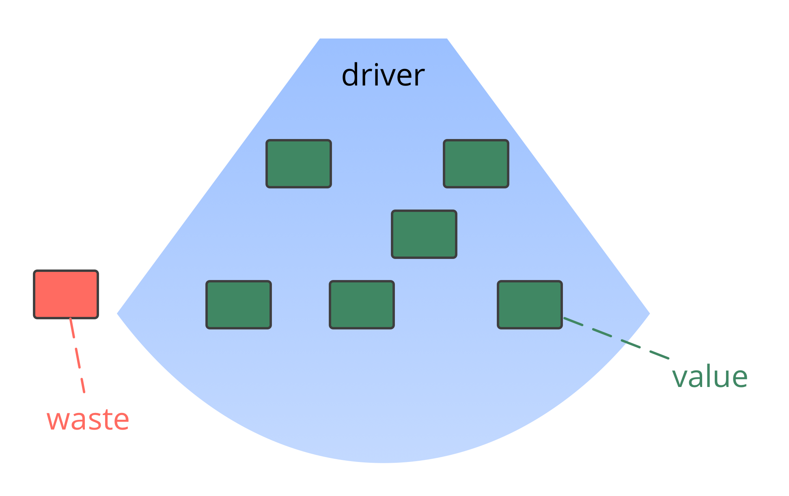

**לחשוף את המניעים וליצור מערכת משיכה מבוססת מדדים לשינוי ארגוני, באמצעות שיפור ודיוק מתמיד של תהליך העבודה.**

- הציגו את העיקרון של הסכמה [וניווט דרך מתח](navigate-via-tension.html) כדי לפתח תהליך עבודה בקבוצה
- שיקלו בחירת מנחה כדי להנחות תהליכים קבוצתיים ולבחירת ערכים להנחיית הקבוצה
- initiate a process of continuous improvement, e.g. through Kanban or regular retrospectives
- חברי הקבוצה ימשכו תבניות S3 עפ"י הנדרש
- אם זה בעל ערך, הרחיבו באופן איטרטיבי את הטווח של הניסוי לקבוצות אחרות
- חפשו בכוונה מכשולים 

### בזבוז ושיפור תמידי

_**בזבוז** זה כל דבר לא הכרחי עבור — או עומד בדרך ל — מענה אפקטיבי (יותר) למניע._

בזבוז קיים בצורות שונות, ברמות שונות של הפשטה (משימות, תהליכים, מבנה ארגוני, מודלים מחשבתיים...)

יצירת תהליך עבור מניעה מתמשכת של בזבוז מאפשר התפתחות טבעית של ארגון לקראת יעילות רבה יותר והסתגלות להקשר משתנה.

[&#9654; הגדרת הסכמים](defining-agreements.html) [&#9664; מרחב פתוח לשינוי](open-space-for-change.html) [&#9650; הכנסת S3](bringing-in-s3.html)

