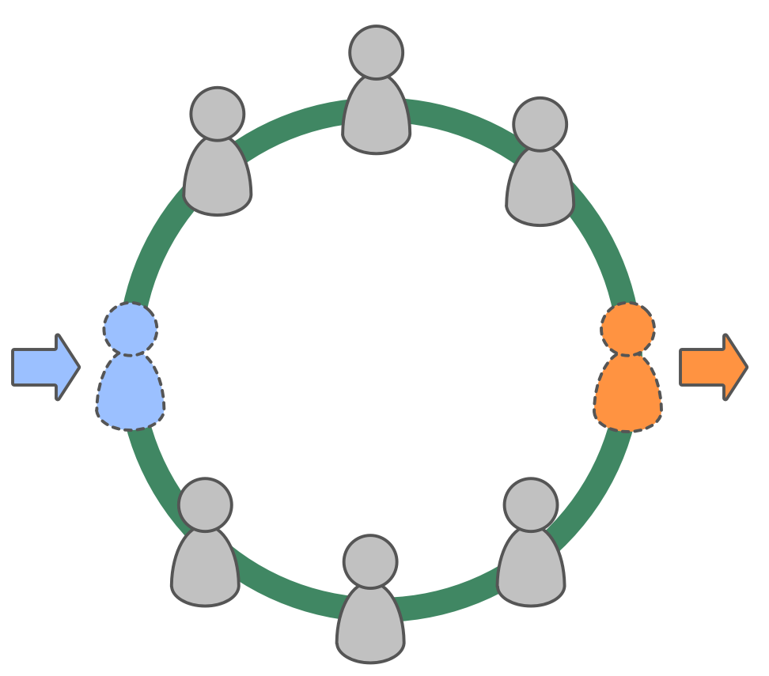

כאשר נכנסים להסכמים פורמליים או לא פורמליים עם אחרים:

- ודאו שכל הצדדים מבינים מה מצופה מהם והם מתכוונים לקיים את ההסכם
- ודאו שההסכם מטיב עם כל הצדדים, ושהציפיות מציאותיות

קחו אחריות על שבירת הסכמים.

כדי לשמור על תרבות ארגונית, יש לשמור על אחריותיות-עצמית ולעזור שלחברים חדשים בארגון או במעגל תהיה התחלה חלקה:

- הגדרת ציפיות עבור חברים חדשים (הן בהתאמה התרבותית והן בכישורים הנדרשים)
- עריכת החוזה עפ"י התרבות הארגונית וגם עפ"י הדרישות המשפטיות
- שקלו תקופת מבחן
- שיהיו לכם נהלים ברורים להפרת החוזה

[&#9654; שקיפות שכר](transparent-salary.html) [&#9664; שבירת הסכמים](breaking-agreements.html) [&#9650; מאפשרים של יצירה משותפת](enablers-of-co-creation.html)

