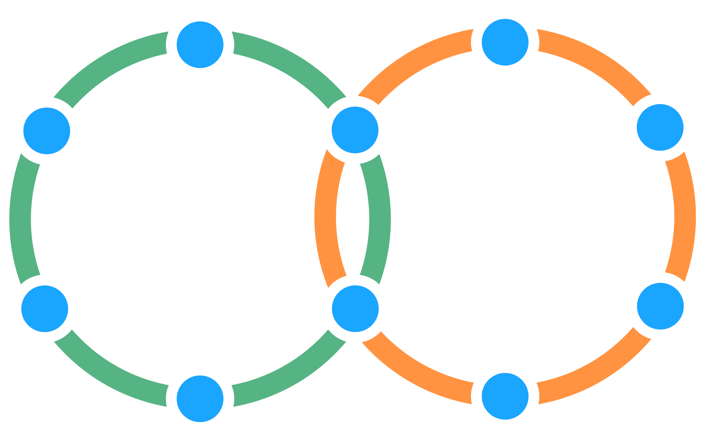

**מאפשר זרימה *דו-כיוונית* של מידע והשפעה בין שתי קבוצות.**

שתי קבוצות התלויות זו בזו כל אחת בוחרת את אחד מחבריה כדי לייצג את האינטרסים שלה בהחלטות המדיניות של הקבוצה השנייה.

- יוצר שקילות בין שתי קבוצות
- יכול לשמש כדי למשוך מידע בעל ערך במבנים היררכיים

[&#9654; נציג](representative.html) [&#9664; קישור](linking.html) [&#9650; בניית ארגונים](building-organizations.html)

