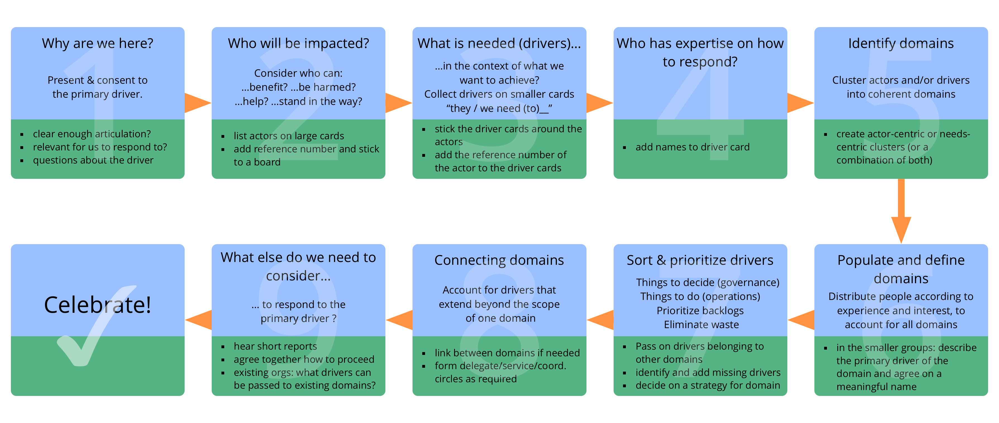
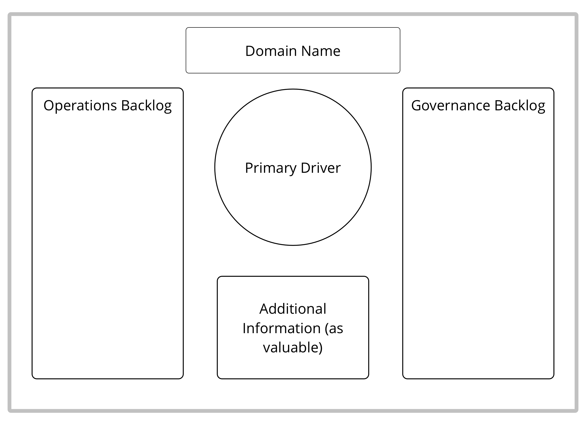

פורמט של סדנה לזיהוי מענה אפקטיבי למצב מורכב: לארגן סטארט-אפים, להריץ פרויקטים, להתמודד עם מכשולים או הזדמנויות משמעותיים, לפתח מבנה ארגוני כדי לאפשר טוב יותר את זרימת הערך.

קבוצות קטנות או גדולות מזהות ומתעדפות מניעים, מתקדמות במהירות מהרעיון לפעולה בקבוצות בהתארגנות-עצמית.

## מיפוי מניעים (...)

### מיפוי מניעים: תבנית עבור תחומים

[&#9654; פיתוח עמיתים](peer-development.html) [&#9664; בחירה לתפקיד](role-selection.html) [&#9650; יצירה משותפת והתפתחות](co-creation-and-evolution.html)

