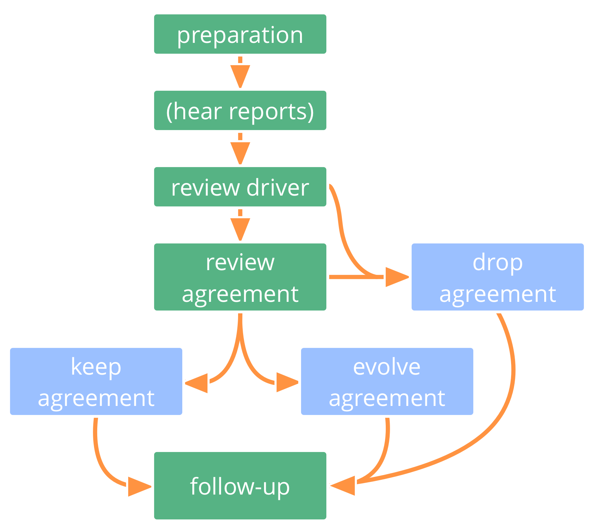

**ללא הרף לפתח את החלק העיקרי של הסכמים, ולסלק את הפסולת.**

סקירה סדירה של הסכמים היא תרגול חיוני עבור ארגון לומד:

- התאימו הסכמים בהתאם להקשר המשתנה
- שלבו למידה כדי להפוך אותם למועילים יותר

וודאו שלכל ההסכמים יש תאריך סקירה ראוי.

## להעריך ולפתח הסכמים (...)

הערכת הסכמים יכולה להיות פשוטה כמו בדיקה האם זה עדיין רלוונטי, ואין הסתייגות להשאיר את ההסכם כפי שהוא.

הסכמים נסקרים לעיתים קרובות ב[פגישות המדיניות](governance-meeting.html), אולם לפעמים זה מועיל לתאם מפגש ייעודי.

התאימו את תדירות הסקירות לפי הצורך, וסיקורו מוקדם יותר אם נדרש.

אלמנטים של תבנית זו יכולים לשמש גם אנשים כדי להעריך את ההחלטות שהם עושים.

## פורמט קצר להערכת הסכמים

- *כיצד הסכם זה עזר לנו?*
- *האם יש סיבה לבטל הסכם זה?*
- *כיצד ניתן לשפר הסכם זה?*
- הסכמה על תאריך הסקירה הבאה.

## פורמט ארוך להערכת הסכמים

הכנה:

- תזמון מועד לסקירה.
- לוודא שכל המידע הנחוץ זמין.

מעקב:

- הסכמה על תאריך הסקירה הבאה.
- לתעד החלטות ומשימות, ולשתף עם האנשים הרלוונטיים.
- לקחת בחשבון השפעות על כל ההסכמים הקשורים.

[&#9654; אלה שמושפעים מחליטים](those-affected-decide.html) [&#9664; פתירת הסתייגויות](resolve-objections.html) [&#9650; יצירה משותפת והתפתחות](co-creation-and-evolution.html)

