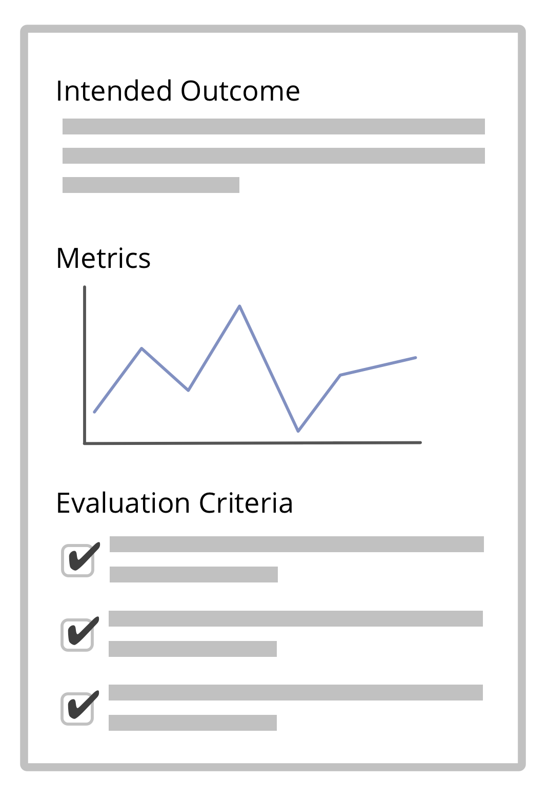

קריטריונים להערכה המוגדרים היטב יכולים לסייע להבין אם להסכם יש או אין את התוצאה הרצויה.

- לכו על קריטריונים **פשוטים וחד משמעיים** ותעדו אותם (כדי למנוע דיון בעת סקירת ההסכמים שלכם)
- הגדירו **מדדים ישימים** כדי לעקוב ברציפות אחר השפעות ואיתור סטיות מן התוצאות המיועדות

[&#9654; יומן](logbook.html) [&#9664; תיאור תוצרים](describe-deliverables.html) [&#9650; הגדרת הסכמים](defining-agreements.html)

