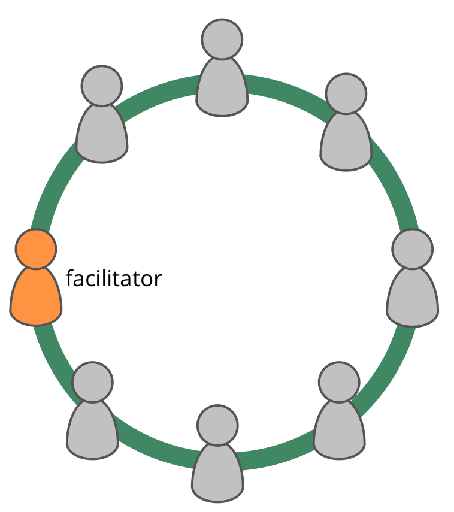

**בחר מישהו להנחיית פגישות מדיניות.**

מנחה מדיניות:

- מבטיח כי ישיבות המדיניות יישארו על המסלול ושהם עוברים הערכה
- הוא (בדרך כלל) נבחר על ידי קבוצה מבין חבריה (ולתקופה מסוימת)
- מתוודע בעצמו עם [בקלוג המדיניות](governance-backlog.html)
- לעתים מזמין אחרים כדי להנחות חלק מהדברים שעל סדר היום

## מנחה מדיניות (...)

כמנחה מדיניות, שקול ללמוד על השימוש בתבניות הבאות מ- S3 כדי לטפל ביעילות במדיניות:

- [סבבים](rounds.html)
- [גיבוש הצעה](proposal-forming.html)
- [קבלת החלטה בהסכמה](consent-decision-making.html)
- [בחירה לתפקיד](role-selection.html)
- [הערכת פגישות](evaluate-meetings.html)
- [פתירת הסתייגויות](resolve-objections.html)
- [סקירת עמיתים](peer-review.html)

[&#9654; שבירת הסכמים](breaking-agreements.html) [&#9664; הסכמה על ערכים](agree-on-values.html) [&#9650; מאפשרים של יצירה משותפת](enablers-of-co-creation.html)

