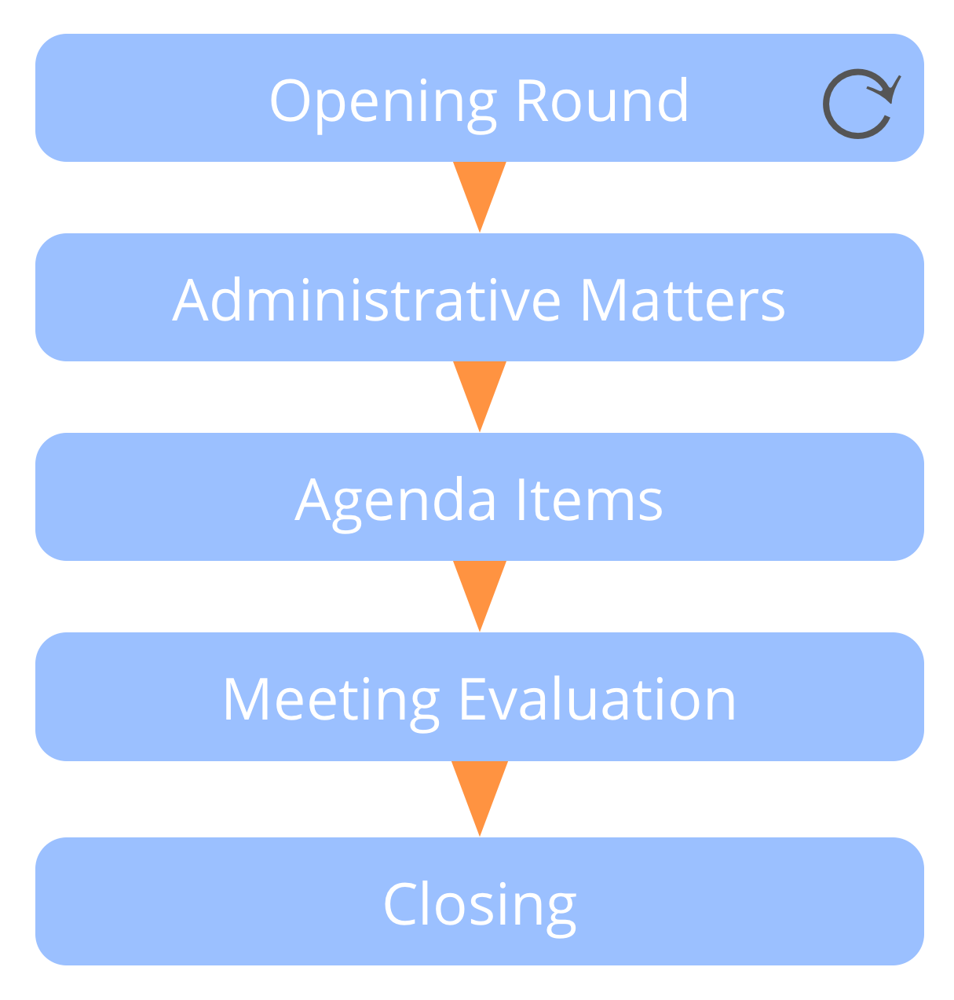

**קבוצות נפגשות במרווחי זמן קבועים כדי להחליט מה לעשות כדי להשיג את היעדים, וכדי להגדיר מגבלות על איך ומתי דברים יעשו.**

פגישת מדיניות בדרך כלל:

- מונחית 
- מוכנת מראש 
- קצובה בזמן של 90-120 דקות
- מתוזמנת כל 2-4 שבועות

## פגישת מדיניות (...)

פגישת מדיניות טיפוסית כוללת:

- opening: opening: check in with each other and attune to the objective of the meeting
- עניינים מנהליים 
    - לבדוק הסכמה לפרוטוקול של המפגש האחרון
    - להסכים על תאריך הפגישה הבאה
    - לברר אם יש פריטי סדר יום כלשהם של הרגע האחרון, והסכימו על סדר היום
- פריטים על סדר היום 
- הערכת הפגישה: הרהרו על האינטראקציות שלכם, תחגגו הצלחות ושתפו הצעות לשיפור
- סגירה: לבדוק מה המצב אחד עם השני. לפני שאתם עוזבים את הפגישה

## פגישת מדיניות (...)

פרטי סדר יום טיפוסיים כוללים:

- דיווחים קצרים 
- הערכת הסכמים קיימים שהגיע מועד הסקירה שלהם
- בחירת אנשים לתפקידים 
- מניעים חדשים הדורשים החלטות שצריכות להיעשות, כולל: 
    - גיבוש הצעות
    - עשיית הסכמים 
    - תכנון תחומים, וקבלת החלטה על לקיחת אחריות עבורם (למשל: תפקידים, מעגלים, צוותים או תחומים פתוחים חדשים)

[&#9654; רטרוספקטיבה](retrospective.html) [&#9650; אינטראקציות ממוקדות](focused-interactions.html)

