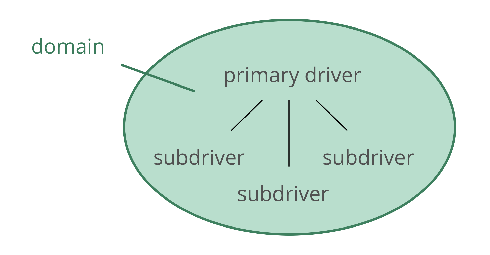
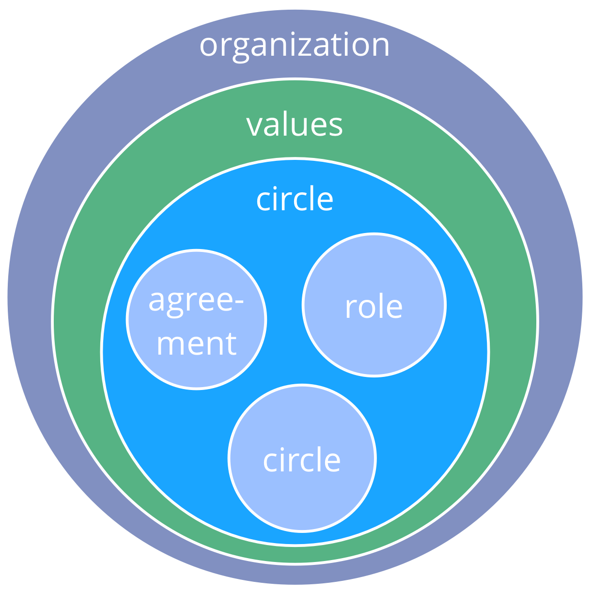

# סוציוקרטיה 3.0 - מדריך מעשי לארגונים מתפתחים חסונים וזמישים

### שיתוף פעולה אפקטיבי בכל קנה מידה

- **מבוססת על עקרונות**: דרך עקבית ליצירת יושרה ארגונית ופיתוח דפוס חשיבה סוציוקרטי וזמיש
- ** גמישות**: תבניות הניתנות להתאמה, עצמאיות ומחזקות זו את זו, כדי לעזור לכם בכל ההיבטים של שיתוף פעולה
- **חינם**: licensed under a Creative Commons Free Culture License

## מה יוצא לי מזה?

סוציוקרטיה 3.0 - **המוכרת גם בשם "S3"** - מביאה לכם אוסף נרחב של הנחיות ושיטות (תבניות) אשר הוכחו כמועילות עבור ארגונים **לשיפור ביצועים, תיאום, הגשמה ורווחה**.

S3 מסייעת לכם לגלות כיצד להגיע בצורה הטובה ביותר אל היעדים שלכם ולנווט מורכבות, צעד אחד בכל פעם, **ללא צורך בהערכות מחדש רדיקלית או יוזמת שינוי גדולה**:

- פשוט התחילו עם אזור הצורך הגדול ביותר שלכם, ביחרו תבנית אחת או יותר לנסות,** נועו בקצב שלכם** ופתחו מיומנויות תוך כדי.

- **לא משנה מה העמדה שלכם בארגון**, אתם תמצאו תבנית רלוונטית ומועילה עבורכם.

## תוכן

- סקירה קצרה של כמה מושגים בסיסיים מאחורי S3
- תיאור של כל התבניות ב- S3
- נספח עם רשימת שינויים, תודות, מידע על המחברים ועל הרישיון, מילון מונחים, אינדקס
## השפעות והיסטוריה

## מושגי יסוד

לפני הצלילה אל תוך התוכן, שקלו לקחת זמן כדי ללמוד אודות כמה מושגים בסיסיים מאחורי S3:

- מהי תבנית?
- שבעת העקרונות
- דרייברים, ערך ובזבוז
- דומיינים, האצלת סמכויות ואחריותיות
- מדיניות, התארגנות-עצמית, אוטונומיה חלקית

עבור כל מושג שאתם לא מבינים בדקו במלון המונחים בסוף.
## תבניות

_**דפוס** זו תבנית לניווט בהצלחה של הקשר ספציפי._

- תבניות S3 מתגלות באמצעות תצפיות על ארגונים רבים בזמן שהם פותרים בעיות ונענים להזדמנויות
- תבניות S3 יכולות להתפתח, ולהיות מותאמות כדי שיהלמו הקשרים נבדלים
- התבניות מקובצות לפי נושא לעשר קטגוריות
## כל התבניות מבוססות על שבעת העקרונות

## שבעת העקרונות

**מועילות:** *הקדש זמן רק למה שמביא אותך קרוב יותר להשגת המטרות שלך.*

**הסכמה:** *לעשות דברים בהעדר סיבות לא לעשותם.*

**אמפיריות:** *בדוק את כל ההנחות באמצעות ניסויים, שינוי תמידי והפרכה.*

## שבעת העקרונות (המשך)

**שיפור תמידי:** *לעשות שינוי הדרגתי כדי לסגל למידה אמפירית קבועה.*

**שקילות:** *ערב אנשים בקבלה ובפיתוח החלטות שמשפיעות עליהם.*

**שקיפות:** *היפכו את כל המידע לנגיש לכל אדם בארגון, אלא אם כן יש סיבה לסודיות.*

**אחריותיות:** *הענה כשמשהו נדרש, עשה את מה שהסכמת לעשות וקח בעלות על מהלך הארגון.*
## דרייברים

_**דרייבר** הוא המניע של אדם או של קבוצה להגיב על מצב מסוים._

דרייברים:

- יכולים לשמש כדי להפיק מטרות, יעדים, כוונות, שליחות, חזון, תכלית
- יכולים להשתנות לאורך הזמן

### דרייברים, ערך ובזבוז

_**ערך** הוא החשיבות, הערך או השימושיות של משהו ביחס לדרייבר._

_**בזבוז** זה כל דבר לא הכרחי עבור – או עומד בדרך ל – מענה אפקטיבי לדרייבר._

על ידי אימוץ התפיסה של ערך ובזבוז, שיטות ורעיונות רבים מ-**ייצור רזה** ו-**פיתוח תוכנה רזה** יכולים להיות מנוצלים על ידי כך שארגונים ימשכו תבניות S3:

- מיפוי זרימת הערך
- אסטרטגיות שונות עבור מניעת בזבוז
- שיטת קנבן
## דומיינים

_* * דומיין* * הוא שטח מובהק של השפעה, פעילות וקבלת החלטות בארגון._

כל הדומיינים נמצאים בתוך הדומיין הכללי של ארגון ועשויים להיות חופפים ו/או להיות כלולים באופן מלא בדומיינים אחרים.

תחומים מואצלים לאנשים (למשל ליחידה, מחלקה, צוות או יחידים), שלוקחים אחריות עבור התחום במסגרת המגבלות המוגדרות להשפעה ולאוטונומיה שלו.

## האצלת סמכויות לדומיינים

אלה שמאצילים סמכויות לדומיין (*המאצילים*) עדיין שומרים על אחריות כוללת עבור דומיין זה, ולעתים קרובות מגדירים:

- **אחראויות עיקריות** (עבודה חיונית וקבלת החלטות שהואצלו)
- **אילוצים לאוטונומיה ולהשפעה** עבור אלה שהדומיין מואצל אליהם, בדרך כלל קשור לארגון עצמו (למשל תקציב, משאבים, רמת יפויי הכוח, דיווח)

## מניעים ותחומים

תחום יכול להיות מוגדר ביחס למניע ארגוני - המכונה **המניע הראשי** של התחום - ע"י מערכת של תת-מניעים שהארגון עשוי להפיק מהם תועלת כאשר הוא מגיב למניע הזה:

- **תחומי אחריות עיקריים**: באים ישירות מן המניע הראשי של התחום
- **מגבלות**: הנוגעות להקשר הרחב יותר של הארגון

## דומיינים ואחריותיות

- אחריותיות חלה על כל ההסכמים, כולל על הארגון עצמו, המעגלים והתפקידים
- האחריותיות הראשית של כולם היא שיתוף פעולה אפקטיבי במענה לדרייברים ארגוניים
- יחידים וקבוצות אחראים על העבודה, הלמידה המתמשכת וההתפתחות שלהם, כאשר הארגון מספק את התמיכה הנדרשת
- כולם בארגון אחראים על התאמת הפעילות עם הערכים הארגוניים
## מדיניות, אוטונומיה-חלקית והתארגנות-עצמית

**מדיניות**: להחליט ברציפות מה לעשות כדי להשיג מטרות, ולקבוע אילוצים על איך ומתי הדברים ייעשה.

**מדיניות-עצמית**: אנשים המנהלים את עצמם במסגרת אילוצים של דומיין.

**התארגנות-עצמית**: אנשים המתאמים עבודה במסגרת האילוצים שהוגדרו דרך מדיניות.

**תפעוליות** (עשיית העבודה): אנשים עושים את מה שצריך להיעשות, מודרכים על ידי תיאום ומדיניות.

**אוטונומיה-חלקית**: אנשים עם אוטונומיה ליצור ערך, מוגבלת על ידי האילוצים של הדומיין שלהם.

## מדיניות לעומת תפעול

מעקב, סקירה ופיתוח החלטות הנעשים כדי להשיג את היעדים מאפשרים לארגון ללמוד ולהשתפר באופן תמידי.

*האם זה דורש או מפיק תועלת מהחלטה של יחידים או של קבוצה?*

- כן: מדיניות 
    - אינה מכוסה על ידי הסכם קודם
    - נדרשת הסכמה, החלטה או תיקון
- לא: תפעול 
    - מכוסה על ידי ההסכם הקודם (אלה שאחראים חופשיים לפעול)
    - צריך להיעשות

[&#9654; יצירה משותפת ופיתוח](co-creation-and-evolution.html)

