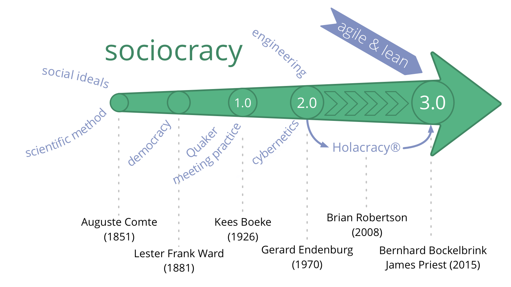
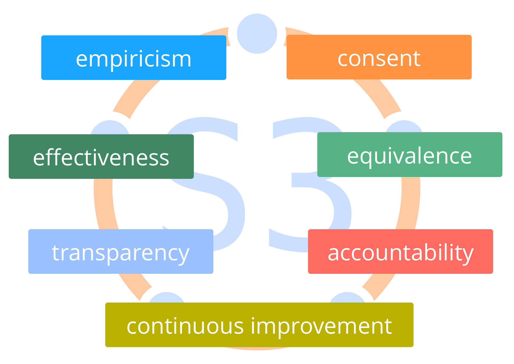
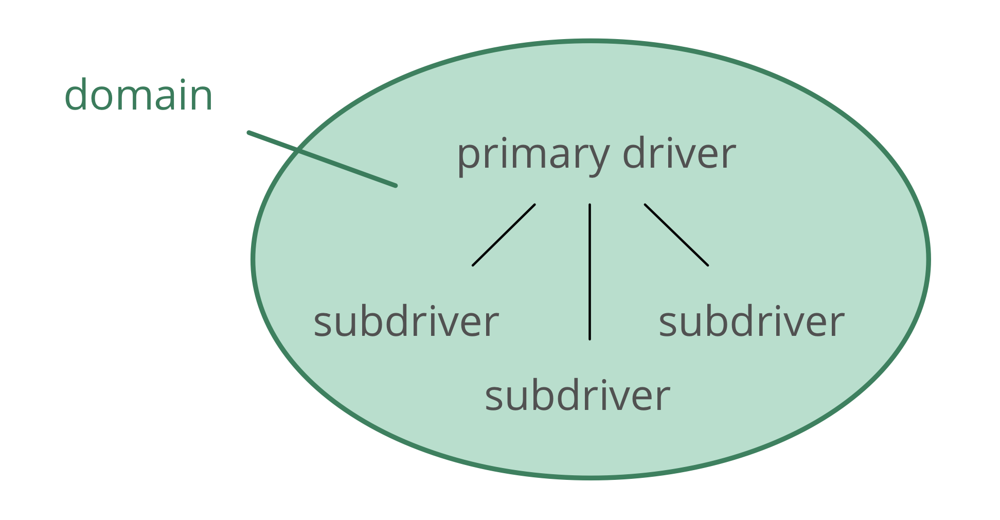

## סוציוקרטיה 3.0 - מדריך מעשי לארגונים מתפתחים חסונים וזמישים

### שיתוף פעולה אפקטיבי בכל קנה מידה

- **מבוססת על עקרונות**: דרך עקבית ליצירת יושרה ארגונית ופיתוח דפוס חשיבה סוציוקרטי וזמיש
- **גמישות**: תבניות הניתנות להתאמה, עצמאיות ומחזקות זו את זו, כדי לעזור לכם עם כל ההיבטים של שיתוף הפעולה
- **חינם**: licensed under a Creative Commons Free Culture License

## מה יוצא לי מזה?

Sociocracy 3.0 — **a.k.a. "S3"** — brings you an extensive collection of guidelines and practices (patterns) that have proven helpful for organizations to **improve performance, alignment, fulfillment and wellbeing**.

S3 מסייעת לכם לגלות כיצד להגיע בצורה הטובה ביותר אל היעדים שלכם ולנווט מורכבות, צעד אחד בכל פעם, **ללא הצורך בהערכות מחדש רדיקלית פתאומית או תכנון יוזמת שינוי גדולה ארוכת טווח**:

- פשוט התחילו עם אזור הצורך הגדול ביותר שלכם, בחרו תבנית אחת או יותר לנסות, **נועו בקצב שלכם** ופתחו מיומנויות תוך כדי.

- **לא משנה מה העמדה שלכם בארגון**, אתם תמצאו תבנית רלוונטית ומועילה עבורכם.

## תוכן

- סקירה קצרה של כמה מושגים בסיסיים מאחורי S3
- תיאור של כל התבניות ב- S3
- נספח 
    - רשימת שינויים
    - מידע על המחברים ותודות
    - הרשיון
    - מילון מונחים ואינדקס
## השפעות והיסטוריה

## מניעים ליצירת סוציוקרטיה 3.0

> *בשנת 2014 התאחדנו כדי ליצור במשותף גוף של Creative Commons licensed learning resources, מסנתזים רעיונות מסוציוקרטיה, פיתוח תוכנה וניהול זמיש ורזה. גילינו שארגונים בכל הגדלים צריכים תפריט גמיש של שיטות ושל מבנים – המתאים להקשר הספציפי שלהם – אשר מאפשר את ההתפתחות של צורת חשיבה סוציוקרטית וזמישה כדי להשיג יעילות, התאמה, הגשמה, ורווחה רבות יותר.*
## מושגי יסוד

לפני הצלילה אל תוך התוכן, שקלו לקחת זמן כדי ללמוד אודות כמה מושגים בסיסיים מאחורי S3:

- מהי תבנית?
- שבעת העקרונות
- מניעים, ערך ובזבוז
- תחומים, האצלת סמכויות ואחריותיות
- מדיניות, התארגנות-עצמית ואוטונומיה-חלקית

עבור כל מושג שאתם לא מבינים בדקו במלון המונחים בסוף.
## תבניות

_**דפוס** זו תבנית לניווט בהצלחה של הקשר ספציפי._

- תבניות S3 מתגלות באמצעות תצפיות על ארגונים רבים בזמן שהם פותרים בעיות ונענים להזדמנויות
- תבניות S3 יכולות להתפתח, ולהיות מותאמות כדי שיהלמו הקשרים נבדלים
- התבניות מקובצות לפי נושא לעשר קטגוריות
## כל התבניות מבוססות על שבעת העקרונות

## שבעת העקרונות

**עקרון המועילות:** *הקדישו זמן רק למה שמביא אתכם קרוב יותר להשגת המטרות שלכם.*

**עקרון ההסכמה:** *העלה, חפש ופתור הסתייגויות להחלטות ופעולות.*

**עקרון הנסותנות:** *בדקו את כל ההנחות באמצעות ניסויים ותיקונים מתמשכים.*

## שבעת העקרונות (...)

**עיקרון השיפור התמידי:** *עשיית שינוי בהדרגתיות כדי לסגל למידה אמפירית יציבה.*

**עקרון השקילות:** *עירוב אנשים בקבלה ובפיתוח החלטות שמשפיעות עליהם.*

**עקרון השקיפות:** *הפיכת כל המידע לנגיש לכל אדם בארגון, אלא אם כן יש סיבה לסודיות.*

**עיקרון האחריותיות:** *להיענות כשמשהו נדרש, עשו את מה שהסכמתם לעשות וקחו בעלות על מהלך הארגון.*

## עיקרון האחריותיות

*להיענות כשמשהו נדרש, עשו את מה שהסכמתם לעשות וקחו בעלות על מהלך הארגון.*

פעל במסגרת המגבלות של כל ההסכמים המסדירים את התחום שיש לך אחריותיות עליהם, כולל הארגון עצמו, קבוצות שאתה חלק מהן ותפקידים שאתה נושא.

האחריותיות הראשית של כולם היא שיתוף פעולה אפקטיבי במענה למניעים ארגוניים.

יחידים אחראים גם על עבודתם, על למידה מתמשכת ופיתוח, ועל תמיכה אחד בשני.

כולם בארגון אחראים על התאמת הפעילות עם הערכים הארגוניים.
## מניעים

_**מניע** הוא הסיבה של אדם או של קבוצה להגיב למצב מסוים._

מניעים:

- יכולים לשמש כדי להפיק מטרות, יעדים, כוונות, שליחות, חזון, תכלית
- יכולים להשתנות לאורך הזמן

### מניעים: ערך ובזבוז

_**ערך** הוא החשיבות, הערך או השימושיות של משהו ביחס למניע._

_**בזבוז** זה כל דבר לא הכרחי עבור — או עומד בדרך ל — מענה אפקטיבי (יותר) למניע._

על ידי אימוץ התפיסה של ערך ובזבוז, שיטות ורעיונות רבים מ-**ייצור רזה** ו-**פיתוח תוכנה רזה** יכולים להיות מנוצלים על ידי כך שארגונים ימשכו תבניות S3:

- מיפוי זרימת הערך
- אסטרטגיות שונות עבור מניעת בזבוז
- שיטת קנבן
## תחומים

_* *תחום** הוא שטח מובהק של השפעה, פעילות וקבלת החלטות בארגון._

כל התחומים נמצאים בתוך תחום הכללי של ארגון ועשויים להיות חופפים ו/או להיות כלולים באופן מלא בתחומים אחרים.

תחומים מואצלים לאנשים (למשל ליחידה, מחלקה, צוות או יחידים), שלוקחים אחריות עבור התחום ופועלים במסגרת המגבלות המוגדרות שלו על השפעה ואוטונומיה.

## האצלת סמכויות לתחומים

אלה שמאצילים סמכויות לתחום (*המאצילים*) עדיין שומרים על אחריות כוללת עבור תחום זה, ולעתים קרובות מגדירים:

- **אחראויות עיקריות** (עבודה וקבלת החלטות חיוניות שהואצלו)
- **מגבלות לאוטונומיה ולהשפעה** לאלה שהתחום מואצל אליהם (ה*מואצלים*), בדרך כלל קשור לארגון עצמו (למשל תקציב, משאבים, רמת יפויי הכוח, דיווח)

## מניעים ותחומים

ניתן גם להבין תחום ביחס למניעים ארגוניים:

- התחום של **המניע העיקרי** - המניע הראשי שהאנשים שאחראים לתחום זה (*המואצלים*) מגיבים אליו
- המערכת של התת-מניעים שהארגון עשוי להפיק תועלת מלהתייחס אליהם כאשר מגיבים למניע העיקרי, הכוללים: 
    - **אחריות מפתח** (כל מניע הבא ישירות מן המניע העיקרי של התחום)
    - drivers for **constraints of the domain** (which typically relate to the organization's wider context)
## משילות, אוטונומיה-חלקית והתארגנות-עצמית

**משילות**: לקבל ולפתח החלטות לגבי מה לעשות כדי להשיג מטרות, וקביעת מגבלות על איך ומתי הדברים יעשו.

**משילות-עצמית**: אנשים המנהלים את עצמם במסגרת מגבלות של תחום.

**התארגנות-עצמית**: אנשים המארגנים עבודה במסגרת המגבלות שהוגדרו באמצעות מדיניות.

**תפעול** (עשיית העבודה): העבודה הנעשית כדי ליצור ולהעביר ערך, המונחה על ידי המדיניות.

**אוטונומיה-חלקית**: האוטונומיה של אנשים ליצור ערך, מוגבלת על ידי המגבלות של התחום (כולל ההשפעה של המאציל ושל הנציגים), ועל ידי הסתייגויות מאחרים.

## משילות או תפעול?

*האם זה דורש או מפיק תועלת מהחלטה של יחידים או של קבוצה?*

- כן: משילות 
    - אינו מכוסה על ידי הסכם קודם
    - זה צריך להיות מוסכם, מוחלט או מתוקן
- לא: תפעול 
    - זה מכוסה על ידי הסכם קודם (אלה שאחראים חופשיים לפעול)
    - זה צריך להיעשות

[&#9654; יצירה משותפת והתפתחות](co-creation-and-evolution.html)

