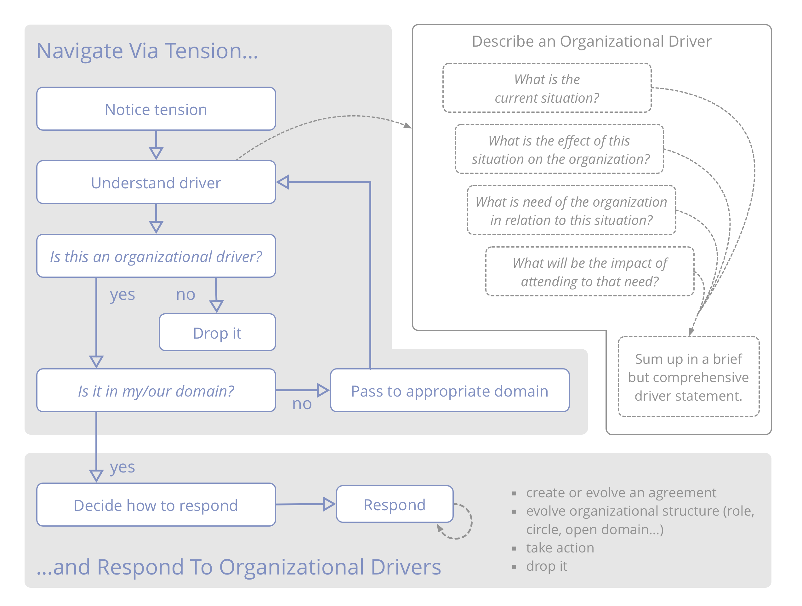

**Pay attention to tension you experience in relation to the organization, investigate the cause and pass on any organizational drivers you discover to the people accountable for the appropriate domain.**

**אתגרים והזדמנויות ** עבור ארגון נחשפים כאשר אנשים מביאים מודעות לסיבות מדוע הם חווים מתח.

**הערה:** בהקשר זה, *מתח* הוא חוויה אישית: סימפטום של דיסוננס בין תפיסתם של היחידים למצב, לבין הציפיות (או ההעדפות) שלהם.

כדי **לגלות מניעים**, חקרו מה מעורר מתח ותארו מה קורה ומה נדרש. לפעמים חקירה מגלה תפיסות מוטעות והמתח נעלם.

[&#9654; תיאור מניעים ארגוניים](describe-organizational-drivers.html) [&#9664; מענה למניעים ארגוניים](respond-to-organizational-drivers.html) [&#9650; יצירה משותפת והתפתחות](co-creation-and-evolution.html)

