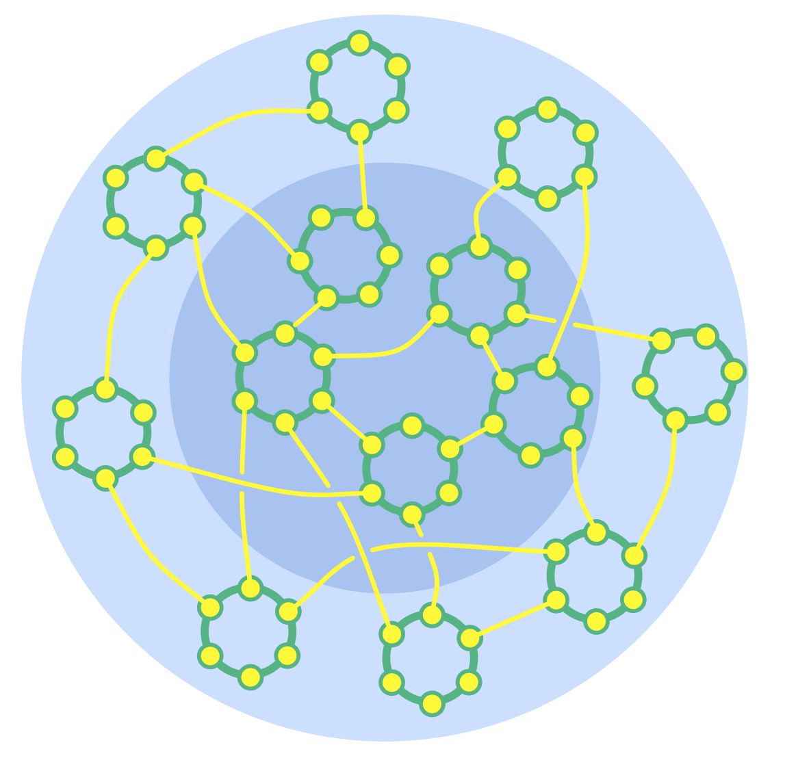

מספק ערך בסביבה תחרותית ומורכבת באמצעות **ביזור** (של משאבים והשפעה) **ומכוון את האינטראקציה ** בין אלה שיוצרים ערך, והלקוחות שהם משרתים.

- מעגלים בפריפריה מספקים ערך בהחלפה ישירה עם העולם החיצון (לקוחות, שותפים, קהילות, עיריות ועוד.) 
- המרכז מספק שירותי פנים כדי לתמוך בארגון
- הפריפריה מעמידה את המשאבים הכספיים ומנווטת את הארגון
- מקשר דומיינים כשנדרש כדי להזרים מידע והשפעה ומטפל בתלויות

[&#9654; היררכיית קישור כפול](double-linked-hierarchy.html) [&#9664; מעגל נציגים](delegate-circle.html) [&#9650; מבנה ארגוני](organizational-structure.html)

