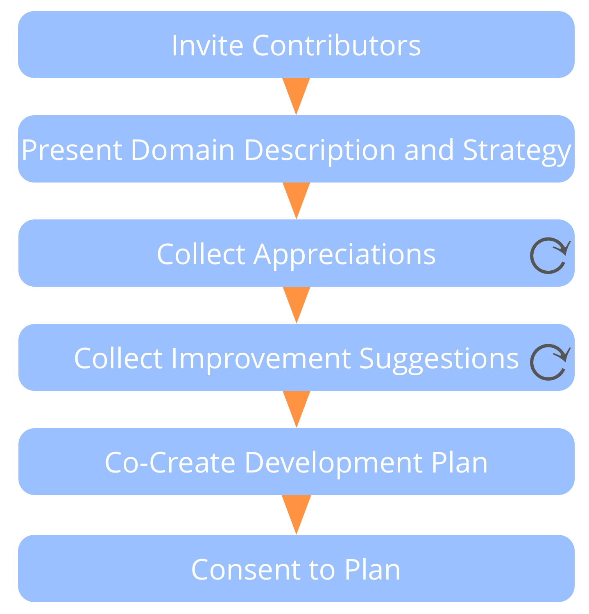
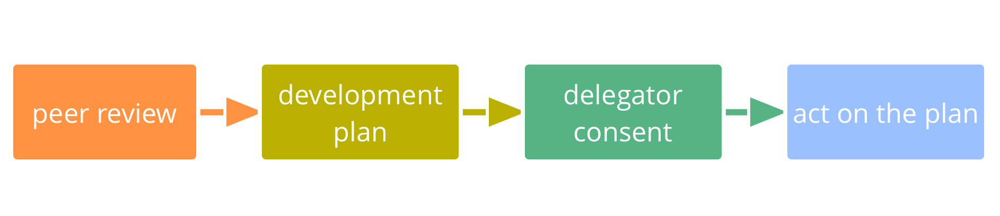

**אנשים תומכים אחד בשני כדי ללמוד ולהתפתח בתפקידים ובקבוצות שהם משרתים.**

נושא התפקיד - או הקבוצה - מוביל את סקירת העמיתים על ידי הגדרת התהליך ומדבר ראשון בכל שלב.

ודא להזמין אנשים עם פרספקטיבות משלימות לתרום לסקירה, וכן מנחה.

הצעות לשיפור חלות על התפתחות אישית, שיתוף פעולה, עדכונים לתיאור הדומיין (כולל הצהרת הדרייבר) ואסטרטגיה.

## סקירת עמיתים (המשך)

### שיפור מתמיד ביכולתם של אנשים למלא באפקטיביות תפקידים או לשתף פעולה בקבוצות.

[&#9654; תוכניות פיתוח](development-plan.html) [&#9664; משוב עמיתים](peer-feedback.html) [&#9650; פיתוח עמיתים](peer-development.html)

