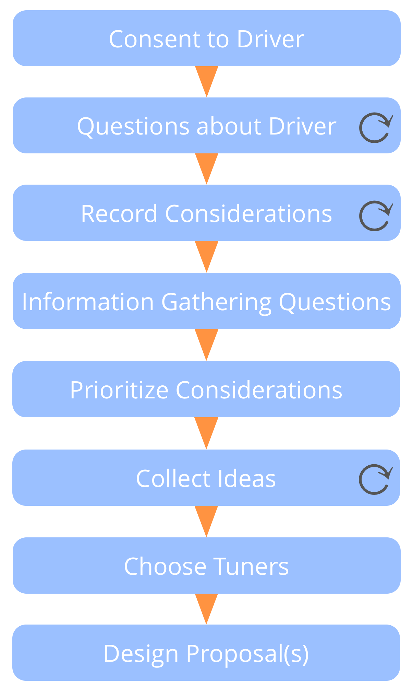
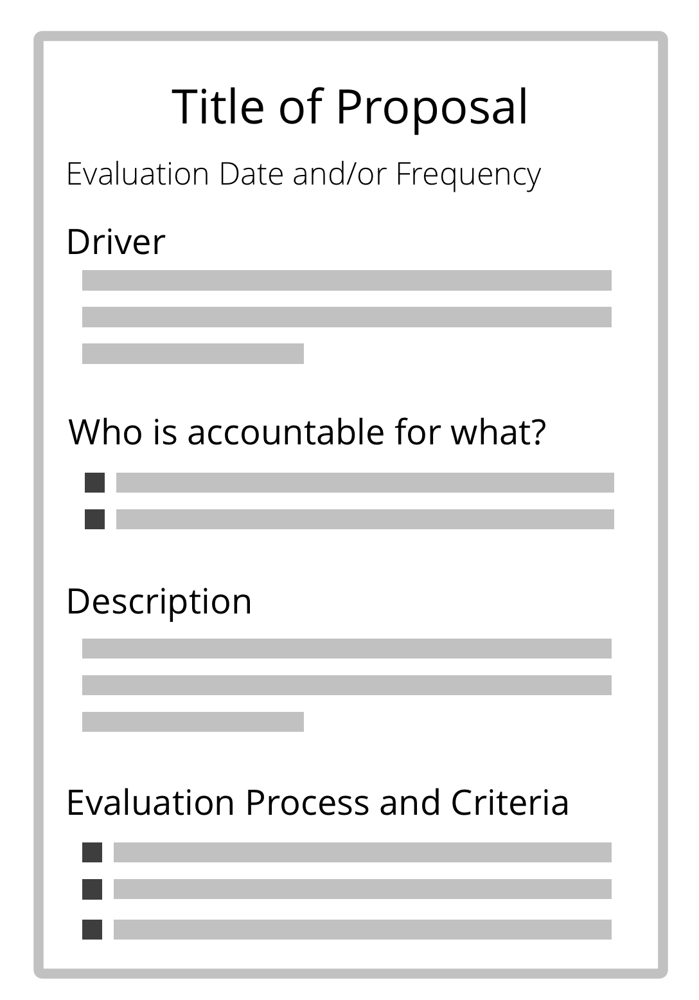

**תהליך קבוצתי (מונחה) ליצירה משותפת של מענה למניע.**

- מתבסס על האינטליגנציה הקולקטיבית ועל מגוון הפרספקטיבות בתוך קבוצה
- מערב אנשים ביצירה משותפת של הסכמים
- מטפח אחריות ותחושת בעלות

*גיבוש הצעה* עשוי להיות גם בשימוש על ידי אדם יחיד.

### שלבי גיבוש הצעה

- **הסכימו למניע** *האם המניע הזה רלוונטי עבורנו כדי להגיב אליו? האם הצהרת המניע מתארת תיאור מדויק של מה שקורה ומה שנדרש?*
- **העמקת הבנה משותפת של מניע:** מזמינה שאלות חיוניות כדי להבין את המניע בפירוט רב יותר.
- **אסוף שיקולים** המנוסחים כשאלות המתייחסות לפתרונות אפשריים. שאלות חושפות אחת מן השתיים או מגבלות (שאלות איסוף מידע) או אפשרויות (שאלות יצרניות).
- **ענו** על כל שאלות איסוף המידע אם אפשר.
- **תתעדפו** שיקולים.
- **איספו רעיונות** כמרכיבים אפשריים עבור הצעה.
- **תכננו הצעה** על מנת לטפל במניע בהתחשב ברעיונות היצירתיים ובמידע שנאספו עד עכשיו. זה בדרך כלל נעשה על ידי קבוצה קטנה יותר "כווננים".

### בחירת מכווננים

שקלו:

- מי צריך להיות שם?
- מי רוצה להיות שם?
- מי עוד יכול לתת תרומה משמעותית?
- שקול מומחיות, מבט מבחוץ והשראה

בין שניים או שלושה מכווננים זה בדרך כלל מתאים.

בדקו אם יש הסתייגויות למכוונן(ים) המוצע(ים).

[&#9654; בחירה לתפקיד](role-selection.html) [&#9664; יצירה משותפת של הצעה](co-create-proposals.html) [&#9650; יצירה משותפת והתפתחות](co-creation-and-evolution.html)

