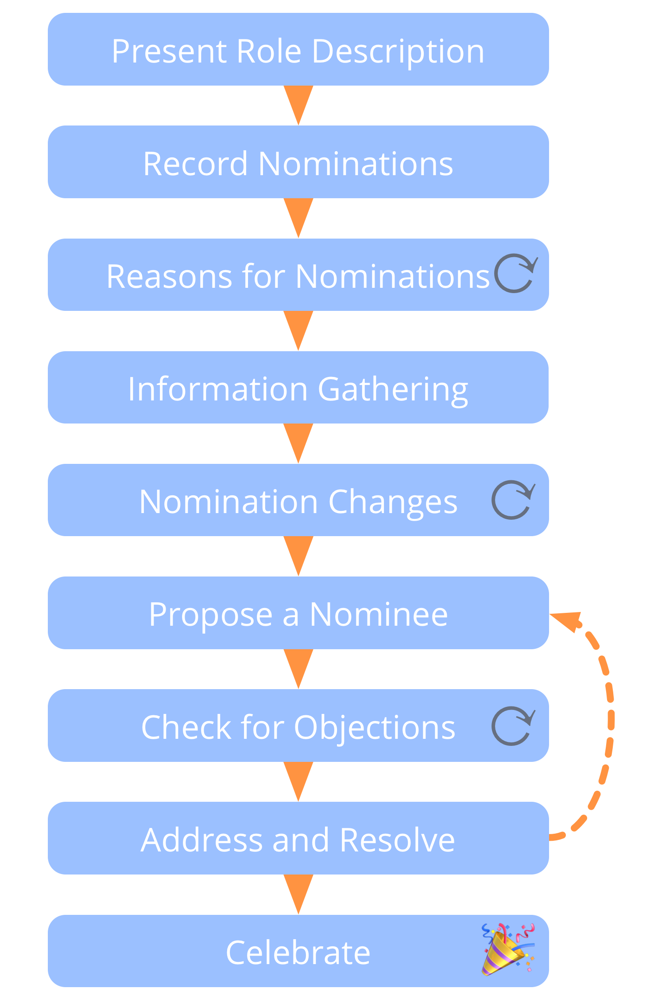

**תהליך קבוצתי לבחירת אדם לתפקיד על סמך חוזק הסיבה.**

במקום פשוט להקצות אנשים לתפקידים, או לעשות בחירה המבוססת רק על הרוב, השתמשו בתהליך בחירה לתפקיד כדי:

- לנצל את האינטליגנציה הקולקטיבית על ידי שמיעה ובחינה של הסיבות למועמדויות
- להגדיל את הבעלות על ההחלטה
- להבטיח תמיכה לנושא בתפקיד על-ידי אלה שמושפעים.

## בחירה לתפקיד (...)

** 1. הציגו את תיאור התפקיד: ** במידת האפשר, שלחו מראש את תיאור התחום של התפקיד.

** 2. רישום מועמדויות: **המשתתפים כותבים את שם המועמד שלהם על פיסת נייר. אנשים יכולים למנות את עצמם, מישהו אחר, או להימנע.

** 3. סיבות למועמדויות ** כל אדם משתף את מי הוא הציע ומדוע.

** 4. איסוף מידע:** המשתתפים משתפים או מבקשים כל מידע שעשוי לתמוך בקבוצה בבחירה המתאימה.

## בחירה לתפקיד (...)

** 5. שינויים במועמדויות: ** בדקו אם מישהו רוצה לשנות את המועמד שלו לאור הסיבות והמידע ששותף עד כה, ושמעו את הסיבות עבור כל שינוי.

** 6. הצעת מועמד ** לתפקיד: המנחה מנחה את התהליך כדי לזהות מועמד מתאים על סמך הסיבות שנשמעו, למשל. על ידי:

- הצעת מועמד בעצמם או לבקש מחבר בקבוצה
- הזמנת (כמה) מועמדים להסכים מי צריך להיות מוצע
- הזמנת דיאלוג קבוצתי כדי לסייע לחשוף את המועמד החזק ביותר

## בחירה לתפקיד (...)

** 7. בדקו את ההסתייגויות:** שאל את המשתתפים (כולל את המועמד המוצע) לציין בו זמנית אם יש להם הסתייגות.

**8. התייחסו ופתרו הסתייגויות,** התחילו עם אחת כלשהי לגבי המועמד המוצע. ניתן לפתור הסתייגויות בדרכים רבות, כולל תיקון תיאור התחום של התפקיד או על ידי מינוי אדם אחר. כאשר כל ההסתייגויות נפתרות, בדקו שוב עם המועמד (הסופי) אם הוא מקבל את התפקיד.

**9. לחגוג:** הכירו בהגעה להסכמה והודו לאדם שמעכשיו ישא בתפקיד.

## בחירה לתפקיד (...)

כדי להימנע מהשפעה על אחרים, יש להימנע מלהביע עניין אישי או דעות לפני שהבחירה מתרחשת.

לפעמים בחירה לתפקיד מגלה חוסר יכולת, ניסיון רלוונטי, תכונות או מיומנות. קבוצה תצטרך אז לשקול מועמדים מבחוץ, לשקול מחדש סדרי עדיפויות או למצוא דרך חלופית לקחת אחריות על התחום.

דפוס זה יכול לשמש גם בכל מצב בו יש צורך לבחור בין מגוון רחב של אפשרויות.

[&#9654; מיפוי מניעים](driver-mapping.html) [&#9664; גיבוש הצעה](proposal-forming.html) [&#9650; יצירה משותפת והתפתחות](co-creation-and-evolution.html)

