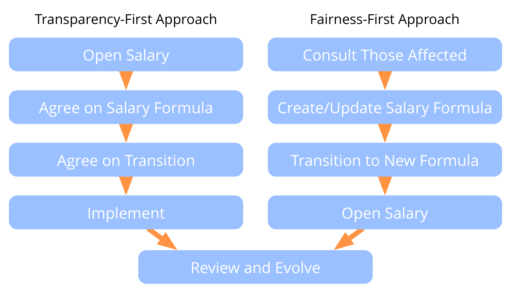

- שקיפות השכר צריכה להיות הוגנת
- להוגנות יש כמה ממדים 
- תפיסת ההגינות היא ספציפית להקשר הארגוני
- לקחת בחשבון חברים ובעלי עניין רלוונטיים (למשל, משקיעים)
- ליצור נוסחת שכר: 
    - קבועה: מבטיחה קיום
    - משתנה: חלוקה הוגנת של רווחים ועלויות
- לשקול גמול על שינוי התפקידים
- ליצור אסטרטגיה למעבר לחוזים חדשים והסכמי פיצויים

### שתי דרכים לחשיפת משכורות

[&#9654; תפקיד תומך](support-role.html) [&#9664; עריכת חוזים ואחריותיות](contracting-and-accountability.html) [&#9650; מאפשרים של יצירה משותפת](enablers-of-co-creation.html)

